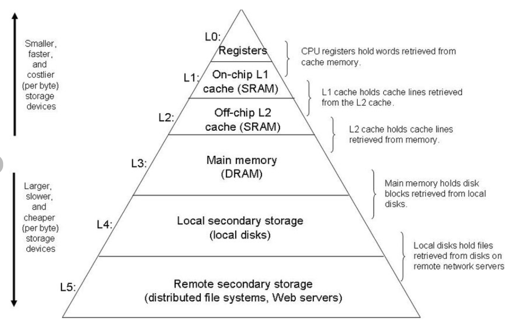
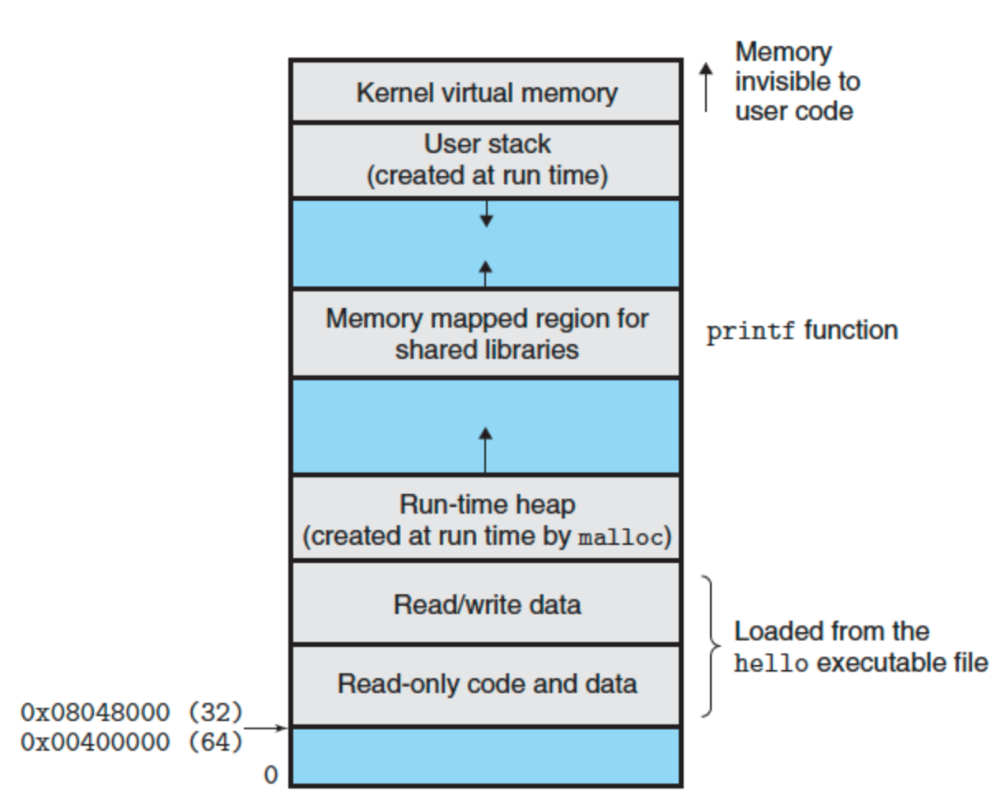

## Information is Bits + Context

- All information in a system is represented as a bunch of bits
- The only thing that distinguishes different data objects is the context in which we view them. For example, in different context, the same sequence of bytes might represent an integer, floating-point number, character string, or machine instruction

## Programs Are Translated by Other Programs into Different Forms

- Compilation System:
  - Pre-processor -> Compiler -> Assembler -> Linker
  - hello.c -> hello.i -> hello.s -> hello.o -> hello

- **Preprocessing phase**: Modifies original C program according to directives that begin with `#` character
- **Compilation phase**: Translates the text C file to an assembly-language program
- **Assembly phase**: Translates the assembly-language program into machine-language instructions
- **Linking phase**: Merge different machine-language instructions file together for executings

## It pays to Understand How Compilation Systems Work

- Reason for programmer to understand compilation systems:
  - Optimizing program performance
  - Understanding link-time error
  - Avoiding security holes

## Processors Read and Interpret Instructions Stored in Memory

### Hardware Organization of a System

- Buses:
  - Carry bytes of information back and forth between the components
  - Designed to transfer fixed-size chunks of bytes known as words
  - The number of bytes in a word (the word size) is a fundamental system parameter, for most machine today
    - 4 bytes (32 bits)
    - 8 bytes (64 bits)
- I/O Devices:
  - System's connection to the external world
  - Connected to the I/O bus by either a controller or an adapter
- Main Memory:
  - Temporary storage device that holds both a program and the data it manipulates while the processor is executing the program
  - Physically, it consists of a collection of dynamic random access memory (DRAM)
  - Logically, memory is organized as a linear array of bytes, each with its own unique address (array index) starting at zero
- Processor:
  - Central Processing Unit (CPU) is the engine that executes instructions stored in main memory
  - Operation of CPU:
    - **Load**: Copy a byte or a word from main memory into a register, overwriting previous contents in register
    - **Store**: Copy a byte or a word from register into a a location in main memory, overwriting previous contents in that location
    - **Operate**: Copy the contents of two registers to the ALU, perform an arithmetic operation on the two words, store the result in a register, overwriting previous contents in register
    - **Jump**: Extract a word from the instruction itself and copy that word into the program counter (PC), overwriting previous value of the PC

## Caches Matter

- A system spends a lot of time moving information from one place to another
  - eg. Disk -> Main Memory -> Processor
- **Processor-memory gap**: Processor can read data from the register file almost 100 times faster than from memory
  - As semiconductor technology progresses over the years, this gap continues to increase
  - To deal with this, designer include smaller faster storage devices called **cache memories (caches)**
  - The idea behind caching is that a system can get the effect of both a very large memory and a very fast one by exploiting **locality**

## Storage Devices From a Hierarchy

- The main idea of a memory hierarchy is that storage at one level serves as a cache for storage at the next lower level

## The Operating System Manages the Hardwares

- Operating System as a layer of software interposed between the application program and the hardware
- Operating System's 2 main purposes:
  - protect hardware from misuse by runaway applications
  - provide applications with simple and uniform mechanisms for manipulating lower-level devices
- Operating System achieve the 2 goals via **fundamental abstractions**:
  - **files** -> I/O devices
  - **virtual memory** -> memory + I/O devices
  - **processes** -> processor + memory + I/O devices

### Processes

- **Process** is the operating system's abstraction for a running program
- Multi-core processors can execute several programs simultaneously
- A single CPU can appear to execute multiple programs concurrently by having the processor switch among them
  - The OS perform this interleaving with a mechanism known as **context switching**

### Threads

- Running in the context of the process and sharing the same code and global data

### Virtual Memory

- An abstraction that provides each process with the illusion that it has exclusive use of the main memory
- Each process has the same uniform view of memory, which is known as its **virtual address space**

### Files

- A file is a sequence of bytes, nothing more and nothing less
- Every I/O devices will be modeled as a file
- All input and output in the system is performed by reading and writing files, using a small set of system calls known as **Unix I/O**
- File is simple but very powerful, since it provide the uniform view of all the varied I/O devices
  - eg. the same program run on different systems that use different disk technologies

## Systems Communicate with Other Systems Using Networks

- From the point of view of an individual system, the network can be viewed as just another I/O device