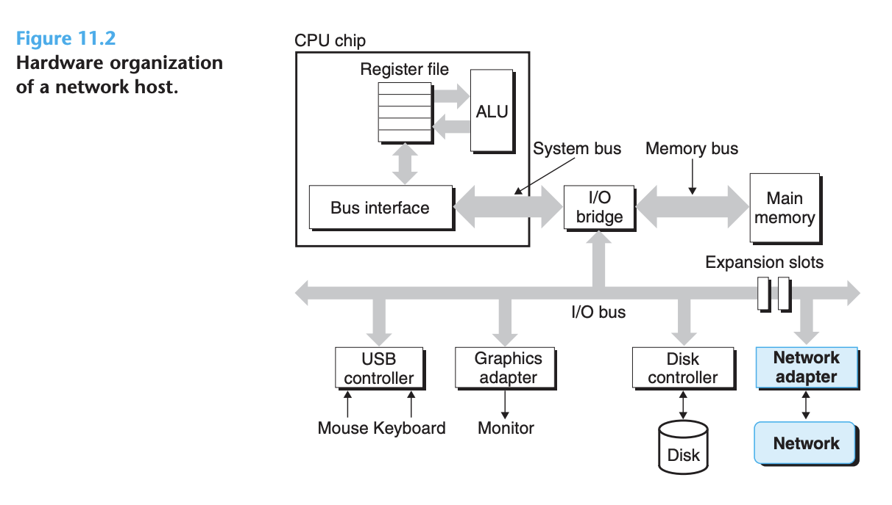
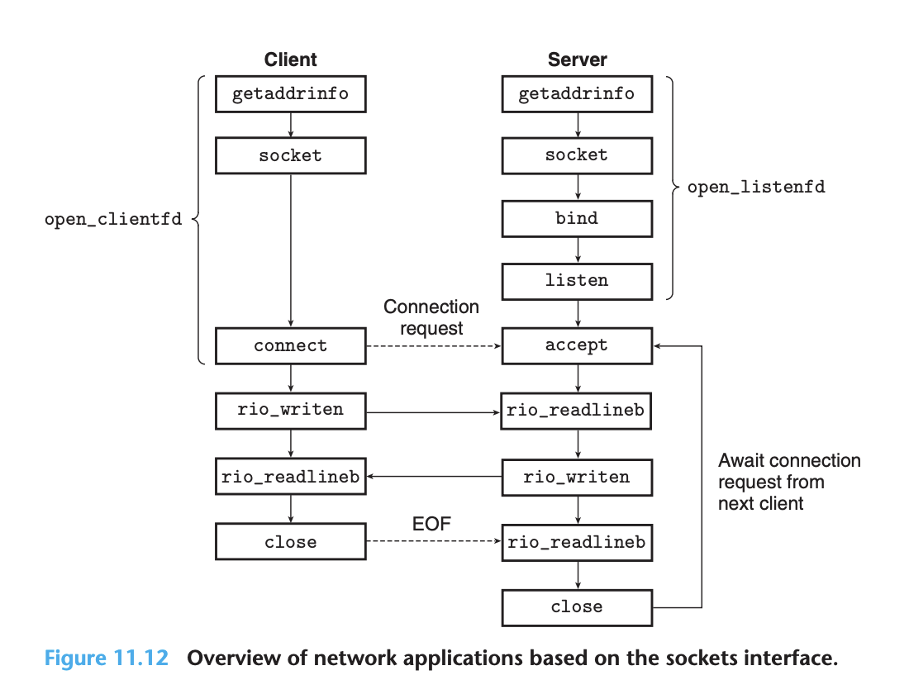

## Network Programming

### The Client-Server Programming Model

- It is important to realize that clients and servers are processes and not machines, or hosts as they are often called in this context


### Networks

- Hardware organization:



- Data received from the network are copied from the adapter across the I/O and memory buses into memory, typically by a DMA transfer

- An **Ethernet segment** consists of some wires (usually twisted pairs of wires) and a small box called a **hub**:


- Every host adapter sees the frame, but only the destination host actually reads it
- Multiple Ethernet segments can be connected into larger LANs, called **bridged Ethernets**, using a set of wires and small boxes called bridges:


- Using a clever distributed algorithm, they automatically learn over time which hosts are reachable from which ports and then selectively copy frames from one port to another only when it is necessary

- At a higher level in the hierarchy, multiple incompatible LANs can be connected by specialized computers called routers to form an internet (interconnected network)

- The crucial property of an internet is that it can consist of different LANs and WANs with radically different and incompatible technologies:


- How hosts and routers use the internet protocol to transfer data across incompatible LANs:


### The Global IP Internet

- Hardware and software organization of an internet application


- The sockets functions are typically implemented as system calls that trap into the kernel and call various kernel-mode functions in TCP/IP
- The IP mechanism is unreliable in the sense that it makes no effort to recover if datagrams are lost or duplicated in the network
- UDP (Unreliable Datagram Protocol) extends IP slightly, so that datagrams can be transferred from process to process, rather than host to host
- TCP is a complex protocol that builds on IP to provide reliable full duplex (bidirectional) connections between processes

#### IP Addresses

- Network programs store IP addresses in the IP address structure:

```c
/* IP address structure */
struct in_addr {
  uint32_t s_addr; /* Address in network byte order (big-endian) */
};
```

- It would make more sense to define a scalar type for IP addresses, but it is too late to change now because of the enormous installed base of applications
- TCP/IP defines a uniform network byte order (big-endian byte order) for any integer data item
- Unix provides the following functions for converting between network and host byte order:

```c
#include <arpa/inet.h>

// Returns: value in network byte order
uint32_t htonl(uint32_t hostlong);
uint16_t htons(uint16_t hostshort);

// Returns: value in host byte order
uint32_t ntohl(uint32_t netlong);
uint16_t ntohs(uint16_t netshort);
```

- eg. `128.2.194.242` is the dotted-decimal representation of the address `0x8002c2f2`
- Application programs can convert back and forth between IP addresses and dotted-decimal strings using the functions `inet_pton` and `inet_ntop`

```c
#include <arpa/inet.h>

// Returns: 1 if OK, 0 if src is invalid dotted decimal, −1 on error
int inet_pton(AF_INET, const char *src, void *dst);

// Returns: pointer to a dotted-decimal string if OK, NULL on error
const char *inet_ntop(AF_INET, const void *src, char *dst, socklen_t size);
```

#### Internet Domain Names

- The set of domain names forms a hierarchy, and each domain name encodes its position in the hierarchy
- The nodes of the tree represent domain names that are formed by the path back to the root


- The Internet defines a mapping between the set of domain names and the set of IP addresses
- Linux nslookup program, which displays the IP addresses associated with a domain name, eg.

```bash
linux> nslookup localhost
Address: 127.0.0.1
```

#### Internet Connections

- A socket is an end point of a connection
- Each socket has a corresponding socket address that consists of an Internet address and a 16-bit integer port and is denoted by the notation address:port
- The mapping between well-known names and well-known ports is contained in a file called `/etc/services`
- A connection is uniquely identified by the socket addresses of its two end points. This pair of socket addresses is known as a socket pair and is denoted by the tuple:

```
(cliaddr:cliport, servaddr:servport)
```


### The Sockets Interface

- The **sockets interface** is a set of functions that are used in conjunction with the Unix I/O functions to build network applications



- Socket address structures:

```c
/* IP socket address structure */
struct sockaddr_in {
  uint16_t sin_family; /* Protocol family (always AF_INET) */
  uint16_t sin_port; /* Port number in network byte order */
  struct in_addr sin_addr; /* IP address in network byte order */
  unsigned char sin_zero[8]; /* Pad to sizeof(struct sockaddr) */
};

/* Generic socket address structure (for connect, bind, and accept) */
struct sockaddr {
  uint16_t sa_family; /* Protocol family */
  char sa_data[14]; /* Address data */
};
```

- The `_in` suffix is short for internet, not input

#### Socket Address Structures

- The IP address and port number are always stored in network (big-endian) byte order

- Clients and servers use the socket function to create a **socket descriptor**:

```c
#include <sys/types.h>
#include <sys/socket.h>

// Returns: nonnegative descriptor if OK, −1 on error
int socket(int domain, int type, int protocol);
```

- eg. `clientfd = Socket(AF_INET, SOCK_STREAM, 0);`
- The clientfd descriptor returned by socket is only partially opened and cannot yet be used for reading and writing

- A client establishes a connection with a server by calling the **connect function**:

```c
#include <sys/socket.h>

// Returns: 0 if OK, −1 on error
int connect(int clientfd, const struct sockaddr *addr, socklen_t addrlen);
```

- If successful, the clientfd descriptor is now ready for reading and writing, and the resulting connection is characterized by the socket pair `(x:y, addr.sin_addr:addr.sin_port)`

- The **bind function** asks the kernel to associate the server's socket address in addr with the socket descriptor sockfd:

```c
#include <sys/socket.h>

// Returns: 0 if OK, −1 on error
int bind(int sockfd, const struct sockaddr *addr, socklen_t addrlen);
```

- Client -> Active(initiate) -> connect
- Server -> Passive(wait) -> listen

- A server calls the listen function to tell the kernel that the descriptor will be used by a server instead of a client:

```c
#include <sys/socket.h>

// Returns: 0 if OK, −1 on error
int listen(int sockfd, int backlog);
```

- The listen function converts sockfd from an active socket to a listening socket that can accept connection requests from clients
- The backlog argument is a hint about the number of outstanding connection requests that the kernel should queue up before it starts to refuse requests

- Servers wait for connection requests from clients by calling the **accept function**:

```c
#include <sys/socket.h>

// Returns: nonnegative connected descriptor if OK, −1 on error
int accept(int listenfd, struct sockaddr *addr, int *addrlen);
```

- The listening descriptor serves as an end point for client connection requests. It is typically created once and exists for the lifetime of the server
- The roles of the listening and connected descriptors:


- Why the distinction between listening and connected descriptors?
  - Bcause it allows us to build concurrent servers that can process many client connections simultaneously

#### Host and Service Conversion

- When used in conjunction with the sockets interface, they allow us to write network programs that are independent of any particular version of the IP protocol

- The `getaddrinfo` Function (string -> socket struct), async-safe

```c
#include <sys/types.h>
#include <sys/socket.h>
#include <netdb.h>

// Returns: 0 if OK, nonzero error code on error
int getaddrinfo(const char *host, const char *service, const struct addrinfo *hints, struct addrinfo **result);

// Returns: nothing
void freeaddrinfo(struct addrinfo *result);

// Returns: error message
const char *gai_strerror(int errcode);
```

- Given host and service (the two components of a socket address), getaddrinfo returns a result that points to a linked list of addrinfo structures, each of which points to a socket address structure that corresponds to host and service:


- After a client calls getaddrinfo, it walks this list, trying each socket address in turn until the calls to socket and connect succeed and the connection is established
- Similarly, a server tries each socket address on the list until the calls to socket and bind succeed and the descriptor is bound to a valid socket address

- When passed as a hints argument, only the ai_family, ai_socktype, ai_protocol, and ai_flags fields can be set. The other fields must be set to zero (or NULL)
- The addrinfo structure used by getaddrinfo:

```c
struct addrinfo {
  int ai_flags; /* Hints argument flags */
  int ai_family; /* First arg to socket function */
  int ai_socktype; /* Second arg to socket function */
  int ai_protocol; /* Third arg to socket function */
  char *ai_canonname; /* Canonical hostname */
  size_t ai_addrlen; /* Size of ai_addr struct */
  struct sockaddr *ai_addr; /* Ptr to socket address structure */
  struct addrinfo *ai_next; /* Ptr to next item in linked list */
};
```

- This powerful property allows us to write clients and servers that are independent of any particular version of the IP protocol

- The `getnameinfo` Function (socket struct -> string), async-safe:

```c
#include <sys/socket.h>
#include <netdb.h>

// Returns: 0 if OK, nonzero error code on error
int getnameinfo(const struct sockaddr *sa, socklen_t salen, char *host, size_t hostlen, char *service, size_t servlen, int flags);
```

- The getnameinfo function converts the socket address structure `sa` to the corresponding host and service name strings and copies them to the host and service buffers
- Simple program, called hostinfo, that uses getaddrinfo and getnameinfo to display the mapping of a domain name to its associated IP addresses (similar to NSLOOKUP):

```c
#include "csapp.h"

int main(int argc, char **argv) {
  struct addrinfo *p, *listp, hints;
  char buf[MAXLINE];
  int rc, flags;
  if (argc != 2) {
    fprintf(stderr, "usage: %s <domain name>\n", argv[0]);
    exit(0);
  }

  /* Get a list of addrinfo records */
  memset(&hints, 0, sizeof(struct addrinfo));
  hints.ai_family = AF_INET; /* IPv4 only */
  hints.ai_socktype = SOCK_STREAM; /* Connections only */
  if ((rc = getaddrinfo(argv[1], NULL, &hints, &listp)) != 0) {
    fprintf(stderr, "getaddrinfo error: %s\n", gai_strerror(rc));
    exit(1);
  }

  /* Walk the list and display each IP address */
  flags = NI_NUMERICHOST; /* Display address string instead of domain name */
  for (p = listp; p; p = p->ai_next) {
    Getnameinfo(p->ai_addr, p->ai_addrlen, buf, MAXLINE, NULL, 0, flags);
    printf("%s\n", buf);
  }

  /* Clean up */
  Freeaddrinfo(listp);
  exit(0);
}
```

#### Helper Functions for the Sockets Interface

- The getaddrinfo function and the sockets interface can seem somewhat daunting when you first learn about them. We find it convenient to wrap them with higherlevel helper functions, called open_clientfd and open_listenfd, that clients and servers can use when they want to communicate with each other

- A client establishes a connection with a server by calling **open_clientfd**:

```c
#include "csapp.h"

// Returns: descriptor if OK, −1 on error
int open_clientfd(char *hostname, char *port);
```

- implementation:

```c
int open_clientfd(char *hostname, char *port) {
  int clientfd;
  struct addrinfo hints, *listp, *p;

  /* Get a list of potential server addresses */
  memset(&hints, 0, sizeof(struct addrinfo));
  hints.ai_socktype = SOCK_STREAM; /* Open a connection */
  hints.ai_flags = AI_NUMERICSERV; /* ... using a numeric port arg. */
  hints.ai_flags |= AI_ADDRCONFIG; /* Recommended for connections */
  Getaddrinfo(hostname, port, &hints, &listp);

  /* Walk the list for one that we can successfully connect to */
  for (p = listp; p; p = p->ai_next) {
    /* Create a socket descriptor */
    if ((clientfd = socket(p->ai_family, p->ai_socktype, p->ai_protocol)) < 0)
      continue; /* Socket failed, try the next */

    /* Connect to the server */
    if (connect(clientfd, p->ai_addr, p->ai_addrlen) != -1)
      break; /* Success */
    Close(clientfd); /* Connect failed, try another */
  }

  /* Clean up */
  Freeaddrinfo(listp);
  if (!p) /* All connects failed */
    return -1;
  else /* The last connect succeeded */
    return clientfd;
}
```

- A server creates a listening descriptor that is ready to receive connection requests by calling the **open_listenfd function**:

```c
#include "csapp.h"

// Returns: descriptor if OK, −1 on error
int open_listenfd(char *port);
```

- implementation:

```c
int open_listenfd(char *port) {
  struct addrinfo hints, *listp, *p;
  int listenfd, optval=1;

  /* Get a list of potential server addresses */
  memset(&hints, 0, sizeof(struct addrinfo));
  hints.ai_socktype = SOCK_STREAM; /* Accept connections */
  hints.ai_flags = AI_PASSIVE | AI_ADDRCONFIG; /* ... on any IP address */
  hints.ai_flags |= AI_NUMERICSERV; /* ... using port number */
  Getaddrinfo(NULL, port, &hints, &listp);

  /* Walk the list for one that we can bind to */
  for (p = listp; p; p = p->ai_next) {
    /* Create a socket descriptor */
    if ((listenfd = socket(p->ai_family, p->ai_socktype, p->ai_protocol)) < 0)
      continue; /* Socket failed, try the next */

    /* Eliminates "Address already in use" error from bind */
    Setsockopt(listenfd, SOL_SOCKET, SO_REUSEADDR,
    (const void *)&optval , sizeof(int));

    /* Bind the descriptor to the address */
    if (bind(listenfd, p->ai_addr, p->ai_addrlen) == 0)
      break; /* Success */
    Close(listenfd); /* Bind failed, try the next */
  }

  /* Clean up */
  Freeaddrinfo(listp);
  if (!p) /* No address worked */
    return -1;

  /* Make it a listening socket ready to accept connection requests */
  if (listen(listenfd, LISTENQ) < 0) {
    Close(listenfd);
    return -1;
  }

  return listenfd;
}
```

#### Example Echo Client and Server

- Since the client's kernel automatically closes all open descriptors when a process terminates, the close in line 24 is not necessary
- However, it is good programming practice to explicitly close any descriptors that you have opened

- Echo client:

```c
#include "csapp.h"

int main(int argc, char **argv) {
  int clientfd;
  char *host, *port, buf[MAXLINE];
  rio_t rio;

  if (argc != 3) {
    fprintf(stderr, "usage: %s <host> <port>\n", argv[0]);
    exit(0);
  }
  host = argv[1];
  port = argv[2];

  clientfd = Open_clientfd(host, port);
  Rio_readinitb(&rio, clientfd);

  while (Fgets(buf, MAXLINE, stdin) != NULL) {
    Rio_writen(clientfd, buf, strlen(buf));
    Rio_readlineb(&rio, buf, MAXLINE);
    Fputs(buf, stdout);
  }
  Close(clientfd);
  exit(0);
}
```

- Main routine for the echo server:

```c
#include "csapp.h"

void echo(int connfd);

int main(int argc, char **argv) {
  int listenfd, connfd;
  socklen_t clientlen;
  struct sockaddr_storage clientaddr; /* Enough space for any address */
  char client_hostname[MAXLINE], client_port[MAXLINE];

  if (argc != 2) {
    fprintf(stderr, "usage: %s <port>\n", argv[0]);
    exit(0);
  }

  listenfd = Open_listenfd(argv[1]);
  while (1) {
    clientlen = sizeof(struct sockaddr_storage);
    connfd = Accept(listenfd, (SA *)&clientaddr, &clientlen);
    Getnameinfo((SA *) &clientaddr, clientlen, client_hostname, MAXLINE,
    client_port, MAXLINE, 0);
    printf("Connected to (%s, %s)\n", client_hostname, client_port);
    echo(connfd);
    Close(connfd);
  }
  exit(0);
}
```

- By definition, the sockaddr_storage structure is large enough to hold any type of socket address, which keeps the code protocol-independent

- Echo routine:

```c
#include "csapp.h"

void echo(int connfd) {
  size_t n;
  char buf[MAXLINE];
  rio_t rio;
  Rio_readinitb(&rio, connfd);
  while((n = Rio_readlineb(&rio, buf, MAXLINE)) != 0) {
    printf("server received %d bytes\n", (int)n);
    Rio_writen(connfd, buf, n);
  }
}
```

- What does EOF on a connection mean?
  - EOF is a condition that is detected by the kernel
  - EOF is general a ending condition

### Web Servers

- What distinguishes Web services from conventional file retrieval services such as FTP? The main difference is that Web content can be written in a language known as HTML (hypertext markup language)
- The real power of HTML is that a page can contain pointers (hyperlinks) to content stored on any Internet host
- To Web clients and servers, content is a sequence of bytes with an associated MIME (multipurpose internet mail extensions) type:


- Web servers provide content to clients in two different ways
  1. Fetch a disk file and return its contents to the client (serving static content)
  2. Run an executable file and return its output to the client (serving dynamic content)

- The communication interface are addressed by a de facto standard called CGI (common gateway interface)


- Programs are often referred to as CGI programs because they obey the rules of the CGI standard
- Before the child process loads and runs the CGI program, it uses the Linux dup2 function to redirect standard output to the connected descriptor that is associated with the client
- The child is responsible for generating the Content-type and Content-length response headers, as well as the empty line that terminates the headers
- A simple CGI program that sums its two arguments and returns an HTML file with the result to the client:

```c
#include "csapp.h"

int main(void) {
  char *buf, *p;
  char arg1[MAXLINE], arg2[MAXLINE], content[MAXLINE];
  int n1=0, n2=0;

  /* Extract the two arguments */
  if ((buf = getenv("QUERY_STRING")) != NULL) {
    p = strchr(buf, '&');
    *p = '\0';
    strcpy(arg1, buf);
    strcpy(arg2, p+1);
    n1 = atoi(arg1);
    n2 = atoi(arg2);
  }

  /* Make the response body */
  sprintf(content, "QUERY_STRING=%s", buf);
  sprintf(content, "Welcome to add.com: ");
  sprintf(content, "%sTHE Internet addition portal.\r\n<p>", content);
  sprintf(content, "%sThe answer is: %d + %d = %d\r\n<p>", content, n1, n2, n1 + n2);
  sprintf(content, "%sThanks for visiting!\r\n", content);

  /* Generate the HTTP response */
  printf("Connection: close\r\n");
  printf("Content-length: %d\r\n", (int)strlen(content));
  printf("Content-type: text/html\r\n\r\n");
  printf("%s", content);
  fflush(stdout);
  exit(0);
}
```

- An HTTP transaction that serves dynamic content from the adder program:

```bash
linux> telnet kittyhawk.cmcl.cs.cmu.edu 8000         # Client: open connection
Trying 128.2.194.242...
Connected to kittyhawk.cmcl.cs.cmu.edu.
Escape character is '^]'.
GET /cgi-bin/adder?15000&213 HTTP/1.0                # Client: request line
                                                     # Client: empty line terminates headers
HTTP/1.0 200 OK                                      # Server: response line
Server: Tiny Web Server                              # Server: identify server
Content-length: 115                                  # Adder: expect 115 bytes in response body
Content-type: text/html                              # Adder: expect HTML in response body
                                                     # Adder: empty line terminates headers
Welcome to add.com: THE Internet addition portal.    # Adder: first HTML line
<p>The answer is: 15000 + 213 = 15213                # Adder: second HTML line in response body
<p>Thanks for visiting!                              # Adder: third HTML line in response body
Connection closed by foreign host.                   # Server: closes connection
linux>                                               # Client: closes connection and terminates
```

### Putting It Together: The TINY Web Server

- Tiny main routine:

```c
/*
* tiny.c - A simple, iterative HTTP/1.0 Web server that uses the
* GET method to serve static and dynamic content
*/
#include "csapp.h"

void doit(int fd);
void read_requesthdrs(rio_t *rp);
int parse_uri(char *uri, char *filename, char *cgiargs);
void serve_static(int fd, char *filename, int filesize);
void get_filetype(char *filename, char *filetype);
void serve_dynamic(int fd, char *filename, char *cgiargs);
void clienterror(int fd, char *cause, char *errnum,
char *shortmsg, char *longmsg);

int main(int argc, char **argv) {
  int listenfd, connfd;
  char hostname[MAXLINE], port[MAXLINE];
  socklen_t clientlen;
  struct sockaddr_storage clientaddr;

  /* Check command-line args */
  if (argc != 2) {
    fprintf(stderr, "usage: %s <port>\n", argv[0]);
    exit(1);
  }

  listenfd = Open_listenfd(argv[1]);
  while (1) {
    clientlen = sizeof(clientaddr);
    connfd = Accept(listenfd, (SA *)&clientaddr, &clientlen);
    Getnameinfo((SA *) &clientaddr, clientlen, hostname, MAXLINE, port, MAXLINE, 0);
    printf("Accepted connection from (%s, %s)\n", hostname, port);
    doit(connfd);
    Close(connfd);
  }
}
```

- The doit function handles one HTTP transaction:

```c
void doit(int fd) {
  int is_static;
  struct stat sbuf;
  char buf[MAXLINE], method[MAXLINE], uri[MAXLINE], version[MAXLINE];
  char filename[MAXLINE], cgiargs[MAXLINE];
  rio_t rio;

  /* Read request line and headers */
  Rio_readinitb(&rio, fd);
  Rio_readlineb(&rio, buf, MAXLINE);
  printf("Request headers:\n");
  printf("%s", buf);
  sscanf(buf, "%s %s %s", method, uri, version);
  if (strcasecmp(method, "GET")) {
    clienterror(fd, method, "501", "Not implemented", "Tiny does not implement this method");
    return;
  }
  read_requesthdrs(&rio);

  /* Parse URI from GET request */
  is_static = parse_uri(uri, filename, cgiargs);
  if (stat(filename, &sbuf) < 0) {
    clienterror(fd, filename, "404", "Not found", "Tiny couldn’t find this file");
    return;
  }

  if (is_static) { /* Serve static content */
    if (!(S_ISREG(sbuf.st_mode)) || !(S_IRUSR & sbuf.st_mode)) {
      clienterror(fd, filename, "403", "Forbidden", "Tiny couldn’t read the file");
      return;
    }
    serve_static(fd, filename, sbuf.st_size);
  } else { /* Serve dynamic content */
    if (!(S_ISREG(sbuf.st_mode)) || !(S_IXUSR & sbuf.st_mode)) {
      clienterror(fd, filename, "403", "Forbidden", "Tiny couldn’t run the CGI program");
      return;
    }
    serve_dynamic(fd, filename, cgiargs);
  }
}
```

- Tiny clienterror sends an error message to the client:

```c
void clienterror(int fd, char *cause, char *errnum, char *shortmsg, char *longmsg) {
  char buf[MAXLINE], body[MAXBUF];

  /* Build the HTTP response body */
  sprintf(body, "<html><title>Tiny Error</title>");
  sprintf(body, "%s<body bgcolor=""ffffff"">\r\n", body);
  sprintf(body, "%s%s: %s\r\n", body, errnum, shortmsg);
  sprintf(body, "%s<p>%s: %s\r\n", body, longmsg, cause);
  sprintf(body, "%s<hr><em>The Tiny Web server</em>\r\n", body);

  /* Print the HTTP response */
  sprintf(buf, "HTTP/1.0 %s %s\r\n", errnum, shortmsg);
  Rio_writen(fd, buf, strlen(buf));
  sprintf(buf, "Content-type: text/html\r\n");
  Rio_writen(fd, buf, strlen(buf));
  sprintf(buf, "Content-length: %d\r\n\r\n", (int)strlen(body));
  Rio_writen(fd, buf, strlen(buf));
  Rio_writen(fd, body, strlen(body));
}
```

- Tiny does not use any of the information in the request headers. It simply reads and ignores them by calling the `read_requesthdrs` function:

```c
void read_requesthdrs(rio_t *rp) {
  char buf[MAXLINE];

  Rio_readlineb(rp, buf, MAXLINE);
  while(strcmp(buf, "\r\n")) {
    Rio_readlineb(rp, buf, MAXLINE);
    printf("%s", buf);
  }
  return;
}
```

- `parse_url` function parses an HTTP URI:

```c
int parse_uri(char *uri, char *filename, char *cgiargs) {
  char *ptr;

  if (!strstr(uri, "cgi-bin")) { /* Static content */
    strcpy(cgiargs, "");
    strcpy(filename, ".");
    strcat(filename, uri);
    if (uri[strlen(uri)-1] == ’/’)
      strcat(filename, "home.html");
    return 1;
  } else { /* Dynamic content */
    ptr = index(uri, ’?’);
    if (ptr) {
      strcpy(cgiargs, ptr+1);
      *ptr = ’\0’;
    } else
      strcpy(cgiargs, "");
    strcpy(filename, ".");
    strcat(filename, uri);
    return 0;
  }
}
```

- The `serve_static` function sends an HTTP response whose body contains the contents of a local file:

```c
void serve_static(int fd, char *filename, int filesize) {
  int srcfd;
  char *srcp, filetype[MAXLINE], buf[MAXBUF];

  /* Send response headers to client */
  get_filetype(filename, filetype);
  sprintf(buf, "HTTP/1.0 200 OK\r\n");
  sprintf(buf, "%sServer: Tiny Web Server\r\n", buf);
  sprintf(buf, "%sConnection: close\r\n", buf);
  sprintf(buf, "%sContent-length: %d\r\n", buf, filesize);
  sprintf(buf, "%sContent-type: %s\r\n\r\n", buf, filetype);
  Rio_writen(fd, buf, strlen(buf));
  printf("Response headers:\n");
  printf("%s", buf);

  /* Send response body to client */
  srcfd = Open(filename, O_RDONLY, 0);
  srcp = Mmap(0, filesize, PROT_READ, MAP_PRIVATE, srcfd, 0);
  Close(srcfd);
  Rio_writen(fd, srcp, filesize);
  Munmap(srcp, filesize);
}

/*
* get_filetype - Derive file type from filename
*/
void get_filetype(char *filename, char *filetype) {
  if (strstr(filename, ".html"))
    strcpy(filetype, "text/html");
  else if (strstr(filename, ".gif"))
    strcpy(filetype, "image/gif");
  else if (strstr(filename, ".png"))
    strcpy(filetype, "image/png");
  else if (strstr(filename, ".jpg"))
    strcpy(filetype, "image/jpeg");
  else
    strcpy(filetype, "text/plain");
}
```

- `mmap` maps the first `filesize` bytes of file `srcfd` to a private read-only area of virtual memory that starts at address `srcp`

- `serve_dynamic` serves dynamic content to a client:

```c
void serve_dynamic(int fd, char *filename, char *cgiargs) {
  char buf[MAXLINE], *emptylist[] = { NULL };

  /* Return first part of HTTP response */
  sprintf(buf, "HTTP/1.0 200 OK\r\n");
  Rio_writen(fd, buf, strlen(buf));
  sprintf(buf, "Server: Tiny Web Server\r\n");
  Rio_writen(fd, buf, strlen(buf));

  if (Fork() == 0) { /* Child */
    /* Real server would set all CGI vars here */
    setenv("QUERY_STRING", cgiargs, 1);
    Dup2(fd, STDOUT_FILENO); /* Redirect stdout to client */
    Execve(filename, emptylist, environ); /* Run CGI program */
  }
  Wait(NULL); /* Parent waits for and reaps child */
}
```

### Conclusion

- Every network application is based on the client-server model
- The basic operation in the client-server model is a client-server transaction, which consists of a request from a client, followed by a response from the server
- A socket is an end point of a connection that is presented to applications in the form of a file descriptor
- A request for static content is served by fetching a file from the server’s disk and returning it to the client
- A request for dynamic content is served by running a program in the context of a child process on the server and returning its output to the client

### Resource

- The official source of information for the Internet is contained in a set of freely available numbered documents known as **RFCs (requests for comments)**
- http://rfc-editor.org
- For authoritative information, there is no better source
