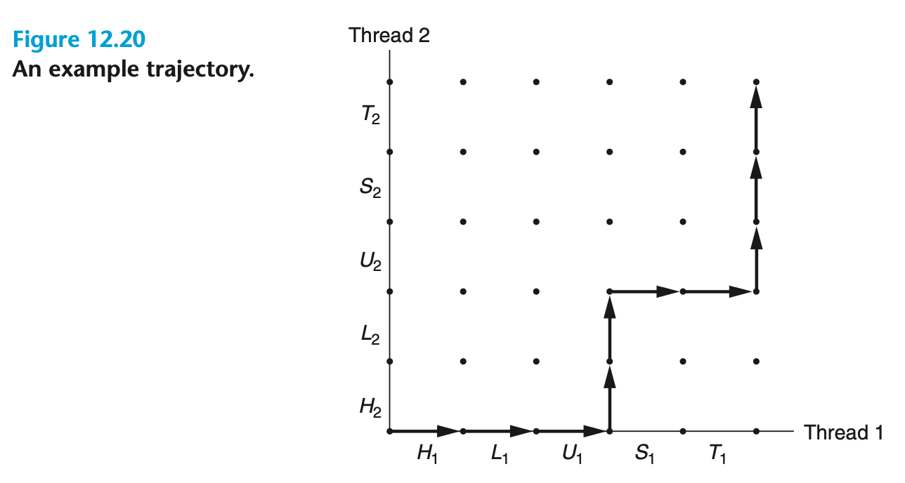

## Concurrent Programming

- Application-level concurrency is useful in some ways:
  - Accessing slow I/O devices
  - Interacting with humans
  - Reducing latency by deferring work
  - Servicing multiple network clients
  - Computing in parallel on multi-core machines
- Modern operating systems provide three basic approaches for building concurrent programs:
  - **Processes**: Since processes have separate virtual address spaces, flows that want to communicate with each other must use some kind of explicit **interprocess communication (IPC)** mechanism
  - **I/O multiplexing**: Logical flows are modeled as state machines that the main program explicitly transitions from state to state as a result of data arriving on file descriptors. Since the program is a single process, all flows share the same address space
  - **Threads**: Threads are logical flows that run in the context of a single process and are scheduled by the kernel

### Concurrent Programming with Processes

- A natural approach for building a concurrent server is to accept client connection requests in the parent and then create a new child process to service each new client
- How this might work:


- Code for a concurrent echo server based on processes (The parent forks a child to handle each new connection request):

```c
#include "csapp.h"

void echo(int connfd);

void sigchld_handler(int sig) {
  while (waitpid(-1, 0, WNOHANG) > 0)
    ;
  return;
}

int main(int argc, char **argv) {
  int listenfd, connfd;
  socklen_t clientlen;
  struct sockaddr_storage clientaddr;

  if (argc != 2) {
    fprintf(stderr, "usage: %s <port>\n", argv[0]);
    exit(0);
  }

  Signal(SIGCHLD, sigchld_handler);
  listenfd = Open_listenfd(argv[1]);
  while (1) {
    clientlen = sizeof(struct sockaddr_storage);
    connfd = Accept(listenfd, (SA *) &clientaddr, &clientlen);
    if (Fork() == 0) {
      Close(listenfd);   /* Child closes its listening socket */
      echo(connfd);      /* Child services client */
      Close(connfd);     /* Child closes connection with client */
      exit(0);           /* Child exits */
    }
    Close(connfd); /* Parent closes connected socket (important!) */
  }
}
```

- Pros and cons of processes
  - Processes have a clean model for sharing state information between parents and children: file tables are shared and user address spaces are not
  - Separate address spaces make it more difficult for processes to share state information
  - Another disadvantage of process-based designs is that they tend to be slower because the overhead for process control and IPC is high

### Concurrent Programming with I/O Multiplexing

- The basic idea is to use the `select` function to ask the kernel to suspend the process, returning control to the application only after one or more I/O events have occurred, as in the following examples:
  - Return when any descriptor in the set {0, 4} is ready for reading
  - Return when any descriptor in the set {1, 2, 7} is ready for writing
  - Time out if 152.13 seconds have elapsed waiting for an I/O event to occur

- `select` is a complicated function with many different usage scenarios. We will only discuss the first scenario: waiting for a set of descriptors to be ready for reading:

```c
#include <sys/select.h>

// Returns: nonzero count of ready descriptors, −1 on error
int select(int n, fd_set *fdset, NULL, NULL, NULL);

// Macros for manipulating descriptor sets
FD_ZERO(fd_set *fdset); /* Clear all bits in fdset */
FD_CLR(int fd, fd_set *fdset); /* Clear bit fd in fdset */
FD_SET(int fd, fd_set *fdset); /* Turn on bit fd in fdset */
FD_ISSET(int fd, fd_set *fdset); /* Is bit fd in fdset on? */
```

- `select` function takes two inputs:
  - A descriptor set(fdset) called the read set
  - The cardinality (n) of the read set (actually the maximum cardinality of any descriptor set)

- A descriptor `k` is ready for reading if and only if a request to read 1 byte from that descriptor would not block
- How we might use select to implement an iterative echo server that also accepts user commands on the standard input:

```c
#include "csapp.h"
void echo(int connfd);
void command(void);

int main(int argc, char **argv) {
  int listenfd, connfd;
  socklen_t clientlen;
  struct sockaddr_storage clientaddr;
  fd_set read_set, ready_set;
  if (argc != 2) {
    fprintf(stderr, "usage: %s <port>\n", argv[0]);
    exit(0);
  }
  listenfd = Open_listenfd(argv[1]);

  FD_ZERO(&read_set); /* Clear read set */
  FD_SET(STDIN_FILENO, &read_set); /* Add stdin to read set */
  FD_SET(listenfd, &read_set); /* Add listenfd to read set */

  while (1) {
    ready_set = read_set;
    Select(listenfd+1, &ready_set, NULL, NULL, NULL);
    if (FD_ISSET(STDIN_FILENO, &ready_set))
      command(); /* Read command line from stdin */
    if (FD_ISSET(listenfd, &ready_set)) {
      clientlen = sizeof(struct sockaddr_storage);
      connfd = Accept(listenfd, (SA *)&clientaddr, &clientlen);
      echo(connfd); /* Echo client input until EOF */
      Close(connfd);
    }
  }
}

void command(void) {
  char buf[MAXLINE];
  if (!Fgets(buf, MAXLINE, stdin))
    exit(0); /* EOF */
  printf("%s", buf); /* Process the input command */
}
```

- Initially we using `FD_ZERO` to create an empty read set:


- Then we define the read set to consist of descriptor 0 and descriptor 3


- Instead of waiting for a connection request by calling the accept function, we call the select function, which blocks until either the listening descriptor or standard input is ready for reading


- The program's problem is that once it connects to a client, it continues echoing input lines until the client closes its end of the connection
  - Thus, if you type a command to standard input, you will not get a response until the server is finished with the client
  - A better approach would be to multiplex at a finer granularity, echoing (at most) one text line each time through the server loop

#### A Concurrent Event-Driven Server Based on I/O Mutiplexing

- Informally, a state machine is a collection of states, input events, and transitions that map states and input events to states
- State machines are typically drawn as directed graphs, where nodes represent states, directed arcs represent transitions, and arc labels represent input events


- Concurrent echo server based on I/O multiplexing:

```c
#include "csapp.h"

typedef struct { /* Represents a pool of connected descriptors */
  int maxfd; /* Largest descriptor in read_set */
  fd_set read_set; /* Set of all active descriptors */
  fd_set ready_set; /* Subset of descriptors ready for reading */
  int nready; /* Number of ready descriptors from select */
  int maxi; /* High water index into client array */
  int clientfd[FD_SETSIZE]; /* Set of active descriptors */
  rio_t clientrio[FD_SETSIZE]; /* Set of active read buffers */
} pool;

int byte_cnt = 0; /* Counts total bytes received by server */

int main(int argc, char **argv) {
  int listenfd, connfd;
  socklen_t clientlen;
  struct sockaddr_storage clientaddr;
  static pool pool;

  if (argc != 2) {
    fprintf(stderr, "usage: %s <port>\n", argv[0]);
    exit(0);
  }
  listenfd = Open_listenfd(argv[1]);
  init_pool(listenfd, &pool);

  while (1) {
    /* Wait for listening/connected descriptor(s) to become ready */
    pool.ready_set = pool.read_set;
    pool.nready = Select(pool.maxfd+1, &pool.ready_set, NULL, NULL, NULL);

    /* If listening descriptor ready, add new client to pool */
    if (FD_ISSET(listenfd, &pool.ready_set)) {
      clientlen = sizeof(struct sockaddr_storage);
      connfd = Accept(listenfd, (SA *)&clientaddr, &clientlen);
      add_client(connfd, &pool);
    }

    /* Echo a text line from each ready connected descriptor */
    check_clients(&pool);
  }
}

void init_pool(int listenfd, pool *p) {
  /* Initially, there are no connected descriptors */
  int i;
  p->maxi = -1;
  for (i=0; i< FD_SETSIZE; i++)
    p->clientfd[i] = -1;

  /* Initially, listenfd is only member of select read set */
  p->maxfd = listenfd;
  FD_ZERO(&p->read_set);
  FD_SET(listenfd, &p->read_set);
}

void add_client(int connfd, pool *p) {
  int i;
  p->nready--;
  for (i = 0; i < FD_SETSIZE; i++) /* Find an available slot */
    if (p->clientfd[i] < 0) {
      /* Add connected descriptor to the pool */
      p->clientfd[i] = connfd;
      Rio_readinitb(&p->clientrio[i], connfd);

      /* Add the descriptor to descriptor set */
      FD_SET(connfd, &p->read_set);

      /* Update max descriptor and pool high water mark */
      if (connfd > p->maxfd)
        p->maxfd = connfd;
      if (i > p->maxi)
        p->maxi = i;
      break;
    }
  if (i == FD_SETSIZE) /* Couldn’t find an empty slot */
    app_error("add_client error: Too many clients");
}

void check_clients(pool *p) {
  int i, connfd, n;
  char buf[MAXLINE];
  rio_t rio;
  for (i = 0; (i <= p->maxi) && (p->nready > 0); i++) {
    connfd = p->clientfd[i];
    rio = p->clientrio[i];

    /* If the descriptor is ready, echo a text line from it */
    if ((connfd > 0) && (FD_ISSET(connfd, &p->ready_set))) {
      p->nready--;
      if ((n = Rio_readlineb(&rio, buf, MAXLINE)) != 0) {
        byte_cnt += n;
        printf("Server received %d (%d total) bytes on fd %d\n",
        n, byte_cnt, connfd);
        Rio_writen(connfd, buf, n);
      }

      /* EOF detected, remove descriptor from pool */
      else {
        Close(connfd);
        FD_CLR(connfd, &p->read_set);
        p->clientfd[i] = -1;
      }
    }
  }
}
```

#### Pros and Cons of I/O Multiplexing

- Pros:
  - Give programmers more control over the behavior of their programs than process-based designs
  - Every logical flow has access to the entire address space of the process
  - Do not require a process context switch to schedule a new flow
- Cons:
  - Coding complexity
  - Complexity increases as the granularity of the concurrency decreases (By granularity, we mean the number of instructions that each logical flow executes per time slice)
  - Event-based cannot fully utilize multi-core processors

### Concurrent Programming with Threads

- A **thread** is a logical flow that runs in the context of a process
- The threads are scheduled automatically by the kernel
  - Each thread has its own thread context, including a unique integer thread ID (TID), stack, stack pointer, program counter, general-purpose registers, and condition codes
  - All threads running in a process share the entire virtual address space of that process

#### Thread Execution Model

- The execution model for multiple threads is similar in some ways to the execution model for multiple processes, eg


- Because a thread context is much smaller than a process context, a thread context switch is faster than a process context switch
- The threads associated with a process form a pool of peers, independent of which threads were created by which other threads
- The main thread is distinguished from other threads only in the sense that it is always the first thread to run in the process
- The main impact of this notion of a pool of peers is that a thread can kill any of its peers or wait for any of its peers to terminate

#### Posix Threads

- Posix threads (Pthreads) is a standard interface for manipulating threads from C programs
- The Pthreads "Hello world!" program:

```c
#include "csapp.h"
void *thread(void *vargp);

int main() {
  pthread_t tid;
  Pthread_create(&tid, NULL, thread, NULL);
  Pthread_join(tid, NULL);
  exit(0);
}

void *thread(void *vargp) { /* Thread routine */
  printf("Hello, world!\n");
  return NULL;
}
```

- The code and local data for a thread are encapsulated in a thread routine. Each thread routine takes as input a single generic pointer and returns a generic pointer
- The main thread waits for the peer thread to terminate with the call to `pthread_join`

#### Creating Threads

- Threads create other threads by calling the pthread_create function:

```c
#include <pthread.h>

typedef void *(func)(void *);

// Returns: 0 if OK, nonzero on error
int pthread_create(pthread_t *tid, pthread_attr_t *attr, func *f, void *arg);
```

- The `pthread_create` function creates a new thread and runs the thread routine `f` in the context of the new thread and with an input argument of `arg`
- The attr argument can be used to change the default attributes of the newly created thread

- The new thread can determine its own thread ID by calling the `pthread_self` function:

```c
#include <pthread.h>

// Returns: thread ID of caller
pthread_t pthread_self(void);
```

#### Terminating Threads

- A thread terminates in one of the following ways:
  - The thread terminates implicitly when its top-level thread routine returns
  - The thread terminates explicitly by calling the `pthread_exit` function. If the main thread calls `pthread_exit`, it waits for all other peer threads to terminate and then terminates the main thread and the entire process with a return value of `thread_return`
  
  ```c
  #include <pthread.h>
  // Never returns
  void pthread_exit(void *thread_return);
  ```

  - Some peer thread calls the Linux `exit` function, which terminates the process and all threads associated with the process
  - Another peer thread terminates the current thread by calling the `pthread_cancel` function with the ID of the current thread:

  ```c
  #include <pthread.h>
  // Returns: 0 if OK, nonzero on error
  int pthread_cancel(pthread_t tid);
  ```

#### Reaping Terminated Threads

- Threads wait for other threads to terminate by calling the `pthread_join` function:

```c
#include <pthread.h>

// Returns: 0 if OK, nonzero on error
int pthread_join(pthread_t tid, void **thread_return);
```

- The pthread_join function blocks until thread tid terminates, assigns the generic `(void *)` pointer returned by the thread routine to the location pointed to by `thread_return`, and then **reaps any memory resources held by the terminated thread**

#### Detaching Threads

- At any point in time, a thread is **joinable** or **detached**
- In contrast with joinable thread, a detached thread cannot be reaped or killed by other threads
- Its memory resources are freed automatically by the system when it terminates
- By default, threads are created joinable. In order to avoid memory leaks, each joinable thread should be either explicitly reaped by another thread or detached by a call to the `pthread_detach` function:

```c
#include <pthread.h>
// Returns: 0 if OK, nonzero on error
int pthread_detach(pthread_t tid);
```

#### Initializing Threads

- The `pthread_once` function allows you to initialize the state associated with a thread routine:

```c
#include <pthread.h>
pthread_once_t once_control = PTHREAD_ONCE_INIT;

// Always returns 0
int pthread_once(pthread_once_t *once_control,void (*init_routine)(void));
```

- The `pthread_once` function is useful whenever you need to dynamically initialize global variables that are shared by multiple threads

#### A Concurrent Server Based on Threads

```c
#include "csapp.h"

void echo(int connfd);
void *thread(void *vargp);

int main(int argc, char **argv) {
  int listenfd, *connfdp;
  socklen_t clientlen;
  struct sockaddr_storage clientaddr;
  pthread_t tid;

  if (argc != 2) {
    fprintf(stderr, "usage: %s <port>\n", argv[0]);
    exit(0);
  }
  listenfd = Open_listenfd(argv[1]);

  while (1) {
    clientlen=sizeof(struct sockaddr_storage);
    connfdp = Malloc(sizeof(int));
    *connfdp = Accept(listenfd, (SA *) &clientaddr, &clientlen);
    Pthread_create(&tid, NULL, thread, connfdp);
  }
}

/* Thread routine */
void *thread(void *vargp) {
  int connfd = *((int *)vargp);
  Pthread_detach(pthread_self());
  Free(vargp);
  echo(connfd);
  Close(connfd);
  return NULL;
}
```

- The obvious approach is to pass a pointer to the descriptor, as in the following:

```c
connfd = Accept(listenfd, (SA *) &clientaddr, &clientlen);
Pthread_create(&tid, NULL, thread, &connfd);
```

- Then we have the peer thread dereference the pointer and assign it to a local variable, as follows:

```c
void *thread(void *vargp) {
  int connfd = *((int *)vargp);
  .
  .
  .
}
```

- This would be wrong, however, because it introduces a race between the assignment statement in the peer thread and the accept statement in the main thread
- In order to avoid the potentially deadly race, we must assign each connected descriptor returned by accept to its own dynamically allocated memory block

### Shared Variable in Threaded Programs

- There are some basic questions to work through in order to understand whether a variable in a C program is shared or not:
  - What is the underlying memory model for threads?
  - Given this model, how are instances of the variable mapped to memory?
  - Finally, how many threads reference each of these instances?
- The variable is shared if and only if multiple threads reference some instance of the variable

- eg.

```c
#include "csapp.h"
#define N 2
void *thread(void *vargp);

char **ptr; /* Global variable */

int main() {
  int i;
  pthread_t tid;
  char *msgs[N] = {
    "Hello from foo",
    "Hello from bar"
  };

  ptr = msgs;
  for (i = 0; i < N; i++)
    Pthread_create(&tid, NULL, thread, (void *)i);
  Pthread_exit(NULL);
}

void *thread(void *vargp) {
  int myid = (int)vargp;
  static int cnt = 0;
  printf("[%d]: %s (cnt=%d)\n", myid, ptr[myid], ++cnt);
  return NULL;
}
```

#### Threads Memory Model

- In an operational sense, it is impossible for one thread to read or write the register values of another thread
- Thus, registers are never shared, whereas virtual memory is always shared
- The memory model for the separate thread stacks is not as clean. These stacks are contained in the stack area of the virtual address space and are usually accessed independently by their respective threads
  - We say usually rather than always, because different thread stacks are not protected from other threads

#### Mapping Variable to Memory

- Variables in threaded C programs are mapped to virtual memory according to their storage classes:
  - **Global variables**: At run time, the read/write area of virtual memory contains exactly one instance of each global variable that can be referenced by any thread
  - **Local automatic variables**: At run time, each thread’s stack contains its own instances of any local automatic variables
  - **Local static variables**: As with global variables, the read/write area of virtual memory contains exactly one instance of each local static variable declared in a program

#### Shared Variables

- We say that a variable `v` is shared if and only if one of its instances is referenced by more than one thread

### Synchronizing Threads with Semaphores

- Shared variables can be convenient, but they introduce the possibility of nasty synchronization errors:

```c
/* WARNING: This code is buggy! */
#include "csapp.h"
void *thread(void *vargp); /* Thread routine prototype */ 5

/* Global shared variable */
volatile long cnt = 0; /* Counter */

int main(int argc, char **argv) {
  long niters;
  pthread_t tid1, tid2;

  /* Check input argument */
  if (argc != 2) {
    printf("usage: %s <niters>\n", argv[0]);
    exit(0);
  }
  niters = atoi(argv[1]);

  /* Create threads and wait for them to finish */
  Pthread_create(&tid1, NULL, thread, &niters);
  Pthread_create(&tid2, NULL, thread, &niters);
  Pthread_join(tid1, NULL);
  Pthread_join(tid2, NULL);

  /* Check result */
  if (cnt != (2 * niters))
    printf("BOOM! cnt=%ld\n", cnt);
  else
    printf("OK cnt=%ld\n", cnt);
  exit(0);
}

/* Thread routine */
void *thread(void *vargp) {
  long i, niters = *((long *)vargp);
  for (i = 0; i < niters; i++)
    cnt++;
  return NULL;
}
```

- We get different answer each time:

```
linux> ./badcnt 1000000
BOOM! cnt=1445085

linux> ./badcnt 1000000
BOOM! cnt=1915220

linux> ./badcnt 1000000
BOOM! cnt=1404746
```


- After we convert to assembly code, we can easily see the problem:
  - Notice that the head and tail manipulate only local stack variables, while Li, Ui, and Si manipulate the contents of the shared counter variable

- In general, there is no way for you to predict whether the operating system will choose a correct ordering for your threads, eg.


#### Progress Graphs

- A progress graph models instruction execution as a transition from one state to another
  - A transition is represented as a directed edge from one point to an adjacent point
  - Legal transitions move to the right (an instruction in thread 1 completes) or up (an instruction in thread 2 completes)
  - Two instructions cannot complete at the same time—diagonal transitions are not allowed
  - Programs never run backward so transitions that move down or to the left are not legal either

- eg. Two-dimensional progress graph for the first loop iteration of the badcnt.c program


- eg. H1, L1, U1, H2, L2, S1, T1, U2, S2, T2



- For thread i, the instructions `(Li, Ui, Si)` that manipulate the contents of the shared variable cnt constitute a critical section (with respect to shared variable cnt) that should not be interleaved with the critical section of the other thread
- In other words, we want to ensure that each thread has mutually exclusive access to the shared variable while it is executing the instructions in its critical section
  - The phenomenon in general is known as mutual exclusion.

- On the progress graph, the intersection of the two critical sections defines a region of the state space known as an unsafe region:


#### Semaphores

- A semaphore, `s`, is a global variable with a nonnegative integer value that can only be manipulated by two special operations, called `P` and `V`:
  - P(s): If s is nonzero, then P decrements s and returns immediately. If s is zero, then suspend the thread until s becomes nonzero and the thread is restarted by a V operation. After restarting, the P operation decrements s and returns control to the caller
  - V (s): The V operation increments s by 1. If there are any threads blocked at a P operation waiting for s to become nonzero, then the V operation restarts exactly one of these threads, which then completes its P operation by decrementing s

- Edsger Dijkstra (1930–2002) was originally from the Netherlands. The names P and V come from the Dutch words proberen (to test) and verhogen (to increment)

- Notice that the defi- nition of V does not define the order in which waiting threads are restarted
- Thus, when several threads are waiting at a semaphore, you cannot predict which one will be restarted as a result of the V
- he definitions of P and V ensure that a running program can never enter a state where a properly initialized semaphore has a negative value. This property, known as the semaphore invariant, provides a powerful tool for controlling the trajectories of concurrent programs

- Each semaphore must be initialized before it can be used:

```c
#include <semaphore.h>

// Returns: 0 if OK, −1 on error
int sem_init(sem_t *sem, 0, unsigned int value);
int sem_wait(sem_t *s);   /* P(s) */
int sem_post(sem_t *s);   /* V(s) */
```

#### Using Semaphores for Mutual Exclusion

- The basic idea is to associate a semaphore `s`, initially 1, with each shared variable (or related set of shared variables) and then surround the corresponding critical section with `P(s)` and `V(s)` operations
- A semaphore that is used in this way to protect shared variables is called a **binary semaphore** because its value is always 0 or 1
  - Binary semaphores whose purpose is to provide mutual exclusion are often called **mutexes(互斥锁)**
  - A semaphore that is used as a counter for a set of available resources is called a **counting semaphore**


- The crucial idea is that this combination of `P` and `V` operations creates a collection of states, called a forbidden region, where `s < 0`
- Multiprocessors behave in ways that cannot be explained by progress graphs

#### Using Semaphores to Schedule Shared Resources

- In this scenario, a thread uses a semaphore operation to notify another thread that some condition in the program state has become true

##### Producer-Consumer Problem


- Since inserting and removing items involves updating shared variables, we must guarantee mutually exclusive access to the buffer
- The buffer provides a reservoir of slots to the producer and a reservoir of encoded frames to the consumer

```c
#include "csapp.h"
#include "sbuf.h"

// code/conc/sbuf.h
typedef struct {
  int *buf;   /* Buffer array */
  int n;   /* Maximum number of slots */
  int front;   /* buf[(front+1)%n] is first item */
  int rear;   /* buf[rear%n] is last item */
  sem_t mutex;   /* Protects accesses to buf */
  sem_t slots;   /* Counts available slots */
  sem_t items;   /* Counts available items */
} sbuf_t;

/* Create an empty, bounded, shared FIFO buffer with n slots */
void sbuf_init(sbuf_t *sp, int n) {
  sp->buf = Calloc(n, sizeof(int));
  sp->n = n;                      /* Buffer holds max of n items */
  sp->front = sp->rear = 0;       /* Empty buffer iff front == rear */
  Sem_init(&sp->mutex, 0, 1);     /* Binary semaphore for locking */
  Sem_init(&sp->slots, 0, n);     /* Initially, buf has n empty slots */
  Sem_init(&sp->items, 0, 0);     /* Initially, buf has zero data items */
}

/* Clean up buffer sp */
void sbuf_deinit(sbuf_t *sp) {
  Free(sp->buf);
}

/* Insert item onto the rear of shared buffer sp */
void sbuf_insert(sbuf_t *sp, int item) {
  P(&sp->slots); /* Wait for available slot */
  P(&sp->mutex); /* Lock the buffer */
  sp->buf[(++sp->rear)%(sp->n)] = item; /* Insert the item */
  V(&sp->mutex); /* Unlock the buffer */
  V(&sp->items); /* Announce available item */
}

/* Remove and return the first item from buffer sp */
int sbuf_remove(sbuf_t *sp) {
  int item;
  P(&sp->items);  /* Wait for available item */
  P(&sp->mutex); /* Lock the buffer */
  item = sp->buf[(++sp->front)%(sp->n)]; /* Remove the item */
  V(&sp->mutex); /* Unlock the buffer */
  V(&sp->slots); /* Announce available slot */
  return item;
}
```

- The front and rear indices keep track of the first and last items in the array
- The `sbuf_insert` function waits for an available slot, locks the mutex, adds the item, unlocks the mutex, and then announces the availability of a new item. The `sbuf_remove` function is symmetric. After waiting for an available buffer item, it locks the mutex, removes the item from the front of the buffer, unlocks the mutex, and then signals the availability of a new slot

##### Readers-Writers Problem

- A collection of concurrent threads is accessing a shared object such as a data structure in main memory or a database on disk. Some threads only read the object, while others modify it
- Writers must have exclusive access to the object, but readers may share the object with an unlimited number of other readers
- Several Variations:
  - The **first readers-writers problem**, which favors readers, requires that no reader be kept waiting unless a writer has already been granted permission to use the object
  - The **second readers-writers problem**, which favors writers, re- quires that once a writer is ready to write, it performs its write as soon as possible
    - Unlike the first problem, a reader that arrives after a writer must wait, even if the writer is also waiting

- eg. first readers-writers problem

```c
/* Global variables */
int readcnt;    /* Initially = 0 */
sem_t mutex, w; /* Both initially = 1 */

void reader(void) {
  while (1) {
    P(&mutex);
    readcnt++;
    if (readcnt == 1) /* First in */
      P(&w);
    V(&mutex);

    /* Critical section */
    /* Reading happens  */

    P(&mutex);
    readcnt--;
    if (readcnt == 0) /* Last out */
      V(&w);
    V(&mutex);
  }
}

void writer(void) {
  while (1) {
    P(&w);
    /* Critical section */
    /* Writing happens  */
    V(&w);
  }
}
```

- As long as a single reader holds the w mutex, an unbounded number of readers can enter the critical section unimpeded
- A correct solution to either of the readers-writers problems can result in **starvation**, where a thread blocks indefinitely and fails to make progress

##### Putting It Together: A Concurrent Server Based on Prethreading

- A server based on prethreading tries to reduce this overhead by using the producer-consumer model:


- A prethreaded concurrent echo server:

```c
#include "csapp.h"
#include "sbuf.h"
#define NTHREADS  4
#define SBUFSIZE  16

void echo_cnt(int connfd);
void *thread(void *vargp);

sbuf_t sbuf; /* Shared buffer of connected descriptors */

int main(int argc, char **argv) {
  int i, listenfd, connfd;
  socklen_t clientlen;
  struct sockaddr_storage clientaddr;
  pthread_t tid;

  if (argc != 2) {
    fprintf(stderr, "usage: %s <port>\n", argv[0]);
    exit(0);
  }
  listenfd = Open_listenfd(argv[1]);

  sbuf_init(&sbuf, SBUFSIZE);
  for (i = 0; i < NTHREADS; i++)  /* Create worker threads */
    Pthread_create(&tid, NULL, thread, NULL);

  while (1) {
    clientlen = sizeof(struct sockaddr_storage);
    connfd = Accept(listenfd, (SA *) &clientaddr, &clientlen);
    sbuf_insert(&sbuf, connfd); /* Insert connfd in buffer */
  }
}

void *thread(void *vargp) {
  Pthread_detach(pthread_self());
  while (1) {
    int connfd = sbuf_remove(&sbuf); /* Remove connfd from buffer */
    echo_cnt(connfd);                /* Service client */
    Close(connfd);
  }
}
```

- `echo_cnt`: A version of echo that counts all bytes received from clients:

```c
#include "csapp.h"

static int byte_cnt; /* Byte counter */
static sem_t mutex; /* and the mutex that protects it */

static void init_echo_cnt(void) {
  Sem_init(&mutex, 0, 1);
  byte_cnt = 0;
}

void echo_cnt(int connfd) {
  int n;
  char buf[MAXLINE];
  rio_t rio;
  static pthread_once_t once = PTHREAD_ONCE_INIT;

  Pthread_once(&once, init_echo_cnt);
  Rio_readinitb(&rio, connfd);
  while((n = Rio_readlineb(&rio, buf, MAXLINE)) != 0) {
    P(&mutex);
    byte_cnt += n;
    printf("server received %d (%d total) bytes on fd %d\n", n, byte_cnt, connfd);
    V(&mutex);
    Rio_writen(connfd, buf, n);
  }
}
```
