## Machine-Level Representation of Programs

- **Reverse Engineering**: Trying to understand the process by which a system was created by studying the system and working backward

### Program Encodings

```
$> gcc -Og -o p p1.c p2.c
```

- `gcc` indicates the GCC C compiler
- `-Og` instructs the compiler to apply a level of optimization that yields machine code that follow the overall structure of the original C code
- The process of `gcc` command
  1. The C **preprocessor** expands the source code to include any files specified with `#include` and to expand any macros (`#define`)
  2. Compiler generates assembly code of two source files p1.s and p2.s
  3. Assembler converts the assembly code into binary object-code files p1.o and p2.o
  4. Linker merges these two object-code files along with code implementing library functions (eg. printf) and generate final executable code file p which is exact form of code that is executed by the processor

#### Machine-Level Code

- The assembly code representation is very close to machine code
  - Its main feature is that it is in a more readable textual format, as compared to the binary format of machine code
- Being able to understand assembly code and how it relates to the original C code is a key step in understanding how computers execute programs
- Parts of the processor state are visible in assembly code but hidden from the C programmer:
  - The **program counter**, indicate the address in memory of the next instruction to be executed
  - The integer **register file**, can hold different data, eg. address, integer data, local variable
  - The condition code registers hold status information about the most recently executed arithmetic or logical instruction
  - A set of vector registers can each hold one or more integer or floating-point values
- Machine code views the memory as simply a large byte-addressable array (virtual addresses)
  - Operation system manage virtual addresses and transform them to physical addresses

#### Code Examples

```c
// mstore.c
long mult2(long, long);

void multstore(long x, long y, long *dest) {
  long t = mult2(x, y);
  *dest = t;
}
```

- After execute `$> gcc -Og -S mstore.c` we can get assembly code file
- After execute `$> gcc -Og -c mstore.c` we can get object code file
- After execute `$> objdump -d mstore.o`, we can get assembly code from corresponding byte:

```
mstore.o:       file format mach-o 64-bit x86-64

Disassembly of section __TEXT,__text:

0000000000000000 <_multstore>:
       0: 55                            pushq   %rbp
       1: 48 89 e5                      movq    %rsp, %rbp
       4: 53                            pushq   %rbx
       5: 50                            pushq   %rax
       6: 48 89 d3                      movq    %rdx, %rbx
       9: e8 00 00 00 00                callq   0xe <_multstore+0xe>
       e: 48 89 03                      movq    %rax, (%rbx)
      11: 48 83 c4 08                   addq    $8, %rsp
      15: 5b                            popq    %rbx
      16: 5d                            popq    %rbp
      17: c3                            retq
```

- In assembly code, all lines beginning with `.` are directives to guide the assembler and linker
- There are 2 version of assembly-code: ATT (Default in GCC) and Intel

### Data Formats

- Due to its origins as a 16-bit architecture, Intel uses the term `word` to refer to a 16-bit datatype
  - 32-bit quantities as `double words`
  - 64-bit quantities as `quad words`

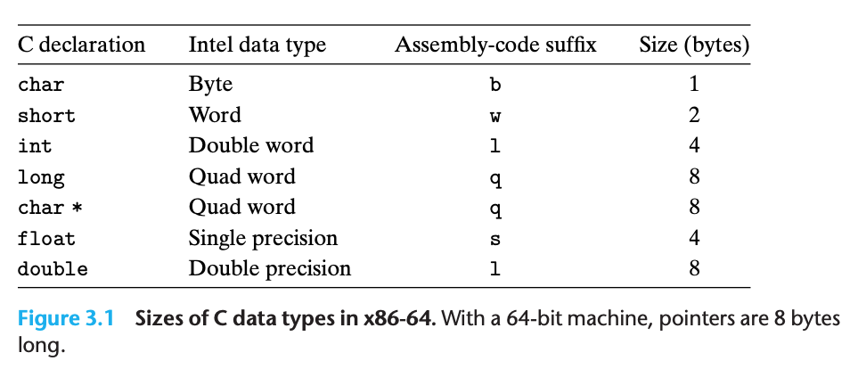

### Accessing Information

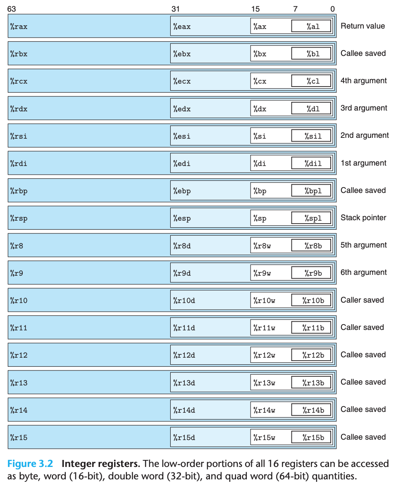

- When instructions have registers as destinations, 2 conventions arise for what happens to the remaining bytes in the register for instructions that generate less than 8 bytes:
  1. Those that generate 1-byte or 2-byte quantities leave the remaining bytes unchanged
  2. Those that generate 4-byte quantities set the upper 4 bytes of the register to zero (adopted as part of the expansion from IA32 to x86-64)

#### Operand Specifiers

- There are many different addressing modes allowing different forms of memory references, below is the most general form:

$$ Imm(r_b,r_i,s) $$

- 4 components:
  1. Immediate offset `Imm`
  2. A base register $ r_b $
  3. An index register $ r_i $
  4. A scale factor s

- The effective address is computed as

$$ Imm + R[r_b] + R[r_i] * s $$

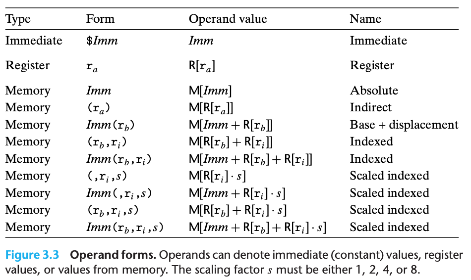

#### Data Movement Instructions

- x86-64 imposes the restriction that a move instruction cannot have both operands refer to memory locations (which requires 2 instructions)

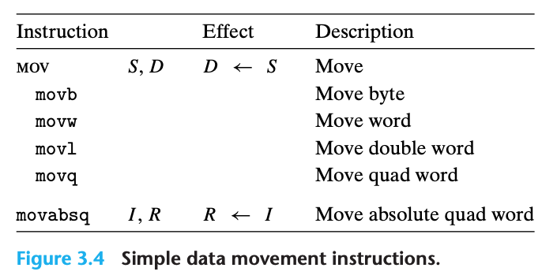

- The `movq` instruction can only have immediate source operands that can be represented as 32-bit two's-complement numbers, which is sign extended to produce the 64-bit value for the destination
- The `movabsq` instruction can hava an arbitrary 64-bit immediate value as its source operand and can only have a register as a destination

- Beside the simple movement instructions, we also have zero-extending and sign-extending movement instructions

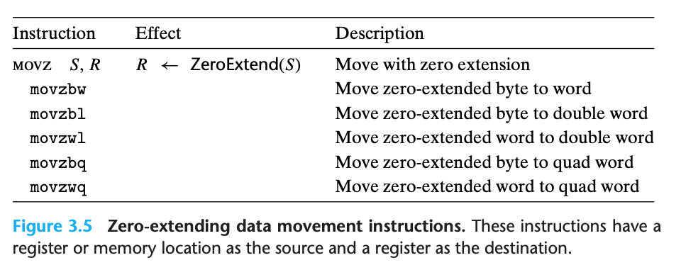

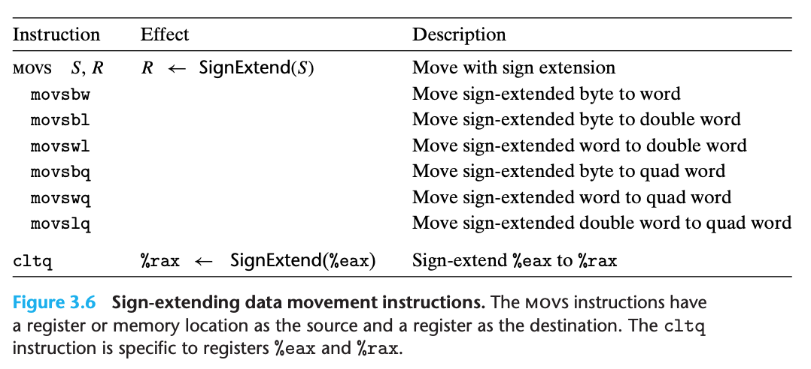

- There is no `movzlq` which can be implemented using a `movl` instruction
- `cltq` is same as `movslq %eax %rax` but has a more compact encodings

#### Data Movement Example

```c
long exchange(long *xp, long *yp) {
  long x = *xp;
  *xp = y;
  return x;
}
```

will be translated in assembly code below:

```
exchange:
  movq  (%rdi), %rax
  movq  %rsi, (%rdi)
  ret
```

- `pointer` in C are simply addresses
- Local variable such as `x` are often kept in register rather than memory

#### Pushing and Popping Stack Data

- With x86-64, the program stack is stored in some region of memory
- There are 2 instruction to push data onto and pop data from program stack

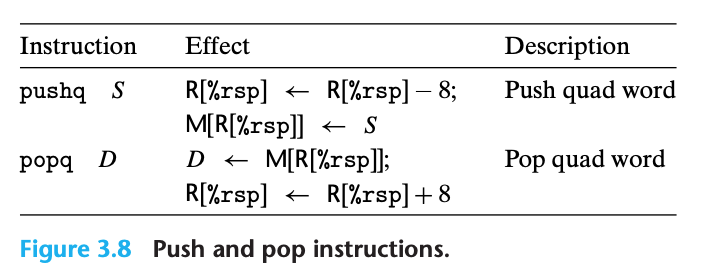

- The stack grows downward such that the top element of the stack has the lowest address of all stack element

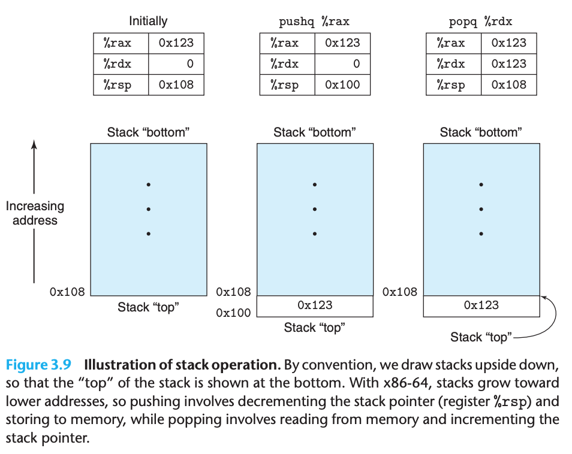

- The behavior of the instruction `pushq %rbp` is equal to instructions below(pushq instruction just single byte, but the instruction below need 8 bytes):
```
subq $8, %rsp
movq %rbp, (%rsp)
```
- The behavior of the instruction `pupq %rax` is equal to instructions below:
```
movq (%rsp), %rax
addq $8, %rsp
```

- Stack is contained in the same memory as the program code and other forms of program data, programs can access arbitrary position within the stack using the standard memory addressing methods. eg. `movq 8(%rsp), %rdx`

### Arithmetic and Logical Operations

- The x86-64 integer and logic operations instruction classes (Only leaq has no variants, just single instruction)

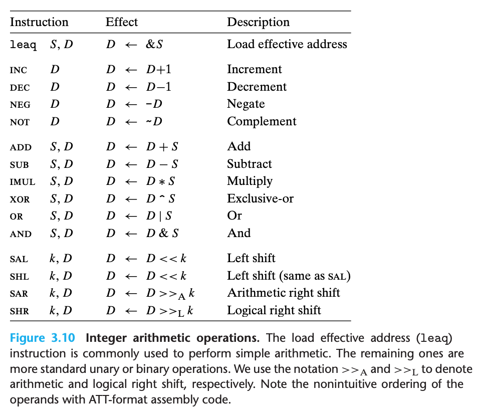

#### Load Effective Address

- `leaq` is actually a variant of the `movq` instruction, it has the form that reads from memory to a register, but it does not reference at all
- Its first operand appears to be a memory reference, but **instead of reading from the designated location, the instruction copies the effective address to the destination**
- This instruction can be used to generate pointers for later memory references

- eg. compiler often find clever uses of `leaq` that have nothing to do with effective address computation
```c
long scale(long x, long y, long z) {
  long t = x + 4 * y + 12 * z;
  return t;
}
```

```
x in %rdi, y in %rsi, z in %rdx
scale:
  leaq  (%rdi,%rsi,4), %rax
  leaq  (%rdx,%rdx,2), %rdx
  leaq  (%rax,%rdx,4), %rax
  ret
```

#### Unary and Binary Operations

- **Unary operation** with the single operand serving as both source and destination
  - eg. `incq (%rsp)` causes the 8-byte element on the top of stack to be incremented
- **Binary operation** with the second operand is used as both a source and a destination
  - eg. `subq %rax,%rdx` decrements register `%rdx` by the value in `%rax`
  - As with the `MOV` instructions, the two operands cannot both be memory locations

#### Shift Operations

- Shift amount is given first and the value to shift is given second
- The destination operand of a shift operation can be either a register or a memory location
- These instructions are unusual in only allowing `%cl` as the operand

#### Special Arithmetic Operations

- Instructions that support generating the full 128-bit product of two 64-bit numbers, as well as integer division:

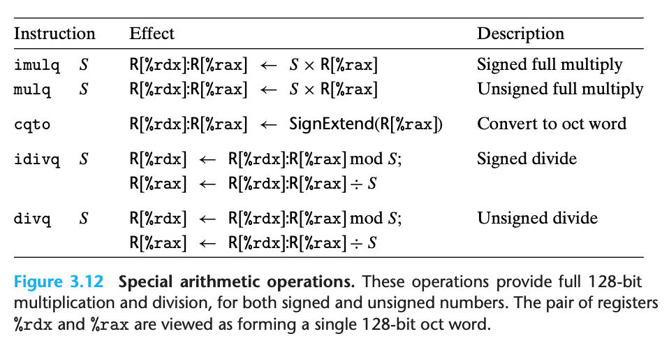

- Although the name `imulq` is used for two distinct multiplication operations, the assembler can tell which one is intended by counting the number of operands
- eg for multiplication.

```c
#include <inttypes.h>

typedef unsigned __int128 uint128_t;

void store_uprod(uint128_t *dest, uint64_t x, uint64_t y) {
  *dest = x * (uint128_t)y;
}
```

```
dest in %rdi, x in %rsi, y in %rdx
store_uprod:
  movq  %rsi, %rax
  mulq  %rdx
  movq  %rax, (%rdi)
  movq  %rax, 8(%rdi)
  ret
```

- Storing the product requires two `movq` instructions

### Control

- 2 mechanisms for implementing conditional behavior in machine code:
  - Tests data values and then alters either the **control flow** or the **data flow** based on the results of these tests

#### Condition Codes

- CPU maintains a set of single-bit **condition code** registers describing attributes of the most recent arithmetic or logical operation:
  - CF: Carry Flag -> Used to detect overflow for unsigned operations
  - ZF: Zero Flag -> The most recent operation yielded zero
  - SF: Sign Flag -> The most recent operation yielded a negative value
  - OF: Overflow Flag -> The most recent operation caused a two's-complement overflow - either negative or positive
- Two instruction classes that set condition code without altering any other registers

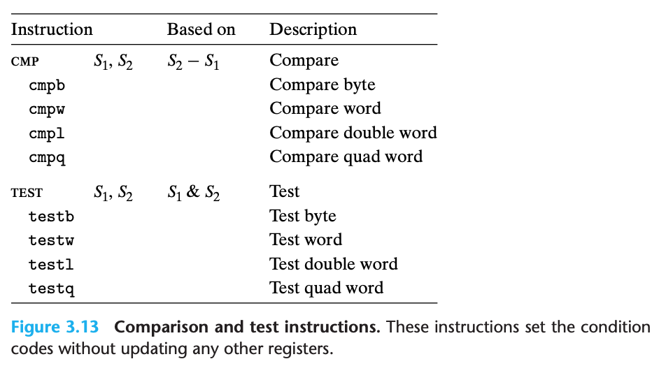

#### Accessing the Condition Codes

- 3 common ways of using the condition codes:
  1. Set a single byte to 0 or 1 depending on some combination of the condition codes
  2. Conditionally jump to other part of the program
  3. Conditionally transfer data
- For the first case:

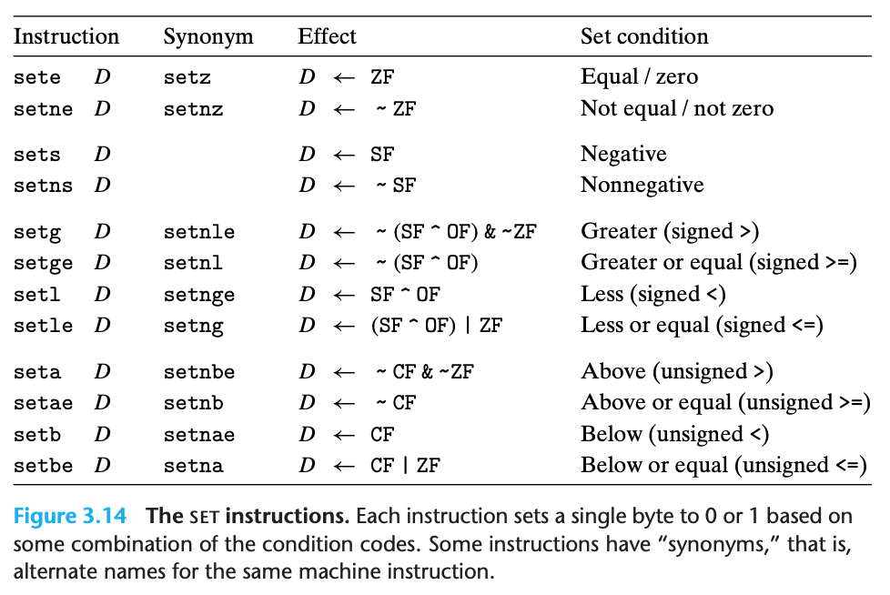

- For these instructions, the suffixes denote different conditions and not different operand sizes

#### Jump Instructions

- Different jump instructions:

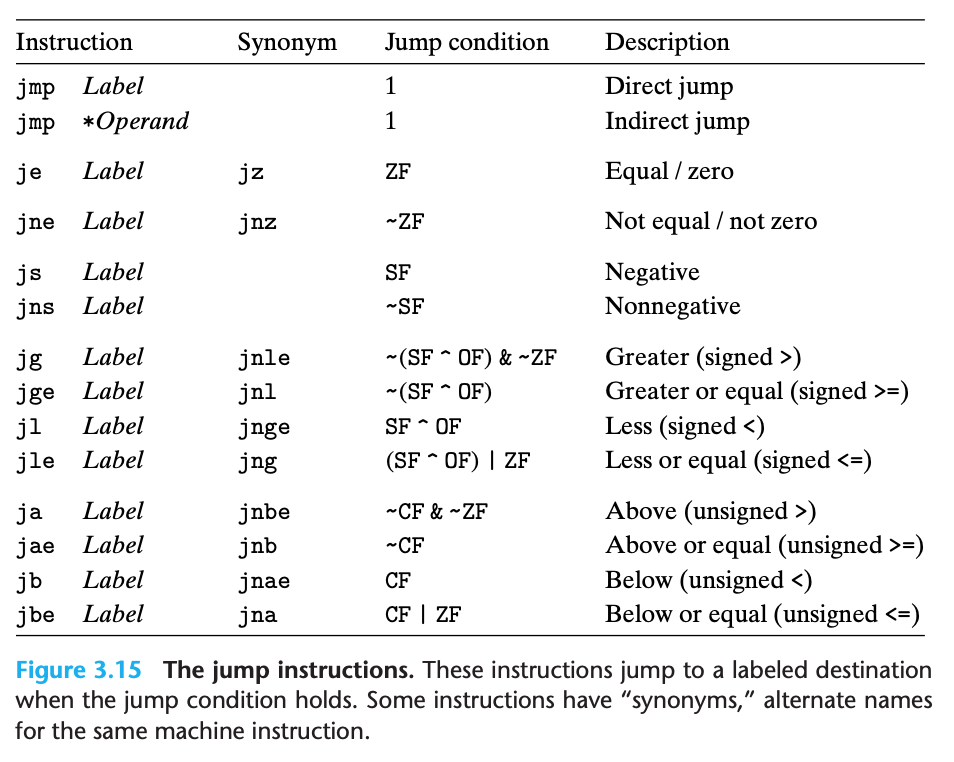

- **Direct Jump**: Jump target is encoded as part of the instructions
- **Indirect Jump**: Jump target is read from a register or a memory location
- **Conditional Jump**: Jump or not depending on some combination of the condition codes (can only be direct)

#### Jump Instruction Encodings

- Common encoding ways (assembler and linker will select appropriate one):
  1. Encode the difference between the address of the target instruction and the address of the instruction immediately following the jump
  2. Give an "absolute" address, using 4 bytes to directly specify the target

- eg.

```
1 movq %rdi, %rax
2 jmp .L2
3 .L3:
4 sarq %rax
5 .L2:
6 testq %rax, %rax
7 jg .L3
8 rep; ret
```

assembler will generate machine code below:

```
1 0: 48 89 f8 mov %rdi,%rax
2 3: eb 03 jmp 8 <loop+0x8>
3 5: 48 d1 f8 sar %rax
4 8: 48 85 c0 test %rax,%rax
5 b: 7f f8 jg 5 <loop+0x5>
6 d: f3 c3 repz retq
```

After linker:

```
1 4004d0: 48 89 f8 mov %rdi,%rax
2 4004d3: eb 03 jmp 4004d8 <loop+0x8>
3 4004d5: 48 d1 f8 sar %rax
4 4004d8: 48 85 c0 test %rax,%rax
5 4004db: 7f f8 jg 4004d5 <loop+0x5>
6 4004dd: f3 c3 repz retq
```

- The jump instructions provide a means to implement conditional execution (if), as well as several different loop constructs

#### Implementing Conditional Branches with Conditional Control

- eg. original C code
```c
long lt_cnt = 0;
long ge_cnt = 0;
long absdiff_se(long x, long y)
{
  long result;
  if (x < y) {
    lt_cnt++;
    result = y - x;
  }
  else {
    ge_cnt++;
    result = x - y;
  }
  return result;
}
```

- equivalent goto version

```c
long gotodiff_se(long x, long y)
{
  long result;
  if (x >= y)
    goto x_ge_y;
  lt_cnt++;
  result = y - x;
  return result;
  x_ge_y:
    ge_cnt++;
    11 result = x - y;
    return result;
}
```

- Generated assembly code

```
long absdiff_se(long x, long y)
x in %rdi, y in %rsi
1 absdiff_se:
2 cmpq %rsi, %rdi Compare x:y
3 jge .L2 If >= goto x_ge_y
4 addq $1, lt_cnt(%rip) lt_cnt++
5 movq %rsi, %rax
6 subq %rdi, %rax result=y-x
7 ret Return
8 .L2: x_ge_y:
9 addq $1, ge_cnt(%rip) ge_cnt++
10 movq %rdi, %rax
11 subq %rsi, %rax result=x-y
12 ret Return
```

- That the control flow of the assembly code generated for `absdiff_se` closely follows the goto code of `gotodiff_se`

```c
if (test-expr)
  then-statement
else
  else-statement
```

```c
  t = test-expr;
  if (!t)
    goto false;
  then-statement
  goto done;
false:
  else-statement
done:
```

#### Implementing Conditional Branches with Conditional Moves

- Original C code

```c
long lt_cnt = 0;
long ge_cnt = 0;
long absdiff(long x, long y)
{
  long result;
  if (x < y)
    result = y - x;
  else
    result = x - y;
  return result;
}
```

- Implementation using conditional assignment

```c
long cmovdiff(long x, long y)
{
  long rval = y-x;
  long eval = x-y;
  long ntest = x >= y;
  /* Line below requires single instruction: */
  if (ntest) rval = eval;
  return rval;
}
```

- Generated assembly code

```
long absdiff(long x, long y)
x in %rdi, y in %rsi
absdiff:
  movq %rsi, %rax
  subq %rdi, %rax                         rval = y-x
  movq %rdi, %rdx
  subq %rsi, %rdx                         eval = x-y
  cmpq %rsi, %rdi                         Compare x:y
  cmovge %rdx, %rax                       If >=, rval = eval
  ret                                     Return tval
```

- The key point is `cmovge` which will transfer the data from the source register to the desination, only if the cmpq instruction of line 6 indicates that one value is greater than or equal to the other (as indicated by the suffix ge)
- The flow of control does not depend on data, and this makes it easier for the processor to keep its pipeline full

- Conditional move instructions available with x86-64:

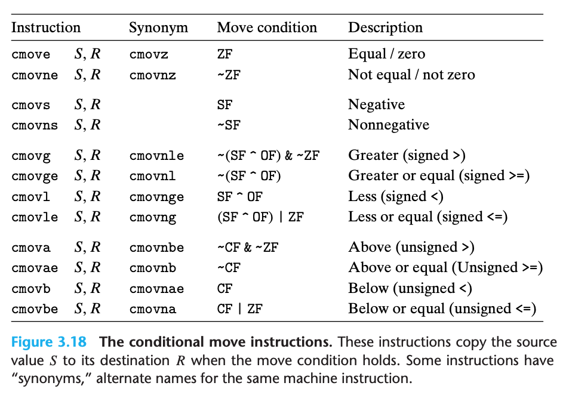

- The source and destination values can be 16, 32 or 64 bits long. Single byte conditional moves are not supported
- The assembler can infer the operand length of a conditional move instruction from the name of the destination register
  - So the same instruction name can be used for all operand lengths

- General code structure for conditional move
```
v  = then-expr;
ve = else-expr;
t  = test-expr;
if(!t) v = ve;
```

#### Loops

- Combinations of conditional tests and jumps are used to implement the effect of loops, there are 2 basic loop patterns

##### Do-While Loop

```
do
  body-statement
while (test-expr);
```

can be translated to `goto` statement below:

```
loop:
  body-statement
  t = test-expr;
  if(t)
    goto loop
```

- eg.

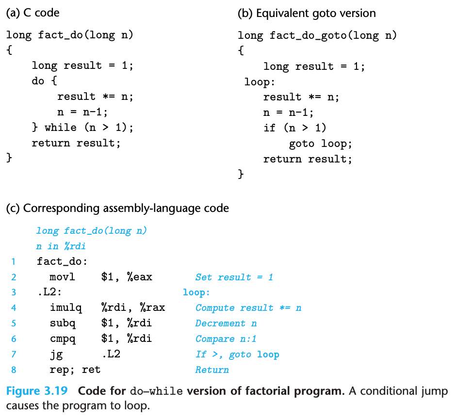

##### While Loops

```
while (test-expr)
  body-statement
```

- First translation method - **jump to middle**:

```
goto test;
loop:
  body-statement
test:
  t = test-expr;
  if (t)
    goto loop;
```

- eg.

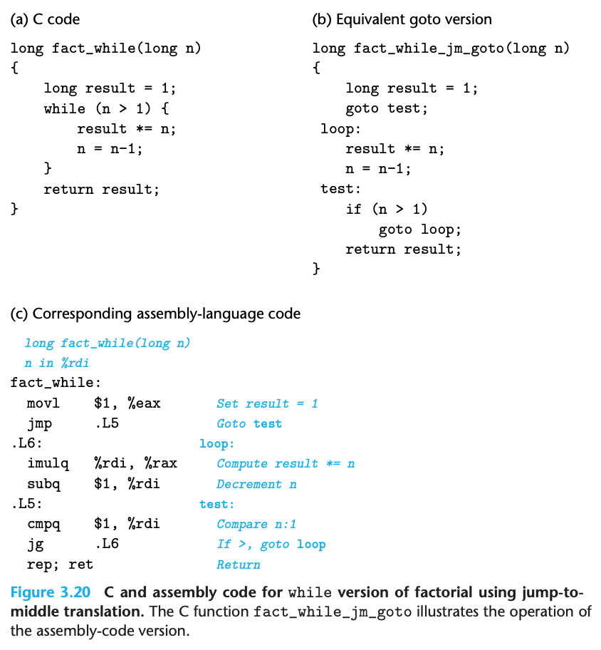

- Second translation method - **guarded do**

- First transforms the code into do-while
```
t = test-expr;
if (!t)
  goto done;
do
  body-statement
  while (test-expr);
done:
```

- Then, transform into `goto` code

```
t = test-expr;
if (!t)
  goto done;
loop:
  body-statement
  t = test-expr;
  if (t)
  goto loop;
done:
```

- eg.

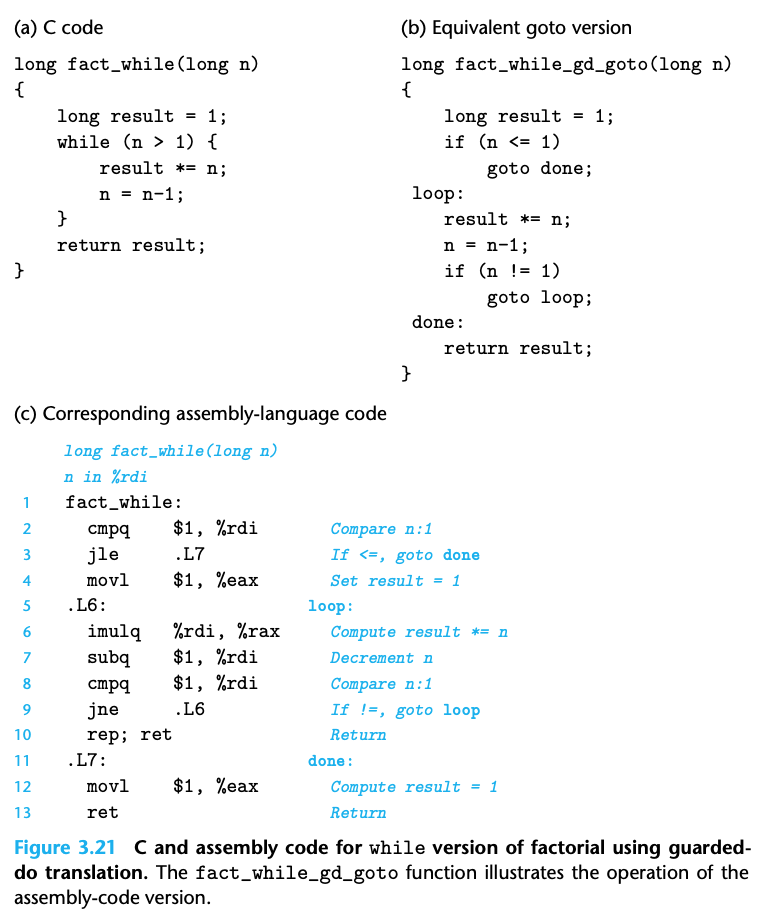

- Using this implementation strategy, the compiler can often optimize the initial test

##### For Loops


```
for (init-expr; test-expr; update-expr)
  body-statement
```

- Such a loop is identical to the following code using a while loop:

```
init-expr;
while (test-expr) {
  body-statement
  update-expr;
}
```

- Using **jump-to-middle** strategy
```
  init-expr;
  goto test;
loop:
  body-statement
  update-expr;
test:
  t = test-expr;
  if (t)
    goto loop;
```

- Using **guarded-do** strategy:
```
  init-expr;
  t = test-expr;
  if (!t)
    goto done;
loop:
  body-statement
  update-expr;
  t = test-expr;
  if (t)
    goto loop;
done:
```

#### Switch Statements

- The advantage of using a jump table over a long sequence of if-else statements is that the time token to perform the switch is independent of the number of switch cases
- The author of GCC created a new operator `&&` to create a pointer for a code location

- eg.

```c
void switch_eg(long x, long n, long *dest)
{
  long val = x;
  switch (n) {
  case 100:
    val *= 13;
    break;
  case 102:
    val += 10;
    /* Fall through */
  case 103:
    val += 11;
    break;
  case 104:
  case 106:
    val *= val;
    break;
  default:
    val = 0;
  }
  *dest = val;
}
```

- Trnaslation into extended C

```c
void switch_eg_impl(long x, long n, long *dest)
{
  /* Table of code pointers */
  static void *jt[7] = {
    &&loc_A, &&loc_def, &&loc_B,
    &&loc_C, &&loc_D, &&loc_def,
    &&loc_D
  };
  unsigned long index=n- 100;
  long val;

  if (index > 6)
    goto loc_def;
  /* Multiway branch */
  goto *jt[index];

  loc_A: /* Case 100 */
    val = x * 13;
    goto done;
  loc_B: /* Case 102 */
    x = x + 10;
    /* Fall through */
  loc_C: /* Case 103 */
    val = x + 11;
    goto done;
  loc_D: /* Cases 104, 106 */
    val = x * x;
    goto done;
  loc_def: /* Default case */
    val = 0;
  done:
    *dest = val;
}
```

- Assembly code:

```
void switch_eg(long x, long n, long *dest)
x in %rdi, n in %rsi, dest in %rdx
switch_eg:
  subq $100, %rsi                             Compute index = n-100
  cmpq $6, %rsi                               Compare index:6
  ja .L8                                      If >, goto loc_def
  jmp *.L4(,%rsi,8)                           Goto *jg[index]
.L3:                                          loc_A:
  leaq (%rdi,%rdi,2), %rax                    3*x
  leaq (%rdi,%rax,4), %rdi                    val = 13*x
  jmp .L2                                     Goto done
.L5:                                          loc_B:
  addq $10, %rdi                              x = x + 10
.L6:                                          loc_C:
  addq $11, %rdi                              val = x + 11
  jmp .L2                                     Goto done
.L7:                                          loc_D:
  imulq %rdi, %rdi                            val = x * x
  jmp .L2                                     Goto done
.L8:                                          loc_def:
  movl $0, %edi                               val = 0
.L2:                                          done:
  movq %rdi, (%rdx)                           *dest = val
  ret                                         Return
```

- In the assembly code, the jump table is indicated by the following declarations
```
  .section .rodata
  .align 8                              Align address to multiple of 8
.L4:
  .quad .L3                             Case 100: loc_A
  .quad .L8                             Case 101: loc_def
  .quad .L5                             Case 102: loc_B
  .quad .L6                             Case 103: loc_C
  .quad .L7                             Case 104: loc_D
  .quad .L8                             Case 105: loc_def
  .quad .L7                             Case 106: loc_D
```

- The key step in executing a switch statement is to access a code location through the jump table

### Procedures

- Procedures are key abstraction in software. Come in many guises in different programming languages - functions, methods, subroutines, handlers, etc
- Mechanism in procedures:
  - **Passing control**
  - **Passing data**
  - **Allcating and deallocating memory**

#### The Run-Time Stack

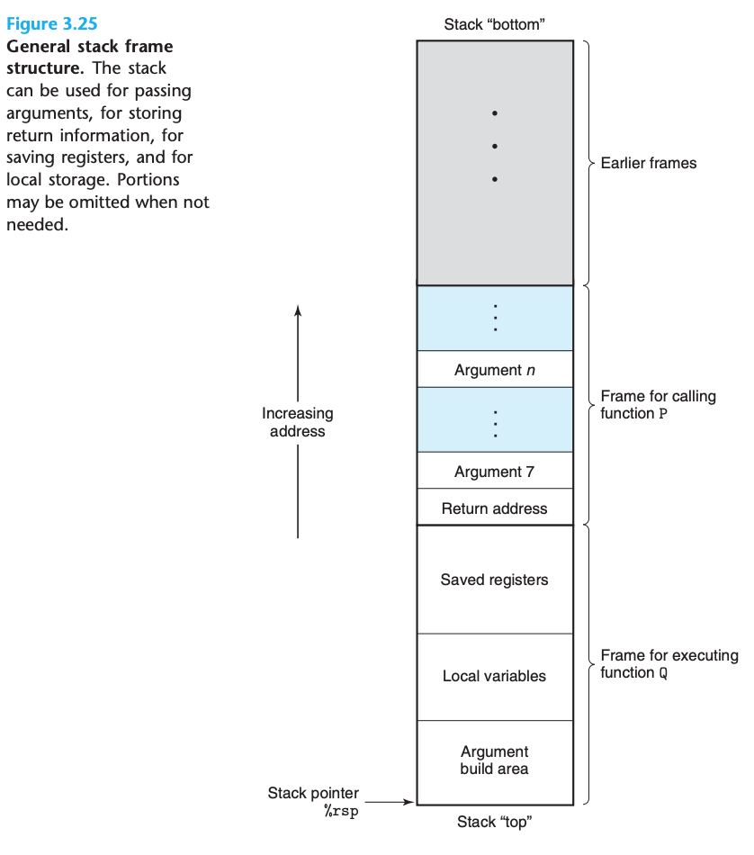

- **Return Address**: Indicating where the program should resume once callee function return
- The frame for the currently executing procedure is always at the top of the stack
- Procedure can pass up to **six** integral values, for more arguments, can be stored within its stack frame prior to the call
- Many functions do not even require a stack frame. This occurs when all of the local variables can be held in registers and the function does not call any other functions

#### Control Transfer

- Example of calls and returns

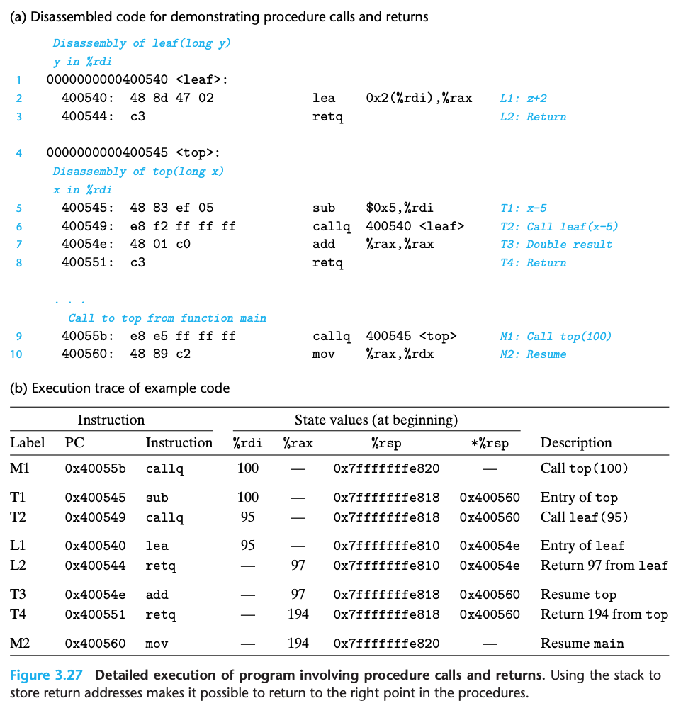

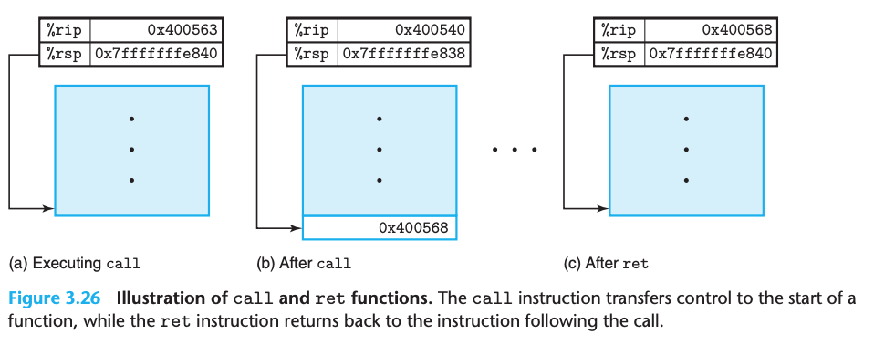

- `%rsp` -> stack pointer
- `%rip` -> program counter

#### Data Transfer

- With x86-64, up to six integral arguments can be passed via registers

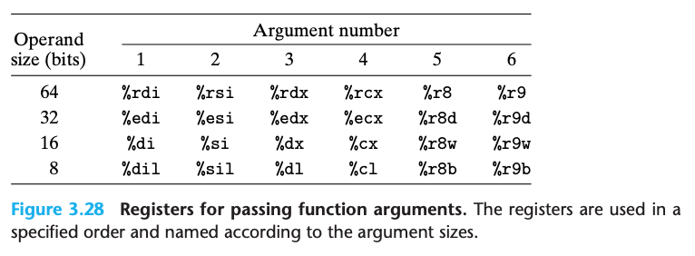

- When a function has more than six integral arguments, the other ones are passed on the stack
- When passing parameters on the stack, all data sizes are rounded up to be multiples of eight

#### Local Storage on the Stack

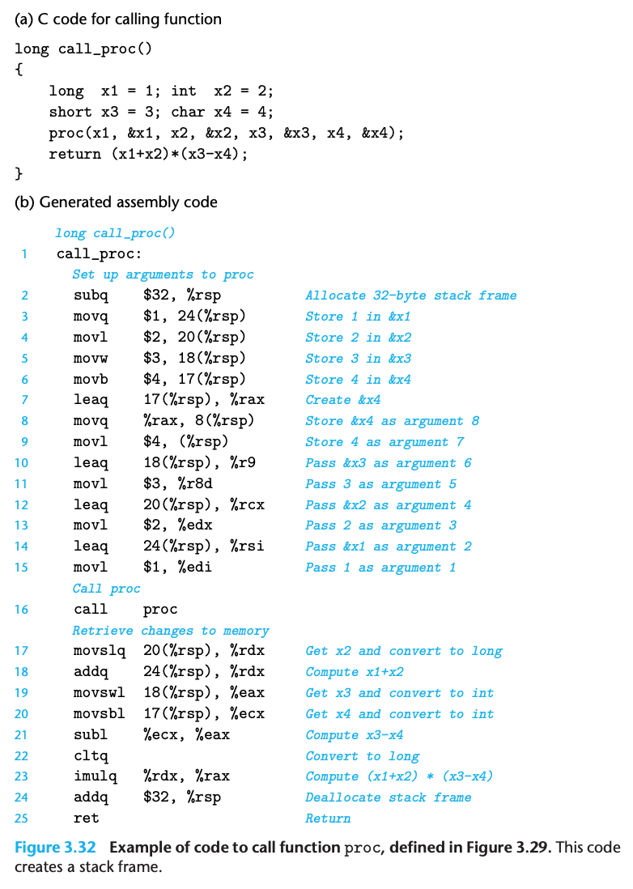

- The stack frame:

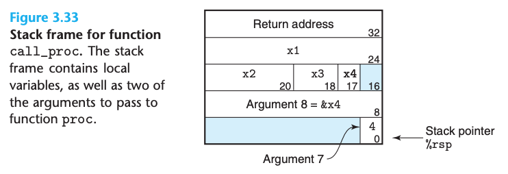

#### Local Storage in Registers

- Register `%rbx`, `%rbp`, and `%r12-%r15` are classified as **callee-saved** registers
  - When procedure P call procedure Q, Q must preserve the values of these registers, ensuring that they have the same values when Q returns to P as they did when Q was called
  - Procedure Q can preserve a register value by either not changing it at all or by pushing the original value on the stack (**Saved Register**), altering it and poping the old value from stack before returning

#### Recursive Procedure

- eg.

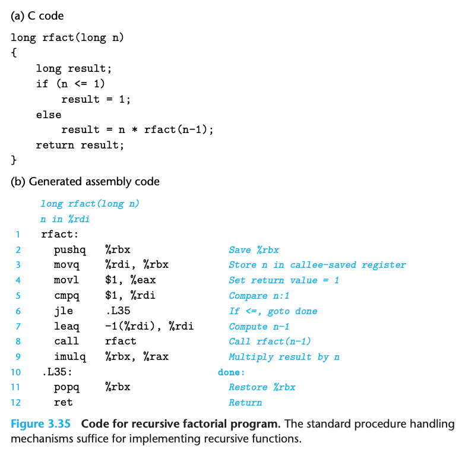

- Calling a function recursively proceeds just like any other function call

### Array Allocation and Access

#### Basic Principle

- Array element `i` can be access at address $ x_A + L * i $
  - $ x_A $ is the starting location/address
  - $ L $ is the size of data type
- eg.

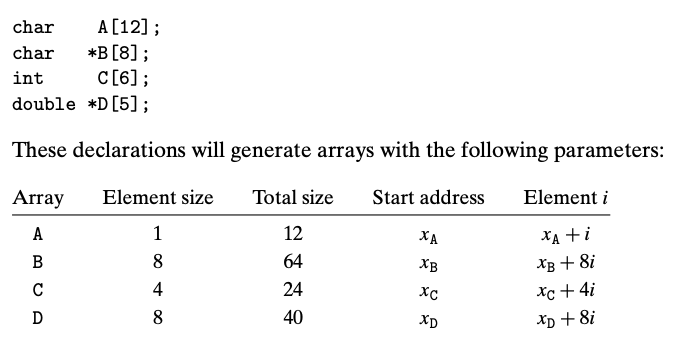

#### Pointer Arithmetic

- `Expr` denoting some object, `&Expr` is a pointer giving the address of the object
- `AExpr` denoting an address, `*AExpr` gives the value at that address

- Suppose the starting address of integer array `E` and integer `i` are stored in register `%rdx` and `%rcx`, respectively

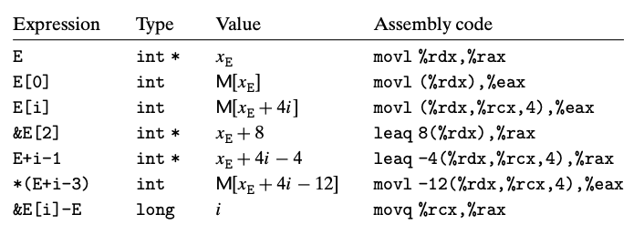

#### Nested Arrays

- For an array declared as `T D[R][C]`, array element `D[i][j]` is at memory address (L is the size of type T):

$$ &D[i][j] = x_D + L(C * i + j) $$

- Following assembly code can use to copy the element to register:

```
D in %rdi, i in %rsi, and j in %rdx
  leaq (%rsi,%rsi,2), %rax
  leaq (%rdi,%rax,4), %rax
  movl (%rax,%rdx,4), %eax
```

#### Fixed-Size Arrays

- The C compiler is able to make many optimizations for code operating on multidimensional arrays of fixed size

- eg.

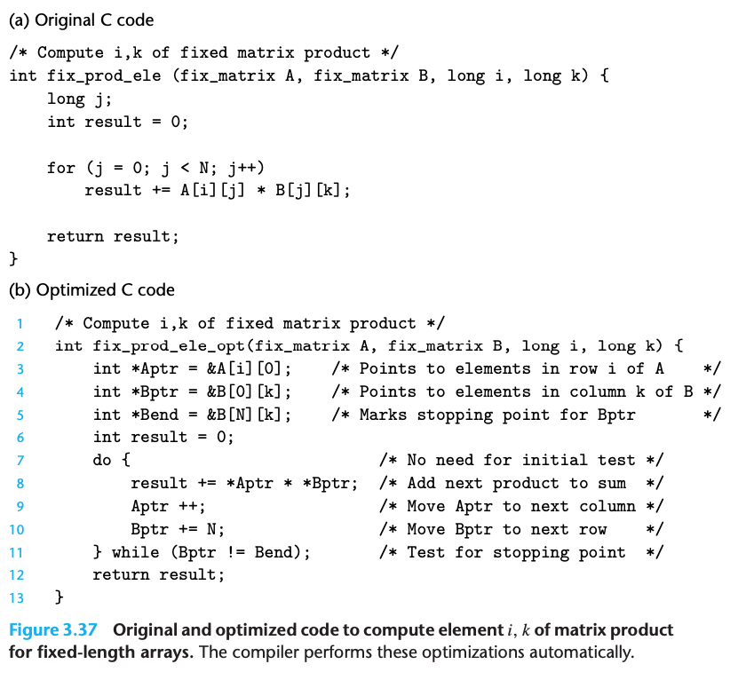

- corresponding assembly code

```
int fix_prod_ele_opt(fix_matrix A, fix_matrix B, long i, long k)
A in %rdi, B in %rsi, i in %rdx, k in %rcx
fix_prod_ele:
  salq $6, %rdx                                                     Compute 64 * i
  addq %rdx, %rdi                                                   Compute Aptr = xA + 64i = &A[i][0]
  leaq (%rsi,%rcx,4), %rcx                                          Compute Bptr = xB + 4k = &B[0][k]
  leaq 1024(%rcx), %rsi                                             Compute Bend = xB + 4k + 1024 = &B[N][k]
  movl $0, %eax                                                     Set result = 0
.L7:                                                                loop:
  movl (%rdi), %edx                                                 Read *Aptr
  imull (%rcx), %edx                                                Multiply by *Bptr
  addl %edx, %eax                                                   Add to result
  addq $4, %rdi                                                     Increment Aptr ++
  addq $64, %rcx                                                    Increment Bptr += N
  cmpq %rsi, %rcx                                                   Compare Bptr:Bend
  jne .L7                                                           If !=, goto loop
  rep; ret                                                          Return
```


#### Variable-Size Arrays

- eg.

```c
int var_ele(long n, int A[n][n], long i, long j) {
  return A[i][j];
}
```

will generate following assembly code:

```
int var_ele(long n, int A[n][n], long i, long j)
n in %rdi, A in %rsi, i in %rdx, j in %rcx
var_ele:
  imulq %rdx, %rdi                          Compute n * i
  leaq (%rsi,%rdi,4), %rax                  Compute xA + 4(n * i)
  movl (%rax,%rcx,4), %eax                  Read from M[xA + 4(n * i) + 4 * j ]
  ret
```

- The dynamic version must use a multiplication instruction to scale i by n, rather than a series of shifts and adds
  - This multiplication can incur a significant performance penalty
- The compiler often do some optimization for this when variable-size arrays are referenced within a loop, eg.

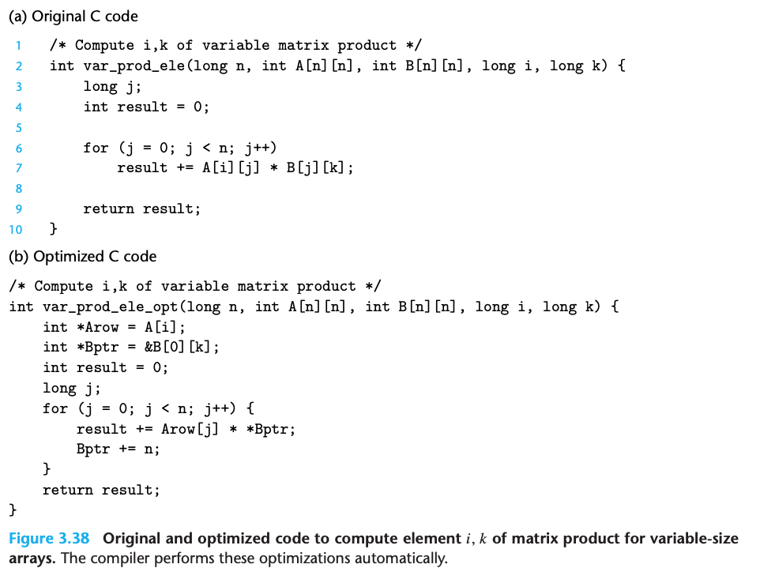

- Corresponding assembly code:

```
Registers: n in %rdi, Arow in %rsi, Bptr in %rcx
4n in %r9, result in %eax, j in %edx
.L24:                                        loop:
  movl (%rsi,%rdx,4), %r8d                   Read Arow[j]
  imull (%rcx), %r8d                         Multiply by *Bptr
  addl %r8d, %eax                            Add to result
  addq $1, %rdx                              j++
  addq %r9, %rcx                             Bptr += n
  cmpq %rdi, %rdx                            Compare j:n
  jne .L24                                   If !=, goto loop
```

### Heterogeneous Data Structures

- **structures**: Aggregate multiple objects into a single unit/object
- **unions**: Allow an object to be referenced using several different types

#### Structures

- The compiler maintains information about each structure type indicating the byte offset of each field
- eg.

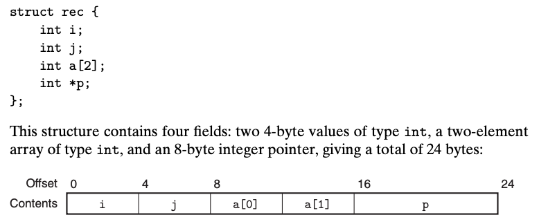

- `rp->v` is equivalent to the expression `(*rp).v`
- The selection of the different fields of a structures is handled completely at compile time
  - The machine code contains no information about the field declarations or the name of the fields

#### Unions

- Union allow a single object to be referenced according to multiple types
- The overall size of a union equals the maximum size of any of its fields
- eg.

```c
unsigned long double2bits(double d) {
  union {
    double d;
    unsigned long u;
  } temp;
  temp.d = d;
  return temp.u;
}
```

- The result will be that `u` will have the same bit representation as `d`
- When using unions to combine data types of different sizes, byte-ordering issues can become important, eg.

```c
double uu2double(unsigned word0, unsigned word1) {
  union {
    double d;
    unsigned u[2];
  } temp;
  temp.u[0] = word0;
  temp.u[1] = word1;
  return temp.d;
}
```

- The result on little-endian machine will be different from big-endian

#### Data Alignment

- Alignment rule is based on the principle that **any primitive object of K bytes must have an address that is a multiple of K**
- **Alignment restrictions** simplify the design of the hardware forming the interface between the processor and the memory system
- Gaps will be inserted in the field allocation to ensure that each structure element satisfies its alignment requirement
- The compiler places directives in the assembly code indicating the desired alignment for global data eg.
```
.align 8
```
- This ensures that the data following it will start with an address that is a multiple of 8

### Combining Control and Data in Machine-Level Programs

#### Understanding Pointers

- Pointer types are not part of machine code; they are an abstraction provided by C to help programmers avoid addressing errors
- The special `NULL(0)` value indicates that the pointer does not point anywhere
- `&` operator can be applied to any C expression that is categorized as an **lvalue**, meaning an expression that can appear on the left side of an assignment
- Both array referencing and pointer arithmetic require scaling the offsets by the object size
  - eg. when we write an expression `p+i` for pointer p with value `q`, the resulting address is computed as `q + L * i`, the `L` is the size of the data type associated with p
- Casting from one type of pointer to another changes its type but not its value
  - eg. if p is a pointer of type `char *`, `(int *) p + 7` computes `p + 28`, while `(int *) (p + 7)` compute `p + 7`
- Pointer can also point to functions
  - eg. `int (*fp)(int, int *)`

#### Life in the Real World: Using the GDB Debugger

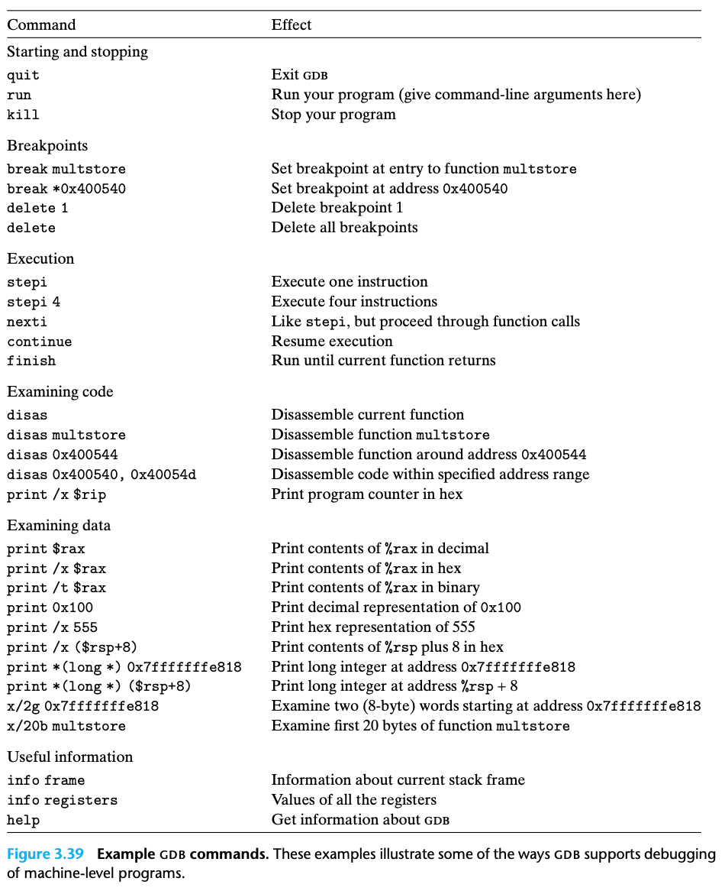
