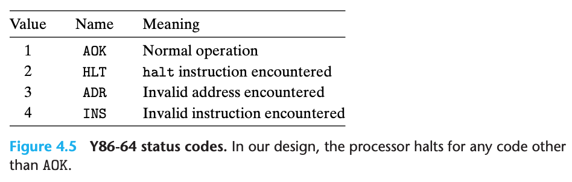

## Processor Architecture

- The instructions supported by a particular processor and their byte-level encoding are known as its **instruction set architecture (ISA)**

### The Y86-64 Instruction Set Architecture

#### Programmer-Visible State

- The state for Y86-64 is similar to that for x86-64


- There are 15 register (`%r15` been omitted for simplying the instruction encoding)
- Three single-bit condition codes, `ZF, SF, OF`, store the effect of the most recent arithemtic or logic instruction
- The program counter (PC) holds the address of the instruction currently been executed
- The memory can be viewed as a large array of bytes (implemented by virtual addresses)
- A status code Stat, indicating the overall state of program execution (normal operation or exeception)

#### Y86-64 Instructions

- Individual instruction in Y86-64:


- x86-64 movq instruction been split into 4 different instruction: `irmovq`, `rrmovq`, `mrmovq`, and `rmmovq`
  - The source is either immediate (i), register (r) or memory (m)
  - The destination is either register (r) or memory (m)
- There are 6 conditional move instructions (`cmovXX`), the destination register is updated only if the condition codes satisfy the required constraints
- The `halt` instruction stops instruction execution

#### Instruction Encoding

- Register encoding in Y86-64


- As an example, `rmmovq %rsp, 0x123456789abcd(%rdx)` will be encoded to `4042cdab896745230100`
- One important property of any instruction set is that the byte encoding must have a unique interpretation
  - Y86-64 hold this property because every instruction has a unique combination of code and function in its **initial byte**

#### Y86-64 Exceptions

- Possible value for the `Stat` in programmer-visible state:



- In Y86-64, we simply have the processor stop executing instructions when it encounters any of the exceptions listed (2~4)
- In a more complete design, processor would typically invoke an **exception handler**

#### Y86-64 Programs

- The comparison between Y86-64 and X86-86

for the program below:

```c
long sum(long *start, long count) {
  long sum = 0;
  while (count) {
    sum += *start;
    start++;
    count--;
  }
  return sum;
}
```

The corresponding assembly code:


The complete program file written in Y86-64


- Loads constants into register since it cannot use immediate data in arithmetic instructions
- Y86-64 code require 2 instructions to read a value from memory and add it to a register, x86-64 can do with single addq
- Words beginning with `.` are **assembly directives** telling the assembler to adjust the address at which it is generating code or insert some words of data

#### Some Y86-64 Instruction Details

- `pushq` push the original value of `%rsp` instead of the decremented value of `%rsp`
  - `pushq` both decrements the stack pointer by 8 and writes a register value to memory
- `popq` read from the memory
  - eg. `popq %rsp` equivalent to `mrmovq (%rsp), %rsp`
- We try to devise a consistent set of conventions for instructions that push or pop the stack pointer
  - Different x86 processor will actuall do different thing on this, so we need to make thing clear on Y86-84

### Logic Design and the Hardware Control Language HCL

- 3 major components are required to implement a digital system:
  - **combinational logic** to compute functions on the bits
  - **memory elements** to store bits
  - **clock signals** to regulate the updating of the memory elements
- Hardward Description Language (HDL)
  - A textual notation that looks similar to a programming language but that is used to describe hardware structures rather than program behavior
  - In the mid-1980s researchers developed **logic synthesis** programs that could generate efficient circuit designs from HDL description
  - eg. Verilog, VHDL

#### Logic Gates


- `&&` for and, `||` for or, `!` for not
  - Use these instead of bit level operation beacuse logic gates operate on single bit quantities, not entire word
- Logic gates are always active
  - If some input to a gate changes, then within some small amount of time, the output will change accordingly

#### Combinational Circuits and HCL Boolean Expression


- Example for test bit equality
- The HCL is `bool eq = (a && b) || (!a && !b);`


- A multiplexor selects a value from among a set of different data signals (a, b), depending on the value of a control input single (s)
- The HCL is `bool out = (s && a) || (!s && b);`

- The difference between HCL and C:
  - In the hardware (HCL), the outputs continually respond to changes in the inputs, but a C expression is only evaluated when it is encountered during the execution of a program
  - The logical expression in C allow the argument to be any arguments. But Logic gates only operate over the bit value 0 and 1
  - Partially evaluated in C, eg. `bool out = (s && a) || (!s && b);`, but combination logic doesn't have this property

#### Word-Level Combinational Circuits and HCL Integer Expression

- In HCL, we will declare any word-level signal as an `int` without specifying the word size
- eg. The word level equality:


- eg. The word level multiplexor


- The format of case expressions in HCL

```
[
  select1 : expr1;
  select2 : expr2;
  .
  .
  .
  selectk : exprk;
]
```

- The selection expressions can sometime be simplified since only the first matching case is selected
- eg. HCL case expression for find the minimum of A, B, C

```
word Min3 = [
  A <= B && A <= C : A;
  B <= A && B <= C : B;
  1 : C;
];
```

- eg. HCL case expression for multiplexor of A, B, C, D

```
word Out4 = [
  !s1 && !s0 : A; # 00
  !s1        : B; # 01
  !s0        : C; # 10
  1          : D; # 11
];
```

- One important combinational circuit, known as an **arithmetic/logic unit(ALU)**:


- The 4 operations diagrammed for this ALU correspond to the 4 different integer operation supported by the Y86-64 instruction set, and the control values match the function codes for these instructions

#### Set Membership

- The general form of a set membership test is

```
iexpr in {iexpr1, iexpr2, ..., iexprk}
```

- `iexpr1` through `iexprk` are all integer expressions

- The simple example for decide control signal from single code:


#### Memory and Clocking

- Combinational circuits do not store any information, they just react to the input signal and generating corresponding output
- **Sequential circuits** - systems that have state and perform computations on that state
- 2 classes of memory devices:
  - **Clocked registers**: store the individual bis or words. The clock signal controls the loading of the register with the value at its input
    - The register serve as barriers between the combinational logic in different parts of the circuit
    - Y86-64 processor will use clocked register to hold the program counter (PC), the condition codes (CC) and the program status (Stat)
  
  - **Random access memories**: store multiple words, using an address to select which word should be read or written
    - virtual memory system
    - register file (register identifiers serve as the addresses, in Y86-64, %rax ~ %r14)
  
  

### Sequential Y86-64 Implementation

#### Organizing Processing into Stages

- Processing an instruction involves a number of operations, we organize them into a uniform sequnece of stages:

1. **Fetch**: Reads the bytes of instruction from memory, using the program counter (PC) as the memory address
2. **Decode**: Reads the two operands from the register file, giving them val
3. **Execute**: ALU either performs the operation specified by the instruction or increments or decrements the stack pointer, or set the conditional code
4. **Memory**:  Write/Read data from memory 
5. **Write Back**: Writes up to two results to the register file
6. **PC Update**: PC is set to the address of the next instruction

- The processor loops indefinitely, performing these stages
- The cost of duplicating blocks of logic in hardware is much higher than the cost of having multiple copies of code in software
- Y86-64 instructions sequential stage:


- `pushq` should decrement the stack pointer before writing
- `popq` should first read memory and then increment the stack pointer

#### SEQ Hardware Structure