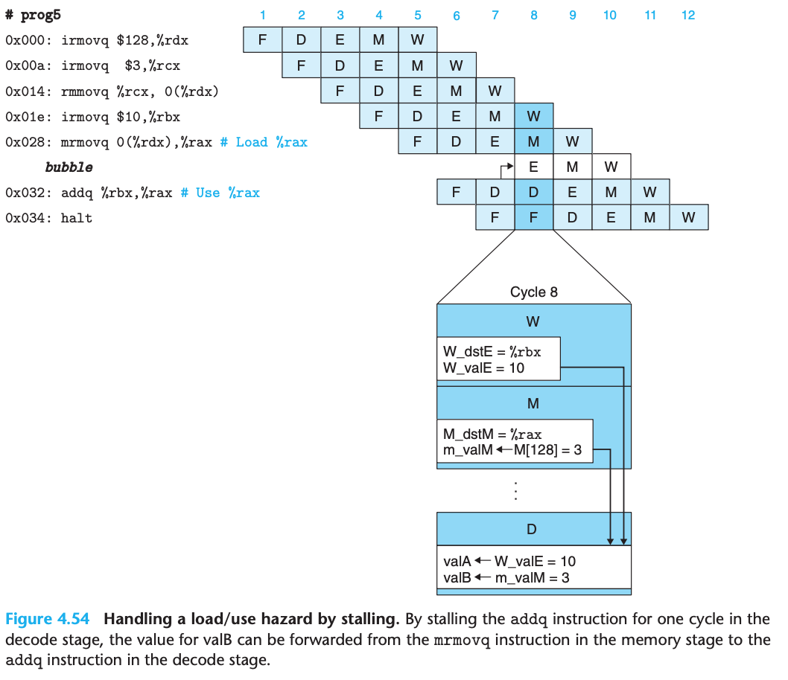
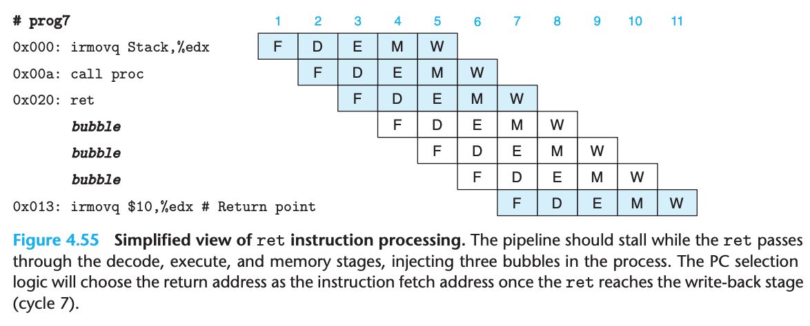

## Processor Architecture

- The instructions supported by a particular processor and their byte-level encoding are known as its **instruction set architecture (ISA)**

### The Y86-64 Instruction Set Architecture

#### Programmer-Visible State

- The state for Y86-64 is similar to that for x86-64


- There are 15 register (`%r15` been omitted for simplying the instruction encoding)
- Three single-bit condition codes, `ZF, SF, OF`, store the effect of the most recent arithemtic or logic instruction
- The program counter (PC) holds the address of the instruction currently been executed
- The memory can be viewed as a large array of bytes (implemented by virtual addresses)
- A status code Stat, indicating the overall state of program execution (normal operation or exeception)

#### Y86-64 Instructions

- Individual instruction in Y86-64:


- x86-64 movq instruction been split into 4 different instruction: `irmovq`, `rrmovq`, `mrmovq`, and `rmmovq`
  - The source is either immediate (i), register (r) or memory (m)
  - The destination is either register (r) or memory (m)
- There are 6 conditional move instructions (`cmovXX`), the destination register is updated only if the condition codes satisfy the required constraints
- The `halt` instruction stops instruction execution

#### Instruction Encoding

- Register encoding in Y86-64


- As an example, `rmmovq %rsp, 0x123456789abcd(%rdx)` will be encoded to `4042cdab896745230100`
- One important property of any instruction set is that the byte encoding must have a unique interpretation
  - Y86-64 hold this property because every instruction has a unique combination of code and function in its **initial byte**

#### Y86-64 Exceptions

- Possible value for the `Stat` in programmer-visible state:


- In Y86-64, we simply have the processor stop executing instructions when it encounters any of the exceptions listed (2~4)
- In a more complete design, processor would typically invoke an **exception handler**

#### Y86-64 Programs

- The comparison between Y86-64 and X86-86

for the program below:

```c
long sum(long *start, long count) {
  long sum = 0;
  while (count) {
    sum += *start;
    start++;
    count--;
  }
  return sum;
}
```

The corresponding assembly code:


The complete program file written in Y86-64


- Loads constants into register since it cannot use immediate data in arithmetic instructions
- Y86-64 code require 2 instructions to read a value from memory and add it to a register, x86-64 can do with single addq
- Words beginning with `.` are **assembly directives** telling the assembler to adjust the address at which it is generating code or insert some words of data

#### Some Y86-64 Instruction Details

- `pushq` push the original value of `%rsp` instead of the decremented value of `%rsp`
  - `pushq` both decrements the stack pointer by 8 and writes a register value to memory
- `popq` read from the memory
  - eg. `popq %rsp` equivalent to `mrmovq (%rsp), %rsp`
- We try to devise a consistent set of conventions for instructions that push or pop the stack pointer
  - Different x86 processor will actuall do different thing on this, so we need to make thing clear on Y86-84

### Logic Design and the Hardware Control Language HCL

- 3 major components are required to implement a digital system:
  - **combinational logic** to compute functions on the bits
  - **memory elements** to store bits
  - **clock signals** to regulate the updating of the memory elements
- Hardward Description Language (HDL)
  - A textual notation that looks similar to a programming language but that is used to describe hardware structures rather than program behavior
  - In the mid-1980s researchers developed **logic synthesis** programs that could generate efficient circuit designs from HDL description
  - eg. Verilog, VHDL

#### Logic Gates


- `&&` for and, `||` for or, `!` for not
  - Use these instead of bit level operation beacuse logic gates operate on single bit quantities, not entire word
- Logic gates are always active
  - If some input to a gate changes, then within some small amount of time, the output will change accordingly

#### Combinational Circuits and HCL Boolean Expression


- Example for test bit equality
- The HCL is `bool eq = (a && b) || (!a && !b);`


- A multiplexor selects a value from among a set of different data signals (a, b), depending on the value of a control input single (s)
- The HCL is `bool out = (s && a) || (!s && b);`

- The difference between HCL and C:
  - In the hardware (HCL), the outputs continually respond to changes in the inputs, but a C expression is only evaluated when it is encountered during the execution of a program
  - The logical expression in C allow the argument to be any arguments. But Logic gates only operate over the bit value 0 and 1
  - Partially evaluated in C, eg. `bool out = (s && a) || (!s && b);`, but combination logic doesn't have this property

#### Word-Level Combinational Circuits and HCL Integer Expression

- In HCL, we will declare any word-level signal as an `int` without specifying the word size
- eg. The word level equality:


- eg. The word level multiplexor


- The format of case expressions in HCL

```
[
  select1 : expr1;
  select2 : expr2;
  .
  .
  .
  selectk : exprk;
]
```

- The selection expressions can sometime be simplified since only the first matching case is selected
- eg. HCL case expression for find the minimum of A, B, C

```
word Min3 = [
  A <= B && A <= C : A;
  B <= A && B <= C : B;
  1 : C;
];
```

- eg. HCL case expression for multiplexor of A, B, C, D

```
word Out4 = [
  !s1 && !s0 : A; # 00
  !s1        : B; # 01
  !s0        : C; # 10
  1          : D; # 11
];
```

- One important combinational circuit, known as an **arithmetic/logic unit(ALU)**:


- The 4 operations diagrammed for this ALU correspond to the 4 different integer operation supported by the Y86-64 instruction set, and the control values match the function codes for these instructions

#### Set Membership

- The general form of a set membership test is

```
iexpr in {iexpr1, iexpr2, ..., iexprk}
```

- `iexpr1` through `iexprk` are all integer expressions

- The simple example for decide control signal from single code:


#### Memory and Clocking

- Combinational circuits do not store any information, they just react to the input signal and generating corresponding output
- **Sequential circuits** - systems that have state and perform computations on that state
- 2 classes of memory devices:
  - **Clocked registers**: store the individual bis or words. The clock signal controls the loading of the register with the value at its input
    - The register serve as barriers between the combinational logic in different parts of the circuit
    - Y86-64 processor will use clocked register to hold the program counter (PC), the condition codes (CC) and the program status (Stat)
  
  - **Random access memories**: store multiple words, using an address to select which word should be read or written
    - virtual memory system
    - register file (register identifiers serve as the addresses, in Y86-64, %rax ~ %r14)
  
  

### Sequential Y86-64 Implementation

- Processor called SEQ (for "sequential" processor)

#### Organizing Processing into Stages

- Processing an instruction involves a number of operations, we organize them into a uniform sequnece of stages:

1. **Fetch**: Reads the bytes of instruction from memory, using the program counter (PC) as the memory address
2. **Decode**: Reads the two operands from the register file, giving them val
3. **Execute**: ALU either performs the operation specified by the instruction or increments or decrements the stack pointer, or set the conditional code
4. **Memory**:  Write/Read data from memory 
5. **Write Back**: Writes up to two results to the register file
6. **PC Update**: PC is set to the address of the next instruction

- The processor loops indefinitely, performing these stages
- The cost of duplicating blocks of logic in hardware is much higher than the cost of having multiple copies of code in software
- Y86-64 instructions sequential stage:


- `pushq` should decrement the stack pointer before writing
- `popq` should first read memory and then increment the stack pointer

#### SEQ Hardware Structure

- Processing is performed by hardware unit associated with different stages
- The abstract view of SEQ:


- More detail view of hardware required to implement SEQ
  - **Clocked registers are shown as white rectangles** - The only one is PC
  - **Hardware units are shown as light blue boxes** - Include memories, ALU etc
  - **Control logic blocks are drawn as gray rounded rectangles**
  - **Wire names are indicated in white circles** - Just label on the wire instead of any kind of hardware element
  - **Word-wide data connections are shown as medium lines** - Each of these lines actually represents a bundle of 64 wires
  - **Byte and narrower data connections are shown as thin lines** - Each of these lines actually represents a bundle of 4 or 8 wires
  - **Single-bit connections are shown as dotted lines**


#### SEQ Timing

- The hardware operates in a different way, with a single clock transition triggering a flow through combinational logic to execute the entire instruction
- This works because our instruction stage obey the principle that - **No reading back**
  - The processor never needs to read back the state updated by an instruction in order to complete the processing of this instruction
  - eg.  suppose we implemented the pushq instruction by first decrementing %rsp by 8 and then using the updated value of %rsp as the address of a write operation. This approach would violate the principle stated above
- Eg of executing instruction:


- Every time the clock transitions from low to high, the processor begins executing a new instruction


#### SEQ Stage Implementations

- The nop instruction simply flows through stages without much processing, except to increment the PC by 1
- Constant values used in HCL descriptions:


- The clock must run slowly enough so that signals can propagate through all of the stages within a single cycle
- Each unit is only active for a fraction of the total clock cycle

##### Fetch Stage


- HCL descriptions for `Need regids`:

```
bool need_regids = icode in { IRRMOVQ, IOPQ, IPUSHQ, IPOPQ, IIRMOVQ, IRMMOVQ, IMRMOVQ };
```

- HCL descriptions for `Need valC`:

```
bool need_regid = icode in { IIRMOVQ, IRMMOVQ, IMRMOVQ, IJXX, ICALL  };
```

##### Decode and Write-Back Stages


- `valA` and `valB` is for read output data, `srcA` and `srcB` is for corresponding read input address
- `valM` and `valE` is for write input data, `dstE` and `dstM` is for corresponding address need to be replaced/written

- HCL descriptions for `srcA`

```
word srcA = [
  icode in { IRRMOVQ, IRMMOVQ, IOPQ, IPUSHQ } : rA;
  icode in { IPOPQ, IRET } : RRSP;
  1 : RNONE; # Don’t need register
  ];
```

- HCL descriptions for `destE` (w/o consider conditional move)

```
word dstE = [
  icode in { IRRMOVQ } : rB;
  icode in { IIRMOVQ, IOPQ} : rB;
  icode in { IPUSHQ, IPOPQ, ICALL, IRET } : RRSP;
  1 : RNONE; # Don’t write any register
];
```

##### Execute Stage


- HCL descriptions for `ALU A`

```
word aluA = [
  icode in { IRRMOVQ, IOPQ } : valA;
  icode in { IIRMOVQ, IRMMOVQ, IMRMOVQ } : valC;
  icode in { ICALL, IPUSHQ } : -8;
  icode in { IRET, IPOPQ } : 8;
  # Other instructions don’t need ALU
];
```

- HCL descriptions for `ALU B`

```
word aluB = [
  icode in { IOPQ, IRMMOVQ, IMRMOVQ, ICALL, IPUSHQ, IRET, IPOPQ } : valB;
  icode in { IRRMOVQ, IIRMOVQ } : 0;
  # Other instructions don’t need ALU
];
```

- HCL descriptions for `ALU fun` and `Set CC`

```
word alufun = [
  icode == IOPQ : ifun;
  1 : ALUADD;
];

bool set_cc = icode in { IOPQ };
```

##### Memory Stage


- Address for memory reads and writes is always `valE` or `valA`

- HCL descriptions for `Mem addr`

```
word mem_addr = [
  icode in { IRMMOVQ, IPUSHQ, ICALL, IMRMOVQ } : valE;
  icode in { IPOPQ, IRET } : valA;
  # Other instructions don’t need address
];
```

- HCL descriptions for `Mem read`

```
bool mem_read = icode in { IMRMOVQ, IPOPQ, IRET };
```

- HCL descriptions for `Mem write`

```
bool mem_write = icode in { IRMMOVQ, IPUSHQ, ICALL };
```

- HCL descriptions for `Stat`

```
bool stat = [
  mem_error || dmem_error: SADR;
  !instr_valid: SINS;
  icode == IHALT: SHLT;
  1: SAOK
];
```

##### PC Update Stage


```
word new_pc = [
  # Call. Use instruction constant
  icode == ICALL : valC;
  # Taken branch. Use instruction constant
  icode == IJXX && Cnd : valC;
  # Completion of RET instruction. Use value from stack
  icode == IRET : valM;
  # Default: Use incremented PC
  1 : valP;
];
```

### General Principles of Pipelining

- A key feature of pipelining is that it increase the **throughput** of the system, but it may also slightly increase the **latency**

#### Computational Pipelines

- In unpipelined computation hardware, one instruction must been completed before beginning the next:


- The thoughput is: `1 instruction / (300 + 20) ps * (1000 ps / 1 ns) = 3.12 GIPS`, GIPS is units of giga-instructions per second, or billions of instruction per second
- The latency is: `320 ps`, **the reciprocal of the throughput**

- After we make this into a pipeline below:


- The thoughput is: `1 instruction / (100 + 20) ps * (1000 ps / 1 ns) = 8.33 GIPS`, which is bigger compare with previous'
- The latency is: `360 ps`, which is slightly larger compare with previous'

#### A Detail Look at Pipeline Operation

- One clock cycle of pipeline operation


- We could have disastrous effects if the clock were run too fast

#### Limitations of Pipelining

##### Nonuniform Partitioning

- The rate at which we can operate the clock is limited by the delay of the slowest stage


##### Diminishing Returns of Deep Pipelining

- As the combination logic is split into shorter blocks, the delay due to register updating becomes a limiting factor
- The circuit designer carefully design the pipeline registers to minimize their delay. The chip designer must also carefully design the clock distribution network to ensure that the clock changes at the exact same time across the entire chip

#### Pipelining a System with Feedback

- There are potential dependencies between successive instructions
- In attempting to speed up the system via pipelining, we have changed the system behavior
- We must deal with feedback effects properly


### Pipelined Y86-64 Implementations

#### SEQ+: Rearranging the Computation Stages

- SEQ+: change the order of SEQ by making it compute the PC value for the current instruction
- SEQ+ Hardware:


- From SEQ to SEQ+ is general transformation known as **circuit retiming** - change the state representation of a system without changing its logical behavior, often used to balance the delays between the different stages of a pipelined system

#### Inserting Pipeline Registers

- After we added the register to each stage, we have the figure below:


- These white boxes represent actual hardware components

#### Rearranging and Relabeling Signals

- As a general principle, we want to keep all of the information about a particular instruction contained within a single pipeline stage
- Block `Select A` is to reduce the amount of state that must be carried forward to pipeline registers `E` and `M`

#### Next PC Prediction

- If the fetched instruction is `ret` or conditional jump, the PC can't been decided in `fetch` stage
- **Branch prediction**: Guessing the branch direction, fetching and initiating the instruction according to the guessing
- The `Select PC` choose one of three values below:
  - predicted PC (in Y86-64, branch are alway token)
  - the value of `valP` for a non-taken branch instruction that reaches pipeline register `M` (`M_valA`)
  - the return address for `ret` in register `W` (`W_valM`)

#### Pipeline Hazards

- We need to solve dependencies situation when design the pipeline

##### Data Dependencies

- The data hazard can happen on the situation below:


- A data hazard can arise for an instruction when one of its operands is updated by any of the three preceding instruction, eg. the below one doesn't have the issue:


- We can avoiding data hazards by **stalling**, holding back the instruction in the decode stage until the instructions generating its source operands have passed through the write-back stage eg.


- This will cause the pipeline to stall for up to three cycles, reducing the overall throughput significantly

- Another way is by **forwarding**, bypassing a result value directly from on pipeline stage to an earlier one, eg.


- To make forwarding work, we need to introduce hardware component to original PIPE:


- There is one situation which couldn't be handled properly by data forwarding, which is **Load/Use data hazards**


- We can avoid a load/use data hazard with combination of stalling and forwarding:



- The use of a stall to handle a load/use hazard is called a **load interlock**

##### Control Dependencies

- Control hazards arise when the processor cannot reliably determine the address of the next instruction based on the current instruction in the fetch stage
- Handling the `ret` instruction:



- We insert bubble until `ret` instruction reaches the write-back stage, the PC selection logic will set the program counter to the return address

- Handling a mispredicted branch:


- The pipeline just `cancel` (or `instruction squashing`) the two misfetched instructions by injecting bubbles. The two misfetched instruction will then simply disappear from the pipeline

#### Exception Handling

- Our instruction set includes 3 different internally generated exceptions:
  1. A `halt` instruction
  2. An instruction with an invalid combination of instruction and function code
  3. An attempt to access an invalid address

- It is possible to have exceptions triggered by multiple instructions simultaneously
- The basic rule is to put priority on the exception triggered by the instruction that is furthest along the pipeline
- The pipeline control logic must disable any updating of the condition code register or the data memory whene an instruction in the memory or write-back stage has caused an exception
