## Optimizing Program Performance

- Writing an efficient program requires several types of activities
  1. Select an appropriate set of algorithms and data structures
  2. Write source code that the compiler can effectively optimize to turn into efficient executable code
  3. Divide a task  into protions that can be computed in parallel

### Capabilities and Limitations of Optimizing Compilers

- **memory aliasing**: Two pointers may designate the same memory location:

```c
void twiddle1(long *xp, long *yp) {
  *xp += *yp;
  *xp += *yp;
}

void twiddle2(long *xp, long *yp) {
  *xp += 2* *yp;
}
```

- Assuming `*xp == *yp == x`, in normal situation, `xp` and `yp` point different location, both function will give `x + 2x`, but both `xp` and `yp` point to same location, `twiddle1` will give `4x`, `twiddle2` will give `3x`
- This situation must be consider by compiler, so it blockers the optimization opportunities of compiler

- **Inline subsitution**: Optimizing function call

```c
/* Result of inlining f in func1 */
long func1in() {
  long t = counter++; /* +0 */
  t += counter++; /* +1 */
  t += counter++; /* +2 */
  t += counter++; /* +3 */
  return t;
}

/* Optimization of inlined code */
long func1opt() {
  long t = 4 * counter + 6;
  counter += 4;
  return t;
}
```

- Inline optimization will make any attempt to trace or set a breakpoint for that call fail

### Express Program Performance

- **cycles per element(CPE)**: To help evaluate the loop performance, how many time cycles cost for process each element

```c
/* Compute prefix sum of vector a */
void psum1(float a[], float p[], long n) {
  long i;
  p[0] = a[0];
  for (i = 1; i < n; i++)
    p[i] = p[i-1] + a[i];
}
```

```c
void psum2(float a[], float p[], long n) {
  long i;
  p[0] = a[0];
  for (i = 1; i < n-1; i+=2) {
    float mid_val = p[i-1] + a[i];
    p[i] = mid_val;
    p[i+1] = mid_val + a[i+1];
  }
  /* For even n, finish remaining element */
  if (i < n)
    p[i] = p[i-1] + a[i];
}
```

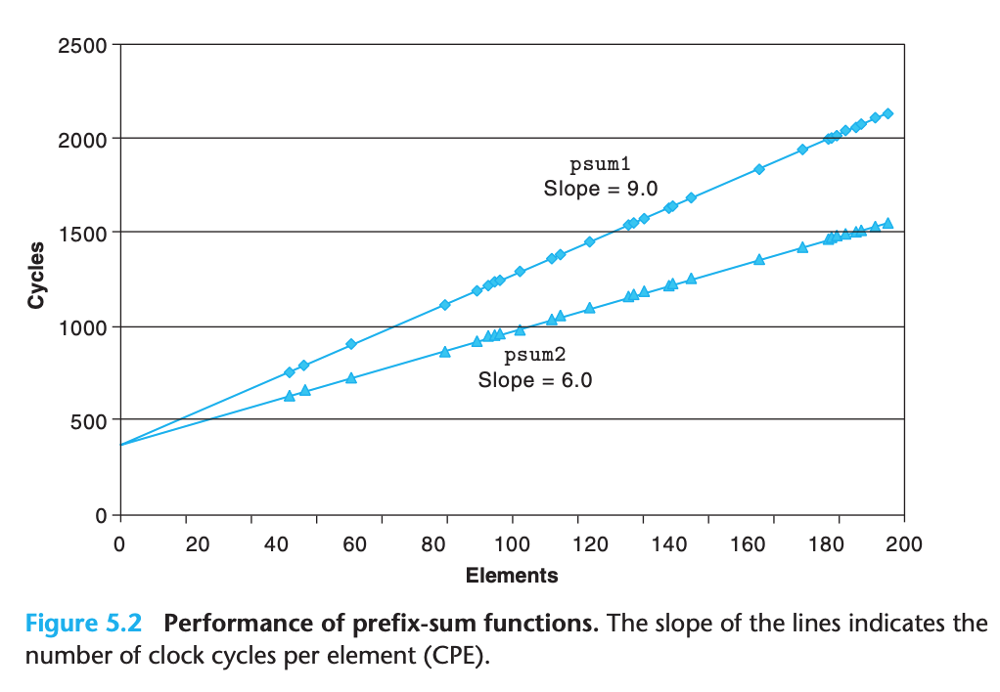

### Program Example

- Program example for optimization

```c
typedef long data_t;

// #define IDENT 0
// #define OP +

#define IDENT 1
#define OP *

/* Create abstract data type for vector */
typedef struct {
  long len;
  data_t *data;
} vec_rec, *vec_ptr;

/*
 * Retrieve vector element and store at dest.
 * Return 0 (out of bounds) or 1 (successful)
 */
int get_vec_element(vec_ptr v, long index, data_t *dest) {
  if (index < 0 || index >= v->len)
    return 0;

  *dest = v->data[index];
  return 1;
}

/* Return length of vector */
long vec_length(vec_ptr v) {
  return v->len;
}
```

- First version of program

```c
/* Implementation with maximum use of data abstraction */
void combine1(vec_ptr v, data_t *dest) {
  long i;
  *dest = IDENT;
  for (i = 0; i < vec_length(v); i++) {
    data_t val;
    get_vec_element(v, i, &val);
    *dest = *dest OP val;
  }
}
```

- Enabling some level of optimization can save the cost:

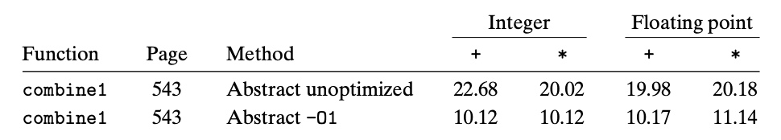

### Eliminating Loop Inefficiencies

- **code motion**: Remove computation performed multiple time, but the result of computation won't be change

```c
/* Move call to vec_length out of loop */
void combine2(vec_ptr v, data_t *dest) {
  long i;
  long length = vec_length(v);
  *dest = IDENT;
  for (i = 0; i < length; i++) {
    data_t val;
    get_vec_element(v, i, &val);
    *dest = *dest OP val;
  }
}
```

### Reducing Procedure Calls

```c
data_t *get_vec_start(vec_ptr v) {
  return v->data;
}

/* Direct access to vector data */
void combine3(vec_ptr v, data_t *dest) {
  long i;
  long length = vec_length(v);
  data_t *data = get_vec_start(v);
  *dest = IDENT;
  for (i = 0; i < length; i++) {
    *dest = *dest OP data[i];
  }
}
```

### Eliminating Unneeded Memory References

- The assembly can give more clue about optimization

```
# Inner loop of combine3. data_t = double, OP = *
# dest in %rbx, data+i in %rdx, data+length in %rax
.L17:                                 # loop:
  vmovsd (%rbx), %xmm0                # Read product from dest
  vmulsd (%rdx), %xmm0, %xmm0         # Multiply product by data[i]
  vmovsd %xmm0, (%rbx)                # Store product at dest
  addq $8, %rdx                       # Increment data+i
  cmpq %rax, %rdx                     # Compare to data+length
  jne .L17                            # If !=, goto loop
```

- `vmovsd (%rbx), %xmm0` and `vmovsd %xmm0, (%rbx)` is not necessary, code below give same result but less instruction:

```
# Inner loop of combine4. data_t = double, OP = *
# acc in %xmm0, data+i in %rdx, data+length in %rax
.L25:                                 # loop:
  vmulsd (%rdx), %xmm0, %xmm0         # Multiply acc by data[i]
  addq $8, %rdx                       # Increment data+i
  cmpq %rax, %rdx                     # Compare to data+length
  jne .L25                            # If !=, goto loop
```

- Corresponding C code

```c
/* Accumulate result in local variable */
void combine4(vec_ptr v, data_t *dest) {
  long i;
  long length = vec_length(v);
  data_t *data = get_vec_start(v);
  data_t acc = IDENT;
  for (i = 0; i < length; i++) {
    acc = acc OP data[i];
  }
  *dest = acc;
}
```

### Understanding Modern Processors

#### Overall Operation

- Simple view of a modern microprocessor

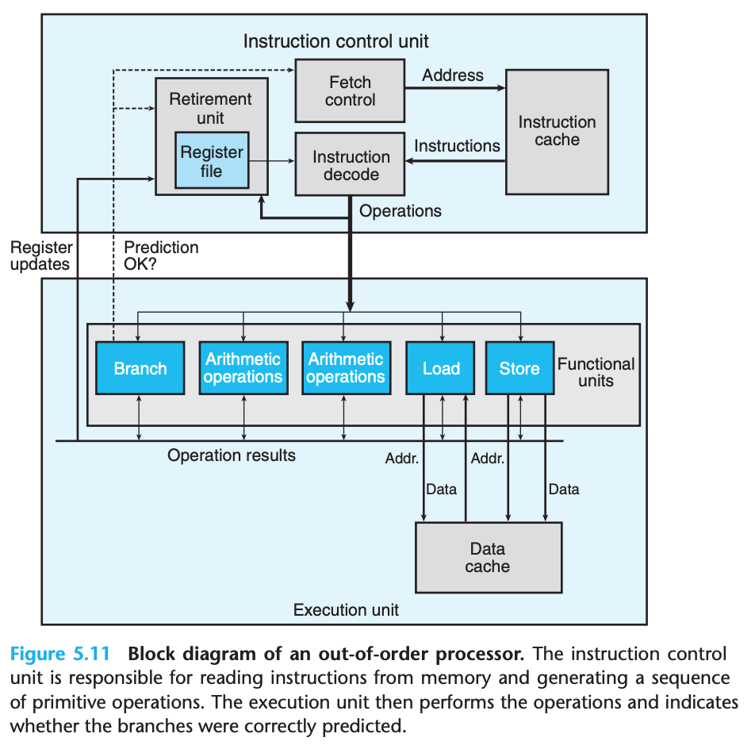

- The processor can perform multiple operations on every clock and **out of order**
- Any updates to the program registers occur only as instructions are being retired
- **register renaming**: By this, values can be forwarded directly from one operation to another

#### Functional Unit Performance

- Intel Core i7 Haswell performance of some of the arithmetic operation

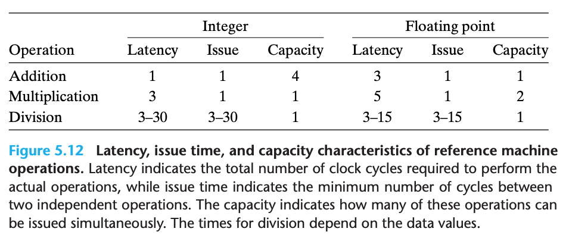

- **Latency**: Total time (clock cycle) required to perform operation
- **Issue**: Minimum number of clock cycles between two independent operations of the same type
- **Capacity**: Number of functional units capable of performing the operation

- The processor can achieve `C/I` throughput, where `C` is the capacity and `I` is the issue time
- The throughput also been limited by other factor, eg. arithmetic unit been limited by load and store unit

#### An Abstract Model of Processor Operation

- Based on the code below:

```
# Inner loop of combine4. data_t = double, OP = *
# acc in %xmm0, data+i in %rdx, data+length in %rax
.L25:                                 # loop:
  vmulsd (%rdx), %xmm0, %xmm0         # Multiply acc by data[i]
  addq $8, %rdx                       # Increment data+i
  cmpq %rax, %rdx                     # Compare to data+length
  jne .L25                            # If !=, goto loop
```

we can get draw the dependencies graph:

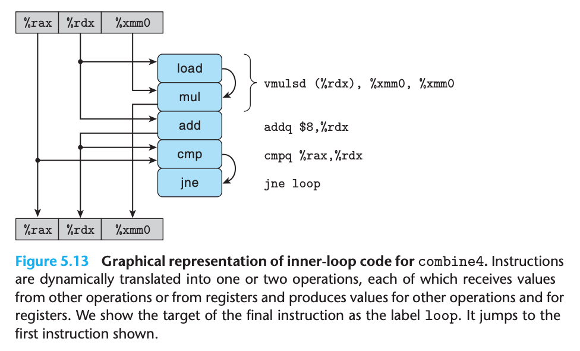

- We can classify the register into 4 categories:
  - **Read-only**: eg. `%rax`
  - **Write-only**: Only been used as destination of data movement instruction
  - **Local**: Updated adn used within the loop, but there is no dependency from one iteration to another, eg. condition code register
  - **Loop**: Both as source values and as destinations for the loop, eg. `%xmm0` and `%rdx`

- We can simply the graph:

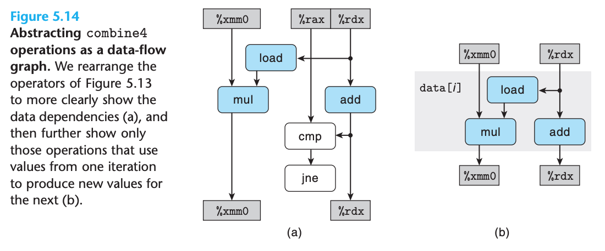

- Also expend to n element (loop)

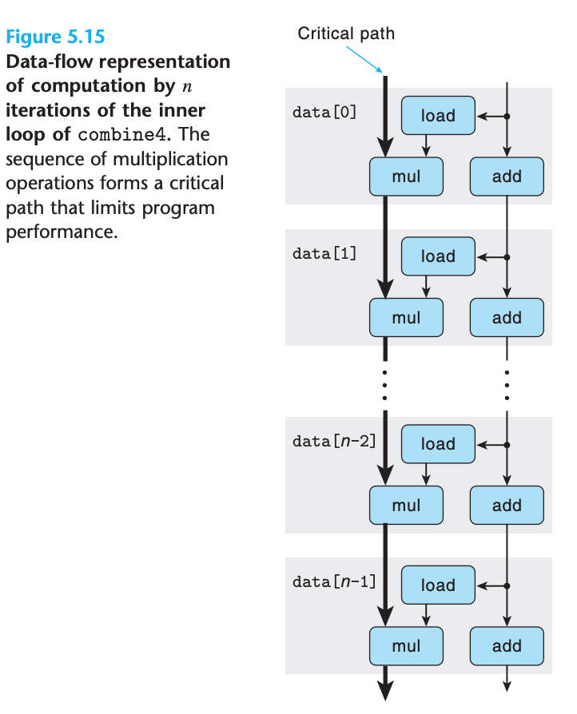

- The critical path will decide the lower bound on how many cycle the program required
- The reason that integer addition not close to latency bound because add is fast and not become the critical path

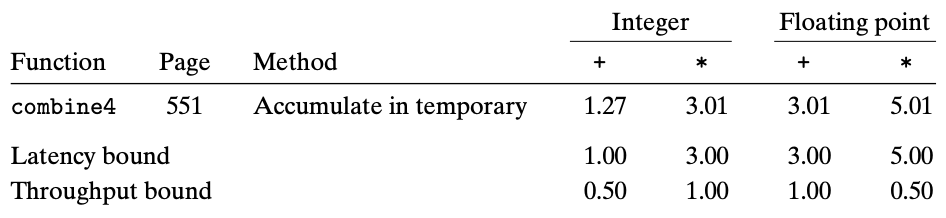

```c
double poly(double a[], double x, long degree) {
  long i;
  double result = a[0];
  double xpwr = x; /* Equals x^i at start of loop */
  for (i = 1; i <= degree; i++) {
    result += a[i] * xpwr;
    xpwr = x * xpwr;
  }
  return result;
}
```

```c
/* Apply Horner’s method */
double polyh(double a[], double x, long degree) {
  long i;
  double result = a[degree];
  for (i = degree-1; i >= 0; i--)
    result = a[i] + x*result;
    return result;
}
```

- `poly` is much faster than `polyh` because `poly`'s critical path is just one `mul` operation, but `polyh` critical path is `mul` + `add`

### Loop Unrolling

- Loop unrolling is a program transformation that reduces the number of iterations in a loop by increasing the numebr of elements computed on each iteration
- `combine4` can be converted to program below:

```c
/* 2 x 1 loop unrolling */
void combine5(vec_ptr v, data_t *dest) {
  long i;
  long length = vec_length(v);
  long limit = length-1;
  data_t *data = get_vec_start(v);
  data_t acc = IDENT;

  /* Combine 2 elements at a time */
  for (i = 0; i < limit; i+=2) {
    acc = (acc OP data[i]) OP data[i+1];
  }

  /* Finish any remaining elements */
  for (; i < length; i++) {
    acc = acc OP data[i];
  }
  *dest = acc;
}
```

- We can also generalize this idea to yielding k X 1 loop unrolling
- The CPE change listed below:

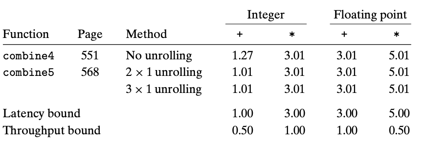

- The corresponding assembly code:

```
# Inner loop of combine5. data_t = double, OP = *
# i in %rdx, data %rax, limit in %rbx, acc in %xmm0
.L35:                                    # loop:
  vmulsd (%rax,%rdx,8), %xmm0, %xmm0     # Multiply acc by data[i]
  vmulsd 8(%rax,%rdx,8), %xmm0, %xmm0    # Multiply acc by data[i+1]
  addq $2, %rdx                          # Increment i by 2
  cmpq %rdx, %rbp                        # Compare to limit:i
  jg .L35                                # If >, goto loop
```

- The data dependencies graph:

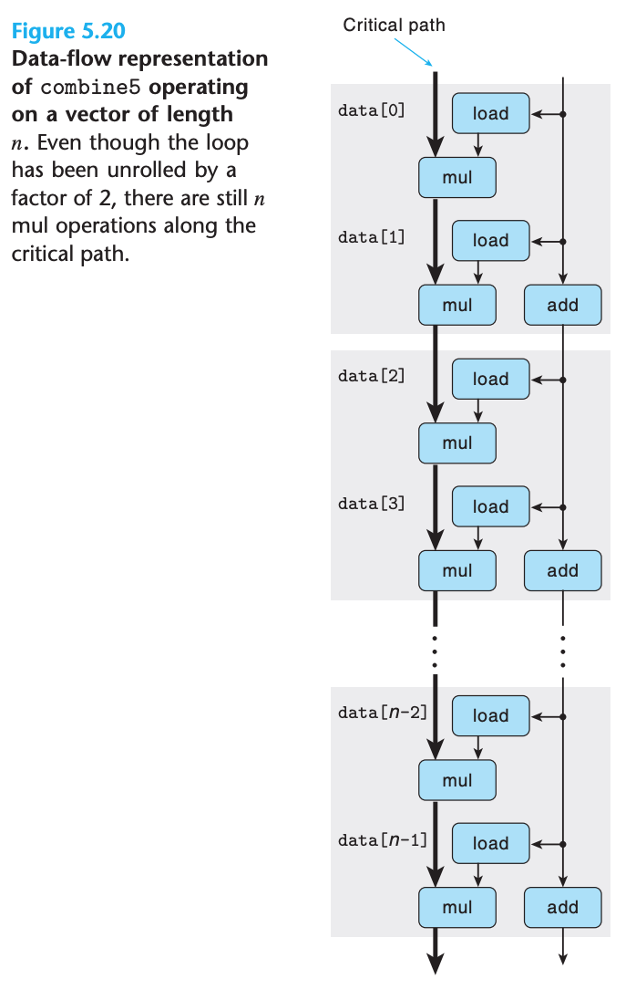

- gcc will perform some forms of loop unrolling when invoked with optimization level 3 or higher

### Enhancing Parallelism

- In the previous loop, we can't compute a new value (acc) until preceding computation complete

#### Multiple Accumulators

- We can modify previous program and generate the one below:

```c
/* 2 x 2 loop unrolling */
void combine6(vec_ptr v, data_t *dest) {
  long i;
  long length = vec_length(v);
  long limit = length-1;
  data_t *data = get_vec_start(v);
  data_t acc0 = IDENT;
  data_t acc1 = IDENT;

  /* Combine 2 elements at a time */
  for (i = 0; i < limit; i+=2) {
    acc0 = acc0 OP data[i];
    acc1 = acc1 OP data[i+1];
  }

  /* Finish any remaining elements */
  for (; i < length; i++) {
    acc0 = acc0 OP data[i];
  }
  *dest = acc0 OP acc1;
}
```

- The performance comparsion showed below:

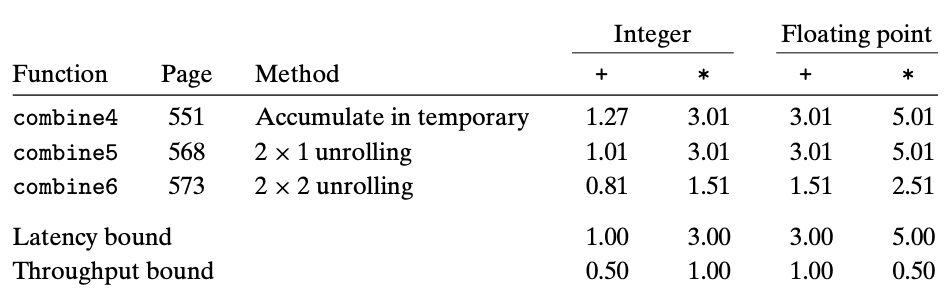

- Data-flow of the corresponding function:

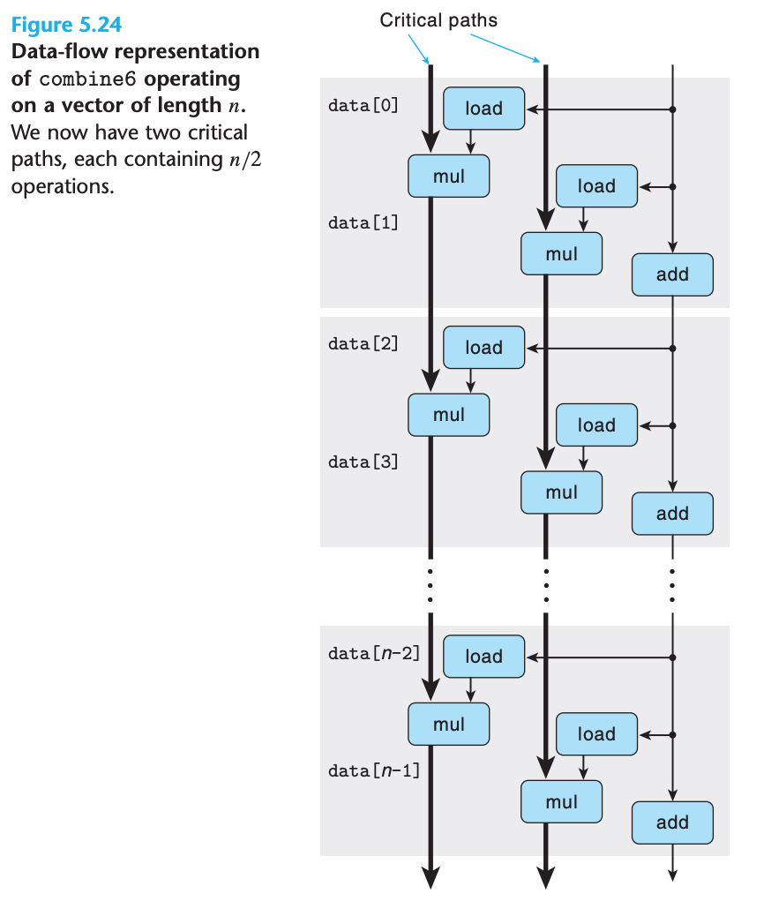

- CPE of performance:

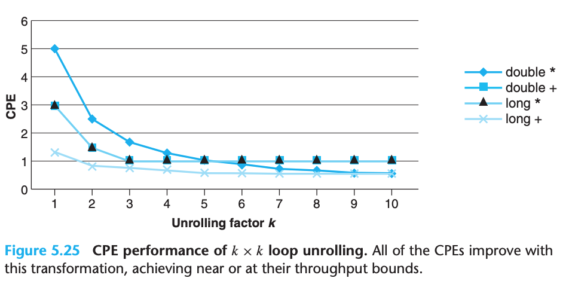

- The program can achieve throghtput bound for an operation only when it can keep the pipelines filled for all the functional units capable of performing that operation
  - One functional unit could take multiple operation parallely
  - with `k >= L * C` where `L` is latency and `C` is capacity
- Floating-point addition and multiplication are not accociative but most of time it won't be the problem
