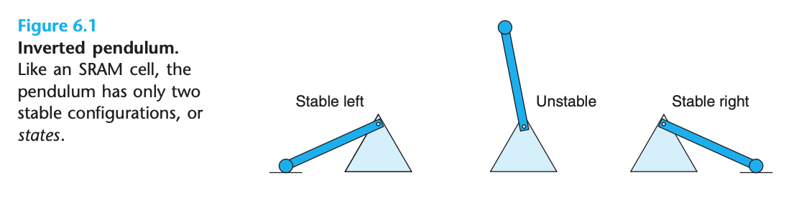
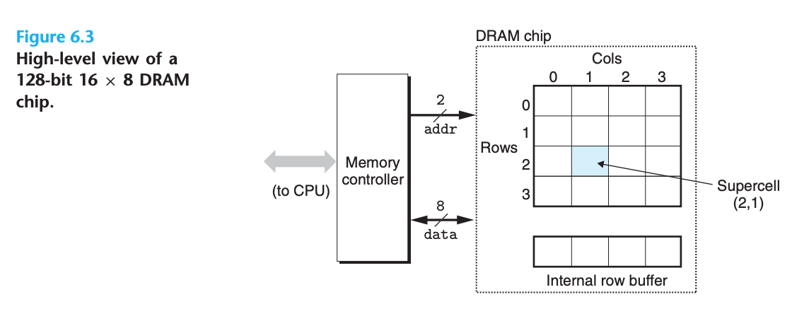
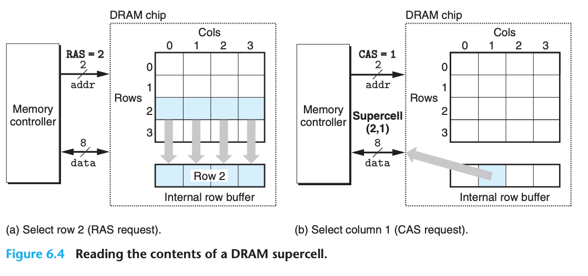
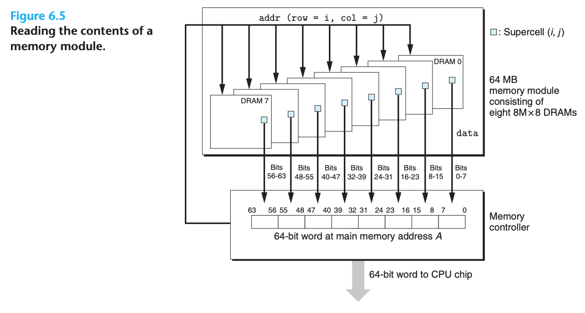
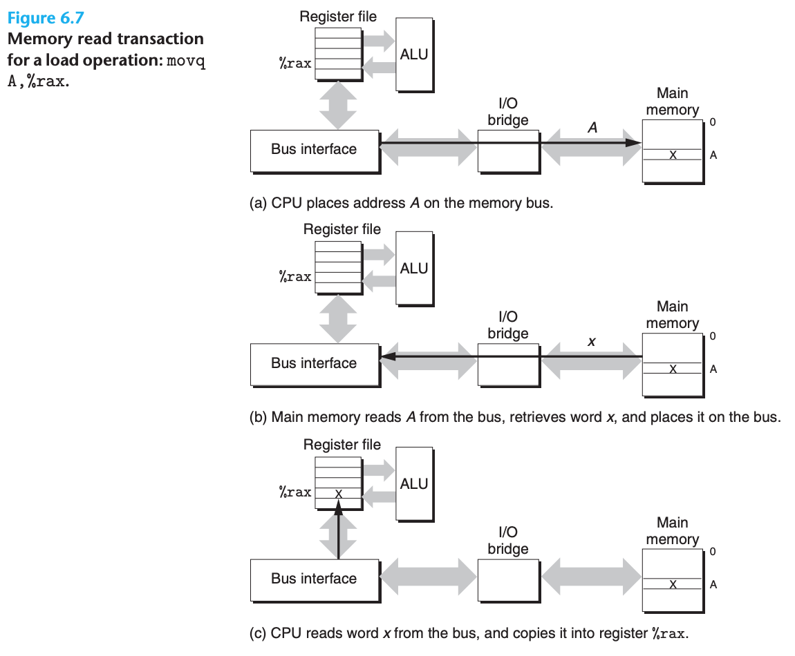
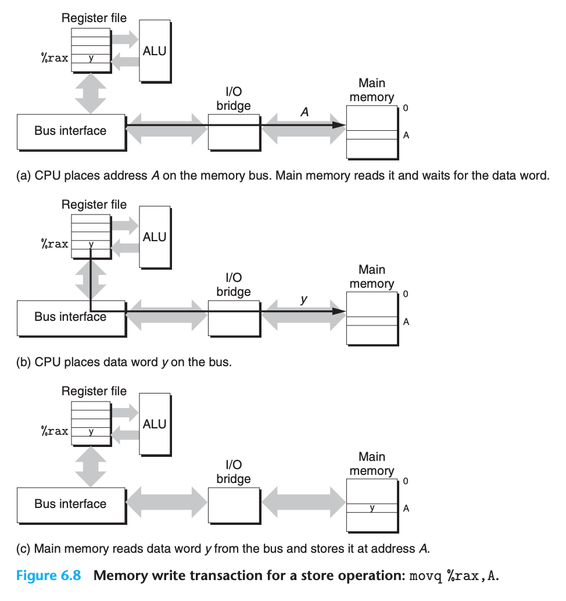
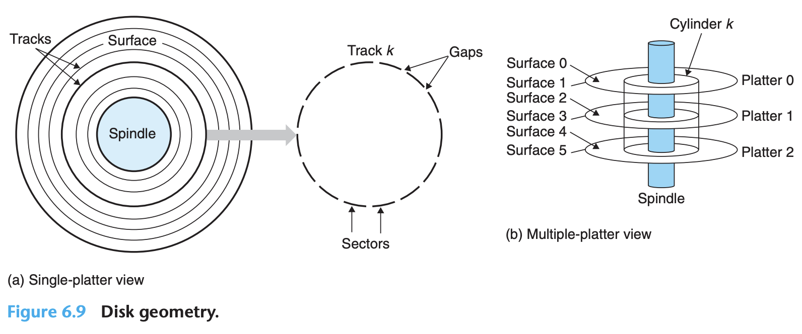
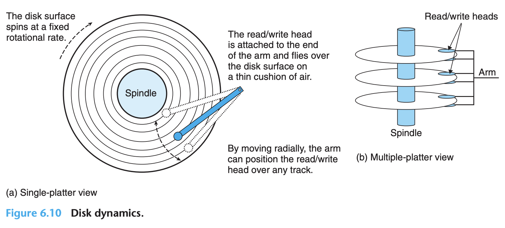

## The Memory Hierarchy

- Memory system is a hierarchy of storage devices with different capacities, costs, and access time
- If stored in a cache, 4 to 75 cycles. If store in main memory, hundreds of cycles. And if stored in disk, tens of millions of cycles

### Storage Technologies

#### Random Access Memory

- RAM
  - SRAM
  - DRAM

##### Static RAM

- SRAM stores each bit in a bistable memory cell
- Due to its bistable nature, an SRAM memory cell will retain its value indefinitely, as long as it is kept powered

##### Dynamic RAM

- The cells (bits) in a DRAM chip are partitioned into d supercells, each consisting of w DRAM cells
  - A d × w DRAM stores a total of `d * w` bits of information
- The high-level view of a DRAM

- One reason circuit designers organize DRAMs as two-dimensional arrays instead of linear arrays is to reduce the number of address pins on the chip
- Reading the contents of a DRAM supercell

- Main memory can be aggregated by connecting multiple memory modules to the memory controller

##### Enhanced DRAMS

- Each is based on the conventional DRAM cell, with optimizations that improve the speed with which the basic DRAM cells can be accessed
- **Fast page mode DRAM (FPM DRAM)**: To read supercells from the same row of an FPM DRAM, the memory controller sends an initial RAS/CAS request, followed by three CAS requests
- **Extended data out DRAM (EDO DRAM)**: An enhanced form of FPM DRAM that allows the individual CAS signals to be spaced closer together in time
- **Synchronous DRAM (SDRAM)**: Optimize control signal
- **Double Data-Rate Synchronous DRAM (DDR SDRAM)**: doubles the speed of the DRAM by using both clock edges as control signals
- **Video RAM (VRAM)**: Used in the frame buffers of graphics systems, allows concurrent reads and writes to the memory

##### Nonvolatile Memory

- For historical reasons, they are referred to collectively as read-only memories (ROMs), even though some types of ROMs can be written to as well as read
- **programmable ROM (PROM)**: can be programmed exactly once
- **erasable programmable ROM (EPROM)**: can be erased and reprogrammed on the order of 1,000 times
- **electrically erasable PROM (EEPROM)**: can be reprogrammed on the order of 10^5 times before it wears out
- **Flash memory**: based on EEPROMs
- Programs stored in ROM devices are often referred to as **firmware**

##### Accessing Main Memory

- **Bus transaction**
  - **read transaction**: data from the main memory to CPU
  - **write transaction**: data from CPU to the main memory
- The control wires carry signals that synchronize the transaction and identify what kind of transaction is currently being performed

- First -> address, Second -> data

#### Disk Storage

##### Disk Geometry

- Disk structure:

- Platter -> Surface -> Track -> Sector -> Bits
- We refer disk as rotating disk to distinguish them from SSD
- There are gaps between sectors, but disk is cycle, inner cycle has less space compare to outter cycle, so we introduce zone and cylinders

##### Disk Capacity

- The capacity of a disk is given by:

$$Capacity = \frac{\# bytes}{sector} \times \frac{average \# sectors}{track} \times \frac{\# track}{surface} \times \frac{\# surface}{platter} \times \frac{\# platter}{disk}$$

- For example, suppose we have a disk with five platters, 512 bytes per sector, 20,000 tracks per surface, and an average of 300 sectors per track. Then the capacity of the disk is:

$$Capacity = \frac{512 bytes}{sector} \times \frac{300 sectors}{track} \times \frac{20000 track}{surface} \times \frac{2 surface}{platter} \times \frac{5 platter}{disk} = 30,720,000,000 \ bytes = 30.72 \ GB$$

- The storage unit is depend on context:
  - For measures that relate to the capacity of DRAMs and SRAMs, typically $K = 2^10$, $M = 2^20$, $G = 2^30$, $T = 2^40$
  - For measures that relate to the capacity of I/O devices such as disks and networks, typically $K = 10^3$, $M = 10^6$, $G = 10^9$, $T = 10^12$
- Rates and throughputs usually use these prefix values as well

##### Disk Operation

- Disks read and write bits stored on the magnetic surface using a read/write head connected to the end of an actuator arm:

- At any point in time, all heads are positioned on the same cylinder
- At these tolerances, a tiny piece of dust on the surface is like a huge boulder. For this reason, disks are always sealed in airtight packages
- Access time for disk has three main components:
  - *seek time*: positions the head over the track that contains the target sector
  - *rotational latency*:  the drive waits for the first bit of the target sector to pass under the head
  - *Transfer time*: read or write the contents of the sector
- Some important observations:
  - Total time dominated by the seek time and the rotational latency
  - Twice the seek time is a simple and reasonable rule for estimating disk access time
- The disk access time, roughly 10 ms, is about 40,000 times greater than SRAM, and about 2,500 times greater than DRAM
