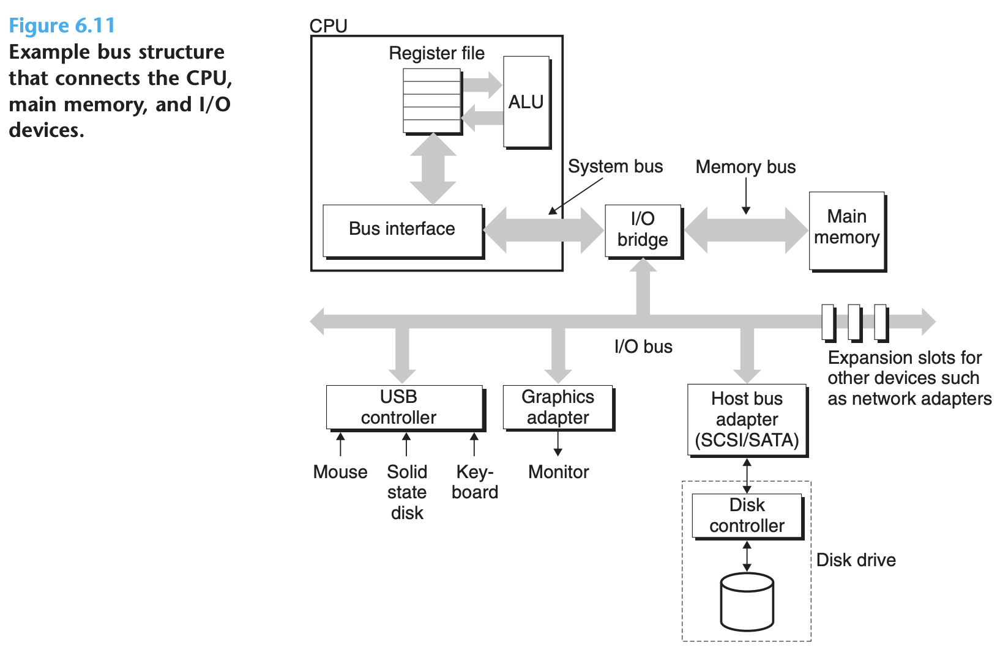
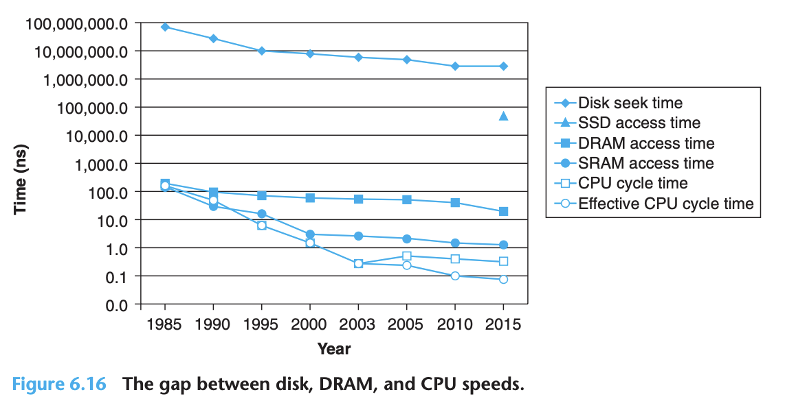

## The Memory Hierarchy

- Memory system is a hierarchy of storage devices with different capacities, costs, and access time
- If stored in a cache, 4 to 75 cycles. If store in main memory, hundreds of cycles. And if stored in disk, tens of millions of cycles

### Storage Technologies

#### Random Access Memory

- RAM
  - SRAM
  - DRAM

##### Static RAM

- SRAM stores each bit in a bistable memory cell
- Due to its bistable nature, an SRAM memory cell will retain its value indefinitely, as long as it is kept powered

##### Dynamic RAM

- The cells (bits) in a DRAM chip are partitioned into d supercells, each consisting of w DRAM cells
  - A d × w DRAM stores a total of `d * w` bits of information
- The high-level view of a DRAM

- One reason circuit designers organize DRAMs as two-dimensional arrays instead of linear arrays is to reduce the number of address pins on the chip
- Reading the contents of a DRAM supercell

- Main memory can be aggregated by connecting multiple memory modules to the memory controller

##### Enhanced DRAMS

- Each is based on the conventional DRAM cell, with optimizations that improve the speed with which the basic DRAM cells can be accessed
- **Fast page mode DRAM (FPM DRAM)**: To read supercells from the same row of an FPM DRAM, the memory controller sends an initial RAS/CAS request, followed by three CAS requests
- **Extended data out DRAM (EDO DRAM)**: An enhanced form of FPM DRAM that allows the individual CAS signals to be spaced closer together in time
- **Synchronous DRAM (SDRAM)**: Optimize control signal
- **Double Data-Rate Synchronous DRAM (DDR SDRAM)**: doubles the speed of the DRAM by using both clock edges as control signals
- **Video RAM (VRAM)**: Used in the frame buffers of graphics systems, allows concurrent reads and writes to the memory

##### Nonvolatile Memory

- For historical reasons, they are referred to collectively as read-only memories (ROMs), even though some types of ROMs can be written to as well as read
- **programmable ROM (PROM)**: can be programmed exactly once
- **erasable programmable ROM (EPROM)**: can be erased and reprogrammed on the order of 1,000 times
- **electrically erasable PROM (EEPROM)**: can be reprogrammed on the order of 10^5 times before it wears out
- **Flash memory**: based on EEPROMs
- Programs stored in ROM devices are often referred to as **firmware**

##### Accessing Main Memory

- **Bus transaction**
  - **read transaction**: data from the main memory to CPU
  - **write transaction**: data from CPU to the main memory
- The control wires carry signals that synchronize the transaction and identify what kind of transaction is currently being performed

- First -> address, Second -> data

#### Disk Storage

##### Disk Geometry

- Disk structure:

- Platter -> Surface -> Track -> Sector -> Bits
- We refer disk as rotating disk to distinguish them from SSD
- There are gaps between sectors, but disk is cycle, inner cycle has less space compare to outter cycle, so we introduce zone and cylinders

##### Disk Capacity

- The capacity of a disk is given by:

$$Capacity = \frac{\# bytes}{sector} \times \frac{average \# sectors}{track} \times \frac{\# track}{surface} \times \frac{\# surface}{platter} \times \frac{\# platter}{disk}$$

- For example, suppose we have a disk with five platters, 512 bytes per sector, 20,000 tracks per surface, and an average of 300 sectors per track. Then the capacity of the disk is:

$$Capacity = \frac{512 bytes}{sector} \times \frac{300 sectors}{track} \times \frac{20000 track}{surface} \times \frac{2 surface}{platter} \times \frac{5 platter}{disk} = 30,720,000,000 \ bytes = 30.72 \ GB$$

- The storage unit is depend on context:
  - For measures that relate to the capacity of DRAMs and SRAMs, typically $K = 2^10$, $M = 2^20$, $G = 2^30$, $T = 2^40$
  - For measures that relate to the capacity of I/O devices such as disks and networks, typically $K = 10^3$, $M = 10^6$, $G = 10^9$, $T = 10^12$
- Rates and throughputs usually use these prefix values as well

##### Disk Operation

- Disks read and write bits stored on the magnetic surface using a read/write head connected to the end of an actuator arm:

- At any point in time, all heads are positioned on the same cylinder
- At these tolerances, a tiny piece of dust on the surface is like a huge boulder. For this reason, disks are always sealed in airtight packages
- Access time for disk has three main components:
  - *seek time*: positions the head over the track that contains the target sector
  - *rotational latency*:  the drive waits for the first bit of the target sector to pass under the head
  - *Transfer time*: read or write the contents of the sector
- Some important observations:
  - Total time dominated by the seek time and the rotational latency
  - Twice the seek time is a simple and reasonable rule for estimating disk access time
- The disk access time, roughly 10 ms, is about 40,000 times greater than SRAM, and about 2,500 times greater than DRAM

##### Logical Disk Blocks

- To hide this complexity from the operating system, modern disks present a simpler view of their geometry as a sequence of B sector-size logical blocks, numbered 0, 1,...,B-1
- Firmware on the controller performs a fast table lookup that translates the logical block number into a `(surface, track, sector)` triple that uniquely identifies the corresponding physical sector
- Before a disk can be used to store data, it must be formatted by the disk controller
  - This involves filling in the gaps between sectors with information that identifies the sectors, identifying any cylinders with surface defects and taking them out of action, and setting aside a set of cylinders in each zone as spares that can be called into action if one or more cylinders in the zone goes bad during the lifetime of the disk

##### Connecting I/O Devices

- I/O buses are designed to be independent of the underlying CPU:

- I/O buses is based on the **peripheral component interconnect (PCI)** bus
- In the PCI model, each device in the system shares the bus, and only one device at a time can access these wires
- In modern systems, the shared PCI bus has been replaced by a PCI express (PCIe) bus, which is a set of high-speed serial, point-to-point links connected by switches

##### Accessing Disks

- This process, whereby a device performs a read or write bus transaction on its own, without any involvement of the CPU, is known as direct memory access (DMA):

#### Solid State Disks

- Data are read and written in units of pages. A page can be written only after the entire block to which it belongs has been erased (typically, this means that all bits in the block are set to 1):

- SSDs have the potential to wear out, and SSDs are about 30 times more expensive per byte than rotating disks

#### Storage Technology Trends

- It is much easier to increase density (and thereby reduce cost) than to decrease access time
- The gap between different storage:

### Locality

- **Locality**: tend to reference data items that are near other recently referenced data items or that were recently referenced themselves
  - **temporal locality**: In a program with good temporal locality, a memory location that is referenced once is likely to be referenced again multiple times in the near future
  - **spatial locality**: In a program with good spatial locality, if a memory location is referenced once, then the program is likely to reference a nearby memory location in the near future
- In general, programs with good locality run faster than programs with poor locality
- In general, as the stride increases, the spatial locality decreases:

- Summary:
  - Programs that repeatedly reference the same variables enjoy good temporal locality
  - For programs with stride-k reference patterns, the smaller the stride, the better the spatial locality. Programs with stride-1 reference patterns have good spatial locality. Programs that hop around memory with large strides have poor spatial locality
  - Loops have good temporal and spatial locality with respect to instruction fetches. The smaller the loop body and the greater the number of loop iterations, the better the locality
- Nonetheless, knowing how to glance at a source code and getting a high-level feel for the locality in the program is a useful and important skill for a programmer to master

### The Memory Hierarchy

- The memory hierarchy:

#### Caching in the memory hierarchy

- The central idea of a memory hierarchy is that for each k, the faster and smaller storage device at level k serves as a cache for the larger and slower storage device at level k + 1
- DRAM -> SSD -> Disk -> Tape
- Basic principle of caching:

- It is important to realize that while the block size is fixed between any particular pair of adjacent levels in the hierarchy, other pairs of levels can have different block sizes
- In general, devices lower in the hierarchy (further from the CPU) have longer access times, and thus tend to use larger block sizes in order to amortize these longer access times
- Hardware caches typically implement a simpler placement policy that restricts a particular block at level k + 1 to a small subset (sometimes a singleton) of the blocks at level k
- The compiler manages the register file, the highest level of the cache hierarchy

### Cache Memories

- General organization of cache:

- Summary of cache parameters:

#### Direct-Mapped Caches

- A cache with exactly one line per set (E = 1) is known as a direct-mapped cache

- The process that a cache goes through of determining whether a request is a hit or a miss and then extracting the requested word consists of three steps:
  - (1) set selection
  - (2) line matching
  - (3) word extraction

#### Set Associative Caches

- A cache with 1 < E < C/B is often called an E-way set associative cache

- An associative memory is an array of (key, value) pairs that takes as input the key and returns a value from one of the (key, value) pairs that matches the input key
- Line matching & word selection:

#### Fully Associative Caches

- A fully associative cache consists of a single set (i.e., E = C/B) that contains all of the cache lines

- Because the cache circuitry must search for many matching tags in parallel, it is difficult and expensive to build an associative cache that is both large and fast
- As a result, fully associative caches are only appropriate for small caches, such as the translation lookaside buffers (TLBs) in virtual memory systems that cache page table entries