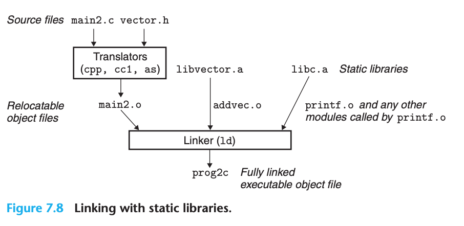

## Linking

### Compiler Driver

- Most compilation systems provide a compiler driver that invokes the language preprocessor, compiler, assembler, and linker, as needed on behalf of the user
- ASCII source file -> executable object file


- The whole process:

```bash
# The driver first runs the C preprocessor (cpp)
>$ cpp [other arguments] main.c /tmp/main.i

# the driver runs the C compiler (cc1), which translates main.i into an ASCII assembly-language file main.s
>$ cc1 /tmp/main.i -Og [other arguments] -o /tmp/main.s

# the driver runs the assembler (as), which translates main.s into a binary relocatable object file main.o
>$ as [other arguments] -o /tmp/main.o /tmp/main.s

# go through same process to get another object file sum.o

# ...

# Finally, it runs the linker program ld, which combines main.o and sum.o, along with the necessary system object files, to create the binary executable object file prog
>$ ld -o prog [system object files and args] /tmp/main.o /tmp/sum.o

>$ ./prog

# The shell invokes a function in the operating system called the loader, which copies the code and data in the executable file prog into memory, and then transfers control to the beginning of the program
```

### Static Linking

- Input a collection of relocatable object files and command-line arguments and generate as output a fully linked executable object file that can be loaded and run
- The linker perform two main tasks:
  1. **Symbol resolution**: Associate each symbol reference with exactly one symbol definition
  2. **Relocation**: Associating a memory location with each symbol defintion, and modifying all the corresponding reference
- Object files are merely collections of blocks of bytes
- Linkers have minimal understanding of the target machine. The compilers and assemblers that generate the object files have already done most of the work.

### Object Files

- Object files come in three forms:
  - Relocatable object file
  - Executable object file
  - Shared object file
- Compilers and assemblers generate relocatable object files (including shared object files)
- Linkers generate executable object files
- Modern x86-64 Linux and Unix systems use **Executable and Linkable Format (ELF)** to organize object files

### Relocatable Object Files

- The ELF `header` is 16-byte sequence that describe:
  - **word size**
  - **byte ordering**
  - **size of the ELF header**
  - **object file type**
  - **machine type**
  - **file offset of the section header table**
  - **size and number of entries in the section header table**
- The locations and sizes of the various sections are described by the **section header table**, which contains a fixed-size entry for each section in the object file


- A typical ELF relocate object file contains the following sections:
  - `.text`: Machine code of compiled program
  - `.rodata`: Read-only data, eg. format strings, jump tables
  - `.data`: **Initialized** global and static C variables
  - `.bss`: **Uninitialized** global and static C variables, along with any global or static variables that are initialized to zero
  - `.symtab`: A symbol table with information about functions and global variables that are defined and referenced in the program
  - `.rel.text`: A list of locations in the .text section that will need to be modified when the linker combines this object file with others
  - `.rel.data`: Relocation information for any global variables that are referenced or defined by the module
  - `.debug`: A debugging symbol table with entries for local variables and typedefs defined in the program, global variables defined and referenced in the program, and the original C source file (only present if the compiler driver is invoked with the -g option)
  - `.line`: A mapping between line numbers in the original C source program and machine code instructions in the .text section (only present if the compiler driver is invoked with the -g option)
  - `.strtab`: A string table for the symbol tables in the .symtab and .debug sections and for the section names in the section headers

### Symbols and Symbol Tables

- Each relocatable object module, `m`, has a symbol table that contains information about the symbols that are defined and referenced by `m`
- Three different kind of symbols:
  - **Global symbols**: nonstatic C functions and global variables defined by module `m`, can be referenced by other modules
  - Global symbols that are referenced by module m but defined by some other module, such symbols are called **externals**
  - **Local symbols**: defined and referenced exclusively by module `m`. correspond to static C functions and global variables that are defined with the static attribute, visible anywhere within module m, but cannot be referenced by other modules
- An ELF symbol table is contained in the `.symtab` section, contains an array of entries:

```c
typedef struct {
  int name; /* String table offset */
  char type:4, /* Function or data (4 bits) */
       binding:4; /* Local or global (4 bits) */
  char reserved; /* Unused */
  short section; /* Section header index */
  long value; /* Section offset or absolute address */
  long size; /* Object size in bytes */
} Elf64_Symbol;
```

- There are three special pseudosections that don’t have entries in the section header table:
  - **ABS**: symbols that should not be relocated
  - **UNDEF**: undefined symbols—that is, symbols that are referenced in this object module but defined elsewhere
  - **COMMON**: uninitialized data objects that are not yet allocated
- Distinction between COMMON and `.bss`:
  - **COMMON**: Uninitialized global variables
  - `.bss`: Uninitialized static variables, and global or static variables that are initialized to zero

### Symbol Resolution

- The compiler allows only one definition of each local symbol per module
- The compiler also ensures that static local variables, which get local linker symbols, have unique names
- When the compiler encounters a symbol (either a variable or function name) that is not defined in the current module, it assumes that it is defined in some other module, generates a linker symbol table entry, and leaves it for the linker to handle
- If the linker is unable to find a definition for the referenced symbol in any of its input modules, it prints an (often cryptic) error message and terminates

#### How Linkers Resolve Duplicate Symbol Names

- Functions and initialized global variables get strong symbols. Uninitialized global variables get weak symbols
- Linux linkers use the following rules for dealing with duplicate symbol names:
  1. Multiple strong symbols with the same name are not allowed
  2. Given a strong symbol and multiple weak symbols with the same name, choose the strong symbol
  3. Given multiple weak symbols with the same name, choose any of the weak symbols
- eg.

```c
/* foo5.c */
#include <stdio.h>

void f(void);
int y = 15212;
int x = 15213;
int main() {
  f();
  printf("x = 0x%x y = 0x%x \n", x, y);
  return 0;
}

/* bar5.c */
double x;
void f() {
  x = -0.0;
}
```

- The assignment `x = -0.0` will overwrite the memory locations for `x` and `y` in `foo5.c` with the double-precision floating-point representation of negative zero

#### Linking with Static Libraries

- All compilation systems provide a mechanism for packaging related object modules into a single file called a **static library**, which can then be supplied as input to the linker
- On Linux systems, static libraries are stored on disk in a particular file format known as an **archive**
- Eg.

```c
#include <stdio.h>
#include "vector.h"

int x[2] = {1, 2};
int y[2] = {3, 4};
int z[2];
int main() {
  addvec(x, y, z, 2);
  printf("z = [%d %d]\n", z[0], z[1]);
  return 0;
}
```

- The activity of the linker:



#### How Linkers Use Static Libraries to Resolve References

- During the symbol resolution phase, the linker scans the relocatable object files and archives left to right in the same sequential order that they appear on the
compiler driver’s command line (The driver automatically translates any .c files on the command line into .o files)
- During scan, the linker maintain three sets (initially, they are empty):
  - `E`: relocatable object files that will be merged to form the executable
  - `U`: unresolved symbols
  - `D`: symbols that have been defined in previous input files
- Steps:
  - For each input file `f` on the command line, the linker determines if `f` is an object file or an archive
  - If `f` is an object file, the linker adds `f` to `E`, updates `U` and `D` to reflect the symbol definitions and references in `f`, and proceeds to the next input file
  - If `f` is an archive, the linker attempts to match the unresolved symbols in `U` against the symbols defined by the members of the archive
    - Any member object files not contained in `E` are simply discarded and the linker proceeds to the next input file
  - If `U` is nonempty when the linker finishes scanning the input files on the command line, it prints an error and terminates
  - It merges and relocates the object files in E to build the output executable file
- If the library that defines a symbol appears on the command line before the object file that references that symbol, then the reference will not be resolved and linking will fail:
  ```bash
  linux> gcc -static ./libvector.a main2.c
  /tmp/cc9XH6Rp.o: In function ‘main’:
  /tmp/cc9XH6Rp.o(.text+0x18): undefined reference to ‘addvec’
  ```
- The general rule for libraries is to place them at the end of the command line
- eg. suppose `foo.c` calls functions in `libx.a` and `libz.a` that call functions in `liby.a`:
  ```bash
  linux> gcc foo.c libx.a libz.a liby.a
  ```
- eg. suppose `foo.c` calls a function in `libx.a` that calls a function in `liby.a` that calls a function in `libx.a`:
  ```bash
  linux> gcc foo.c libx.a liby.a libx.a
  ```