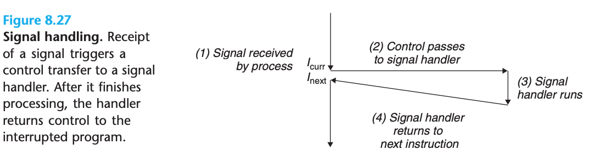
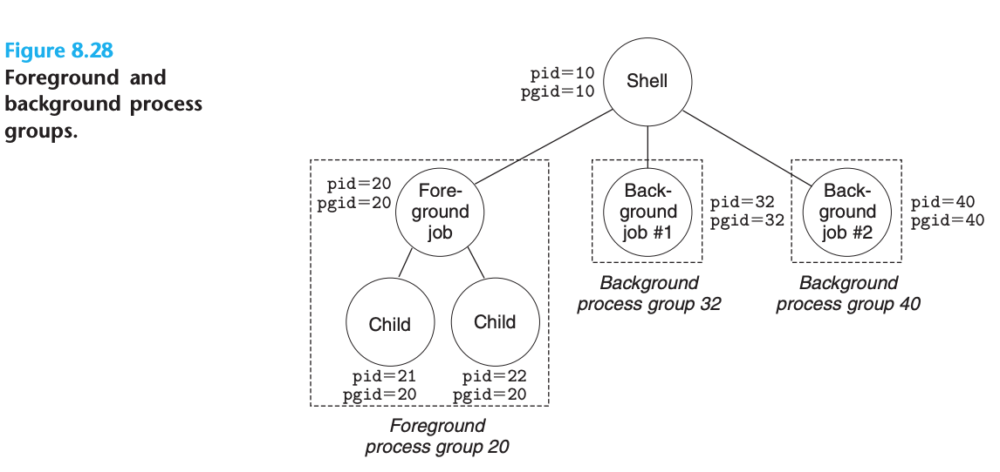
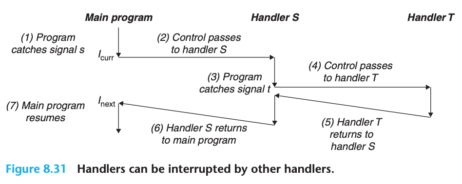

## Exceptional Control Flow

### Exceptions

- Exceptions are a form of exceptional control flow that are implemented partly by the hardware and partly by the operating system
- Higher level picture of ECF


- In any case, when the processor detects that the event has occurred, it makes an indirect procedure call (the exception), through a jump table called an exception table, to an operating system subroutine (the exception handler) that is specifically designed to process this particular kind of event
- After exception handler, three thing might happen:
  1. returns control to the current instruction $I_{curr}$,
  2. returns control to $I_{next}$
  3. aborts the interrupted program

#### Exception Handling

- At system boot time (when the computer is reset or powered on), the operating system allocates and initializes a jump table called an exception table, so that
entry k contains the address of the handler for exception k:


- The exception number is an index into the exception table, whose starting address is contained in a special CPU register called the exception table base register


- Difference between exception and procedure call:
  - No actual return value for exception
  - The processor also pushes some additional processor state onto the stack that will be necessary to restart the interrupted program when the handler returns
  - Exception will use kernel stack instead of user stack
  - Exception handlers run in kernel mode


#### Classes of Exceptions

- Exceptions can be divided into four classes: **interrupts**, **traps**, **faults**, and **aborts**


##### Interrupts

- Process of interrupts:


- Happen after the current instruction finishes executing
- Trigger interrupts by signaling a pin on the processor chip and placing onto the system bus the exception number that identifies the device that caused the interrupt
- The effect is that the program continues executing as though the interrupt had never happened

##### Traps and System Calls

- Traps are intentional exceptions that occur as a result of executing an instruction
- Process of Trap handling:


- Traps provide a ways for user program to call funcs in kernel environment

##### Faults

- Faults result from error conditions that a handler might be able to correct
- Process of faults:


- A classic example of a fault is the page fault exception, which occurs when an instruction references a virtual address whose corresponding page is not resident in memory and must therefore be retrieved from disk

##### Aborts

- Aborts result from unrecoverable fatal errors, typically hardware errors such as parity errors that occur when DRAM or SRAM bits are corrupted
- Process of aborts:


#### Exceptions in Linux/x86-64 Systems

- Examples of faults and aborts:
  - **Divide Error**:
    - Occurs when an application attempts to divide by zero, or when the result of a divide instruction is too big for the destination operand
    - Unix does not attempt to recover from divide errors, opting instead to abort the program
    - Linux shells typically report divide errors as "Floating exceptions"
  - **General Protection Fault**:
    - Usually because a program references an undefined area of virtual memory or because the program attempts to write to a read-only text segment
    - Linux does not attempt to recover from this fault
    - Linux shells typically report general protection faults as "Segmentation faults"
  - **Page Fault**:
    - Is an example of an exception where the faulting instruction is restarted
  - **Machine Check**:
    - Occurs as a result of a fatal hardware error that is detected during the execution of the faulting instruction

- Popular system calls in Linux x86-64 systems:


- Each system call has a unique integer number that corresponds to an offset in a jump table in the kernel (not the same as the exception table)
- All arguments to Linux system calls are passed through general-purpose registers rather than the stack

### Processes

- Exceptions are the basic building blocks that allow the operating system kernel to provide the notion of a **process**
- Key abstractions that a process provides to the application:
  - An independent logical control flow that provides the illusion that our program has exclusive use of the processor
  - A private address space that provides the illusion that our program has exclusive use of the memory system

#### Logical Control Flow

- This sequence of PC values is known as a logical control flow, or simply logical flow


- Each process executes a portion of its flow and then is preempted (temporarily suspended) while other processes take their turns

#### Concurrent Flows

- **Concurrent Flow**: CPU time not need overlap, execute time overlap
- **Parallel Flow**: Run on different CPU core or computer
- Each time period that a process executes a portion of its flow is called a **time slice**

#### Private Address Space

- A process provides each program with its own private address space
- This space is private in the sense that a byte of memory associated with a particular address in the space cannot in general be read or written by any other process
- General process address space:


#### User and Kernel Modes

- Processors typically provide this capability with a mode bit in some control register that characterizes the privileges that the process currently enjoys
- User programs must instead access kernel code and data indirectly via the system call interface
- Linux provides a clever mechanism, called the /proc filesystem, that allows user mode processes to access the contents of kernel data structures

#### Context Switches

- The kernel maintains a context for each process
- After the kernel has scheduled a new process to run, it preempts the current process and transfers control to the new process using a mechanism called a **context switch**:
  1. saves the context of the current process
  2. restores the saved context of some previously preempted process
  3. passes control to this newly restored process
- Anatomy of a process context switch:


- Some senarios:
  - system call
  - interrupt

### System Call Error Handling

- here is how we might check for errors when we call the Linux fork function

```c
if ((pid = fork()) < 0) {
  fprintf(stderr, "fork error: %s\n", strerror(errno));
  exit(0);
}
```

- We can optimize the by add a function:

```c
void unix_error(char *msg) { /* Unix-style error */ 
  fprintf(stderr, "%s: %s\n", msg, strerror(errno));
  exit(0);
}

if ((pid = fork()) < 0)
  unix_error("fork error");
```

- We can simplify our code even further by using **error-handling wrappers**:

```c
pid_t Fork(void){
  pid_t pid;

  if ((pid = fork()) < 0)
    unix_error("Fork error");
  return pid;
}

pid = Fork()
```

### Process Control

#### Obtaining Process IDs

```c
#include <sys/types.h>
#include <unistd.h>

// returns the PID of the calling process
pid_t getpid(void);

// returns the PID of its parent
pid_t getppid(void);
```

- The getpid and getppid routines return an integer value of type pid_t, which on Linux systems is defined in types.h as an int

#### Creating and Terminating Processes

- From a programmer’s perspective, we can think of a process as being in one of three states:
  - **Running**: The process is either executing on the CPU or waiting to be executed and will eventually be scheduled by the kernel
  - **Stopped**: The execution of the process is suspended and will not be scheduled
    - A process stops as a result of receiving a SIGSTOP, SIGTSTP, SIGTTIN, or SIGTTOU signal, and it remains stopped until it receives a SIGCONT signal, at which point it becomes running again
  - **Terminated**: The process is stopped permanently. A process becomes terminated for one of three reasons:
    1. Receiving a signal whose default action is to terminate the process
    2. Returning from the main routine
    3. Calling the exit function

```c
#include <stdlib.h>

// This function does not return
void exit(int status);
```

- The exit function terminates the process with an exit status of status. (The other way to set the exit status is to return an integer value from the main routine.)

- A parent process creates a new running child process by calling the `fork` function

```c
#include <sys/types.h>
#include <unistd.h>

// Returns: 0 to child, PID of child to parent, −1 on error
pid_t fork(void);
```

- The newly created child process is almost, but not quite, identical to the parent
- The most significant difference between the parent and the newly created child is that they have different PIDs
- `fork` function called once but it returns twice
  - once in the calling process (the parent)
  - once in the newly created child process
- In the parent, fork returns the PID of the child. In the child, fork returns a value of 0
- eg.

```c
int main() {
  pid_t pid;
  int x = 1;
  pid = Fork();
  if (pid == 0) { /* Child */
    printf("child : x=%d\n", ++x); // child : x=2
    exit(0);
  }

  /* Parent */
  printf("parent: x=%d\n", --x); // parent: x=0
  exit(0);
}
```

- some subtle aspects to the `fork`:
  - Call once, return twice
  - Concurrent execution
  - Duplicate but separate address spaces
  - Shared files
- Process Graph can help to understand `fork`, eg.


- For a program running on a single processor, any topological sort of the vertices in the corresponding process graph represents a feasible total ordering of the statements in the program

#### Reaping Child Processes

- When a process terminates for any reason, the kernel does not remove it from the system immediately. Instead, the process is kept around in a terminated state until it is reaped by its parent
- When the parent reaps the terminated child, the kernel passes the child’s exit status to the parent and then discards the terminated process, at which point it ceases to exist
- A terminated process that has not yet been reaped is called a **zombie**
- When a parent process terminates, the kernel arranges for the **init process** to become the adopted parent of any orphaned children
  - The init process, which has a PID of 1, is created by the kernel during system start-up, never terminates, and is the ancestor of every process
- Even though zombies are not running, they still consume system memory resources

- A process waits for its children to terminate or stop by calling the **waitpid** function:

```c
#include <sys/types.h>
#include <sys/wait.h>

// Returns: PID of child if OK, 0 (if WNOHANG), or −1 on error
pid_t waitpid(pid_t pid, int *statusp, int options);
```

- The members of the wait set are determined by the pid argument:
  - If pid > 0, then the wait set is the singleton child process whose process ID is equal to pid
  - If pid = -1, then the wait set consists of all of the parent’s child processes

- The default behavior can be modified by setting options to various combinations of the `WNOHANG`, `WUNTRACED`, and `WCONTINUED` constants:
  - `WNOHANG`: Return immediately (with a return value of 0) if none of the child processes in the wait set has terminated yet
  - `WUNTRACED`: Suspend execution of the calling process until a process in the wait set becomes either terminated or stopped
  - `WCONTINUED`: Suspend execution of the calling process until a running process in the wait set is terminated or until a stopped process in the wait set has been resumed by the receipt of a SIGCONT signal
  - `WNOHANG | WUNTRACED`:  Return immediately, with a return value of 0, if none of the children in the wait set has stopped or terminated, or with a return value equal to the PID of one of the stopped or terminated children

- If the statusp argument is non-NULL, then waitpid encodes status information about the child that caused the return in status, which is the value pointed to by statusp:
- The wait.h include file defines several macros for interpreting the status argument:
  - `WIFEXITED(status)`: Returns true if the child terminated normally, via a call to exit or a return
  - `WEXITSTATUS(status)`: Returns the exit status of a normally terminated child. This status is only defined if `WIFEXITED()` returned true
  - `WIFSIGNALED(status)`: Returns true if the child process terminated because of a signal that was not caught
  - `WTERMSIG(status)`: Returns the number of the signal that caused the child process to terminate. This status is only defined if `WIFSIGNALED()` returned true
  - `WIFSTOPPED(status)`: Returns true if the child that caused the return is currently stopped
  - `WSTOPSIG(status)`: Returns the number of the signal that caused the child to stop. This status is only defined if `WIFSTOPPED()` returned true
  - `WIFCONTINUED(status)`: Returns true if the child process was restarted by receipt of a `SIGCONT` signal

- If the calling process has no children, then waitpid returns −1 and sets errno to `ECHILD`
- If the waitpid function was interrupted by a signal, then it returns −1 and sets errno to `EINTR`

- The wait function is a simpler version of waitpid, calling `wait(&status)` is equivalent to calling `waitpid(-1, &status, 0)`

```c
#include <sys/types.h>
#include <sys/wait.h>

// Returns: PID of child if OK or −1 on error
pid_t wait(int *statusp);
```

- example of using `waitpid`:

```c
#include "csapp.h"
#define N 2

int main() {
  int status, i;
  pid_t pid;
  /* Parent creates N children */
  for (i = 0; i < N; i++)
    if ((pid = Fork()) == 0) /* Child */
      exit(100+i);

  /* Parent reaps N children in no particular order */
  while ((pid = waitpid(-1, &status, 0)) > 0) {
    if (WIFEXITED(status))
      printf("child %d terminated normally with exit status=%d\n", pid, WEXITSTATUS(status));
    else
      printf("child %d terminated abnormally\n", pid);
  }

  /* The only normal termination is if there are no more children */
  if (errno != ECHILD)
    unix_error("waitpid error");

  exit(0);
}
```

- Notice that the program reaps its children in no particular order
- Using waitpid to reap zombie children in the order they were created:

```c
#include "csapp.h"
#define N 2

int main() {
  int status, i;
  pid_t pid[N], retpid;

  /* Parent creates N children */
  for (i = 0; i < N; i++)
    if ((pid[i] = Fork()) == 0) /* Child */
      exit(100+i);

  /* Parent reaps N children in order */
  i = 0;
  while ((retpid = waitpid(pid[i++], &status, 0)) > 0) {
    if (WIFEXITED(status))
      printf("child %d terminated normally with exit status=%d\n", retpid, WEXITSTATUS(status));
    else
    printf("child %d terminated abnormally\n", retpid);
  }

  /* The only normal termination is if there are no more children */
  if (errno != ECHILD)
    unix_error("waitpid error");

  exit(0);
}
```

#### Putting Processes to Sleep

- The sleep function suspends a process for a specified period of time:

```c
#include <unistd.h>

// Returns: seconds left to sleep
unsigned int sleep(unsigned int secs);
```

- `pause` puts the calling function to sleep until a signal is received by the process

```c
#include <unistd.h>

// Always returns −1
int pause(void);
```

#### Loading and Running Programs

- The `execve` function loads and runs the executable object file filename with the argument list `argv` and the environment variable list `envp`

```c
#include <unistd.h>

// Does not return if OK; returns −1 on error
int execve(const char *filename, const char *argv[], const char *envp[]);
```

- `execve` is called once and never returns unless there is an error
- By convention, `argv[0]` is the name of the executable object file
- There are three arguments to function main, each stored in a register according to the x86-64 stack discipline:
  - `argc`, which gives the number of non-null pointers in the `argv[]` array
  - `argv`, which points to the first entry in the `argv[]` array
  - `envp`, which points to the first entry in the `envp[]` array
- Linux provide several functions for manipulating the environment array:

```c
#include <stdlib.h>

// Returns: pointer to name if it exists, NULL if no match
char *getenv(const char *name);

// Returns: 0 on success, −1 on error 
int setenv(const char *name, const char *newvalue, int overwrite);

// Returns: nothing
void unsetenv(const char *name);
```

#### Using fork and execve to Run Programs

- A process is a specific instance of a program in execution; a program always runs in the context of some process
  - `fork` run program in child process
  - `execve` run program in current process

- Main routine of a simple shell ( this simple shell is flawed because it does not reap any of its background children)

```c
#include "csapp.h"
#define MAXARGS 128

/* Function prototypes */
void eval(char *cmdline);
int parseline(char *buf, char **argv);
int builtin_command(char **argv);

int main() {
  char cmdline[MAXLINE]; /* Command line */
  while (1) {
    /* Read */
    printf("> ");
    Fgets(cmdline, MAXLINE, stdin);
    if (feof(stdin))
      exit(0);
    /* Evaluate */
    eval(cmdline);
  }
}
```

- Code that evaluates the command line

```c
/* eval - Evaluate a command line */
void eval(char *cmdline) {
  char *argv[MAXARGS]; /* Argument list execve() */
  char buf[MAXLINE]; /* Holds modified command line */
  int bg; /* Should the job run in bg or fg? */
  pid_t pid; /* Process id */
  strcpy(buf, cmdline);
  bg = parseline(buf, argv);
  if (argv[0] == NULL)
    return; /* Ignore empty lines */

  if (!builtin_command(argv)) {
    if ((pid = Fork()) == 0) { /* Child runs user job */
      if (execve(argv[0], argv, environ) < 0) {
        printf("%s: Command not found.\n", argv[0]);
        exit(0);
      }
    }
    /* Parent waits for foreground job to terminate */
    if (!bg) {
      int status;
      if (waitpid(pid, &status, 0) < 0)
        unix_error("waitfg: waitpid error");
    } else
      printf("%d %s", pid, cmdline);
  }
  return;
}

/* If first arg is a builtin command, run it and return true */
int builtin_command(char **argv) {
  if (!strcmp(argv[0], "quit")) /* quit command */
    exit(0);

  if (!strcmp(argv[0], "&")) /* Ignore singleton & */
    return 1;

  return 0; /* Not a builtin command */
}

/* parseline - Parse the command line and build the argv array */
int parseline(char *buf, char **argv) {
  char *delim; /* Points to first space delimiter */
  int argc; /* Number of args */
  int bg; /* Background job? */
  buf[strlen(buf)-1] = ' '; /* Replace trailing ’\n’ with space */

  while (*buf && (*buf == ' ')) /* Ignore leading spaces */
  buf++;

  /* Build the argv list */
  argc = 0;
  while ((delim = strchr(buf, ’ ’))) {
    argv[argc++] = buf;
    *delim = ’\0’;
    buf = delim + 1;
    while (*buf && (*buf == ’ ’)) /* Ignore spaces */
      buf++;
  }

  argv[argc] = NULL;
  if (argc == 0) /* Ignore blank line */
    return 1;
  /* Should the job run in the background? */
  if ((bg = (*argv[argc-1] == ’&’)) != 0)
    argv[--argc] = NULL;

  return bg;
}
```

### Signals

- Low-level hardware exceptions are processed by the kernel’s exception handlers and would not normally be visible to user processes. Signals provide a mechanism for exposing the occurrence of such exceptions to user processes


| Number | Name| Default action | Corresponding event| 
| ---: | ----: | -------------: | -----------------: |
| 1 | SIGHUP| Terminate | Terminal line hangup|
| 2 | SIGINT| Terminate | Interrupt from keyboard|
| 3 | SIGQUIT| Terminate | Quit from keyboard| 
| 4 | SIGILL| Terminate | Illegal instruction| 
| 5 | SIGTRAP| Terminate and dump core | Trace trap| 
| 6 | SIGABRT| Terminate | and dump core | Abort signal from abort function| 
| 7 | SIGBUS| Terminate | Bus error| 
| 8 | SIGFPE| Terminate and dump core | Floating-point exception| 
| 9 | SIGKILL| Terminate | Kill program| 
| 10 | SIGUSR1| Terminate | User-defined signal 1| 
| 11 | SIGSEGV| Terminate and dump core | Invalid memory reference (seg fault)| 
| 12 | SIGUSR2| Terminate | User-defined signal 2| 
| 13 | SIGPIPE| Terminate | Wrote to a pipe with no reader| 
| 14 | SIGALRM| Terminate | Timer signal from alarm function| 
| 15 | SIGTERM| Terminate | Software termination signal| 
| 16 | SIGSTKFLT| Terminate | Stack fault on coprocessor| 
| 17 | SIGCHLD| Ignore | A child process has stopped or terminated| 
| 18 | SIGCONT| Ignore | Continue process if stopped| 
| 19 | SIGSTOP| Stop until next SIGCONT | Stop signal not from terminal| 
| 20 | SIGTSTP| Stop until next SIGCONT | Stop signal from terminal| 
| 21 | SIGTTIN| Stop until next SIGCONT | Background process read from terminal| 
| 22 | SIGTTOU| Stop until next SIGCONT | Background process wrote to terminal| 
| 23 | SIGURG| Ignore | Urgent condition on socket| 
| 24 | SIGXCPU| Terminate | CPU time limit exceeded| 
| 25 | SIGXFSZ| Terminate | File size limit exceeded| 
| 26 | SIGVTALRM| Terminate | Virtual timer expired| 
| 27 | SIGPROF| Terminate | Profiling timer expired| 
| 28 | SIGWINCH| Ignore | Window size changed| 
| 29 | SIGIO| Terminate | I/O now possible on a descriptor| 
| 30 | SIGPWR| Terminate | Power failure|

#### Signal Terminology

- A signal that has been sent but not yet received is called a pending signal
- At any point in time, there can be at most one pending signal of a particular type
- Signal handling process:



#### Sending Signals

- Process Groups:
  - Every process belongs to exactly one process group, which is identified by a positive integer process group ID

```c
#include <unistd.h>

// Returns: process group ID of calling process
pid_t getpgrp(void);
```

- By default, a child process belongs to the same process group as its parent
- A process can change the process group of itself or another process by using the **setpgid** function
  - If pid is zero, the PID of the current process is used
  - If pgid is zero, the PID of the process specified by pid is used for the process group ID

```c
#include <unistd.h>

// Returns: 0 on success, −1 on error
int setpgid(pid_t pid, pid_t pgid);
```

- The `/bin/kill` program sends an arbitrary signal to another process, eg.

```bash
linux> /bin/kill -9 15213
```

- A negative PID causes the signal to be sent to every process in process group PID, eg.

```bash
linux> /bin/kill -9 -15213
```

- Unix shells use the abstraction of a job to represent the processes that are created as a result of evaluating a single command line
- At any point in time, there is at most one foreground job and zero or more background jobs, eg.



- Typing `Ctrl+C` at the keyboard causes the kernel to send a SIGINT signal to every process in the foreground process group
- Typing `Ctrl+Z` causes the kernel to send a SIGTSTP signal to every process in the foreground process group

- Processes send signals to other processes (including themselves) by calling the `kill` function
  - If pid is greater than zero, then the kill function sends signal number sig to process pid
  - If pid is equal to zero, then kill sends signal sig to every process in the process group of the calling process, including the calling process itself
  - If pid is less than zero, then kill sends signal sig to every process in process group |pid| (the absolute value of pid)

```c
#include <sys/types.h>
#include <signal.h>

// Returns: 0 if OK, −1 on error
int kill(pid_t pid, int sig);
```

- example usage:

```c
#include "csapp.h"

int main() {
  pid_t pid;
  /* Child sleeps until SIGKILL signal received, then dies */
  if ((pid = Fork()) == 0) {
    Pause(); /* Wait for a signal to arrive */
    printf("control should never reach here!\n");
    exit(0);
  }

  /* Parent sends a SIGKILL signal to a child */
  Kill(pid, SIGKILL);
  exit(0);
}
```

- A process can send SIGALRM signals to itself by calling the alarm function

```c
#include <unistd.h>

// Returns: remaining seconds of previous alarm, or 0 if no previous alarm
unsigned int alarm(unsigned int secs);
```

- In any event, the call to alarm cancels any pending alarms and returns the number of seconds remaining until any pending alarm was due to be delivered (had not this call to alarm canceled it), or 0 if there were no pending alarms

#### Receiving Signals

- Each signal type has a predefined default action, which is one of the following:
  - The process terminates
  - The process terminates and dumps core
  - The process stops (suspends) until restartede by a SIGCONT signal
  - The process ignores the signal

```c
#include <signal.h>
typedef void (*sighandler_t)(int);

// Returns: pointer to previous handler if OK, SIG_ERR on error (does not set errno)
sighandler_t signal(int signum, sighandler_t handler);
```

- The signal function can change the action associated with a signal signum in one of three ways
  - If handler is SIG_IGN, then signals of type signum are ignored
  - If handler is SIG_DFL, then the action for signals of type signum reverts to the default action
  - Otherwise, handler is the address of a user-defined function, called a signal handler, that will be called whenever the process receives a signal of type signum

- This argument allows the same handler function to catch different types of signals

- Signal handlers can be interrupted by other handlers



#### Blocking and Unblocking Signals

- **Implicit blocking mechanism**: By default, the kernel blocks any pending signals of the type currently being processed by a handler
- **Explicit blocking mechanism**: Applications can explicitly block and unblock selected signals using the sigprocmask function and its helpers

```c
#include <signal.h>

// Returns: 0 if OK, −1 on error
int sigprocmask(int how, const sigset_t *set, sigset_t *oldset);
int sigemptyset(sigset_t *set);
int sigfillset(sigset_t *set);
int sigaddset(sigset_t *set, int signum);
int sigdelset(sigset_t *set, int signum);

// Returns: 1 if member, 0 if not, −1 on error
int sigismember(const sigset_t *set, int signum);
```
