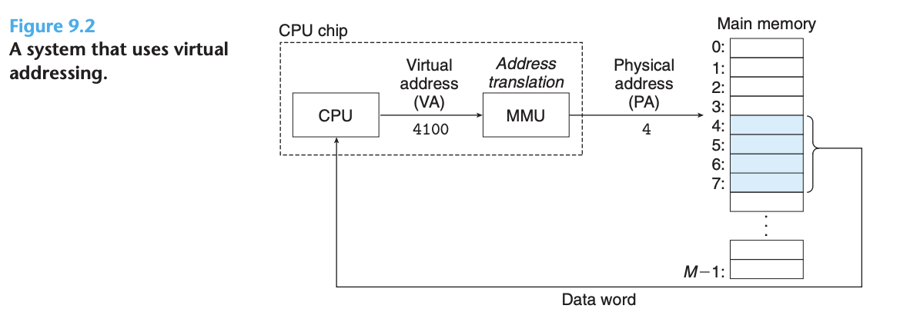
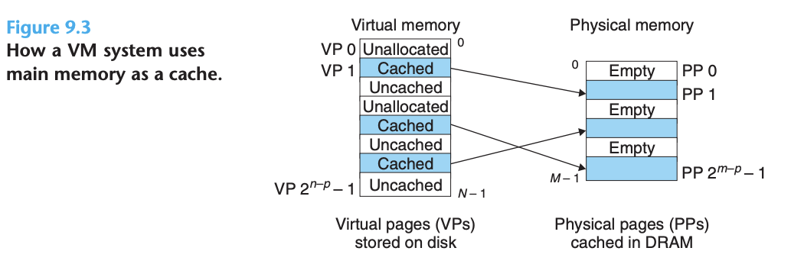
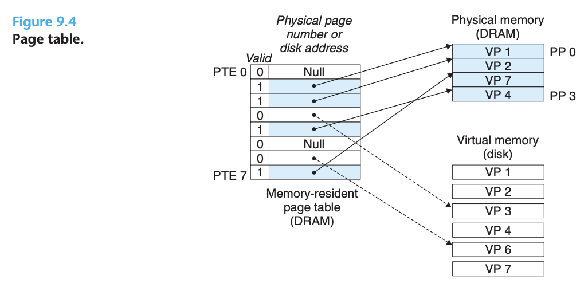
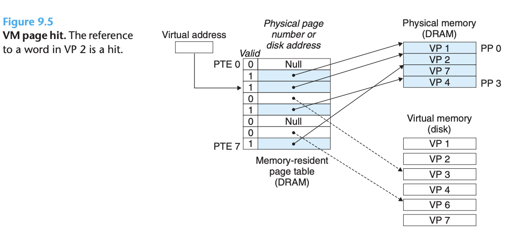
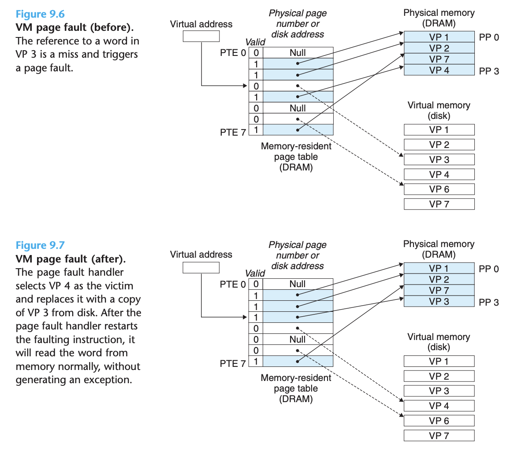
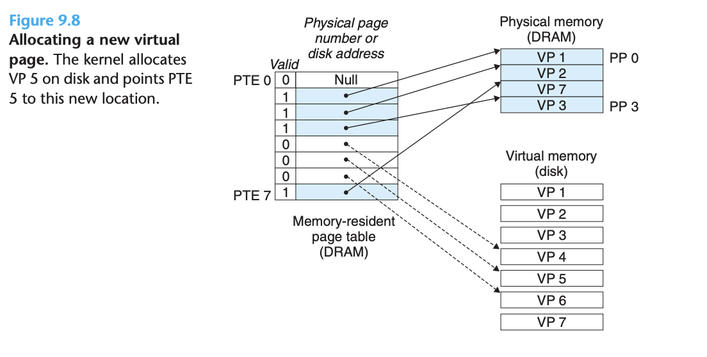
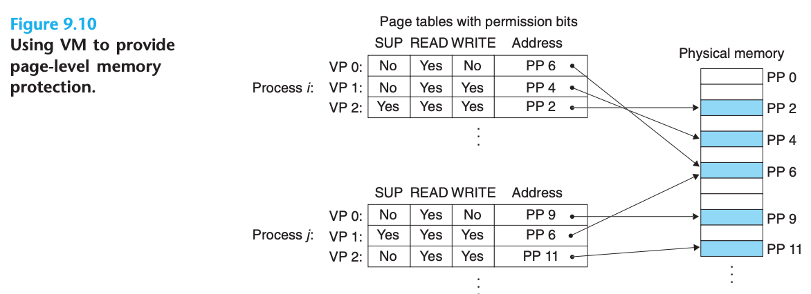
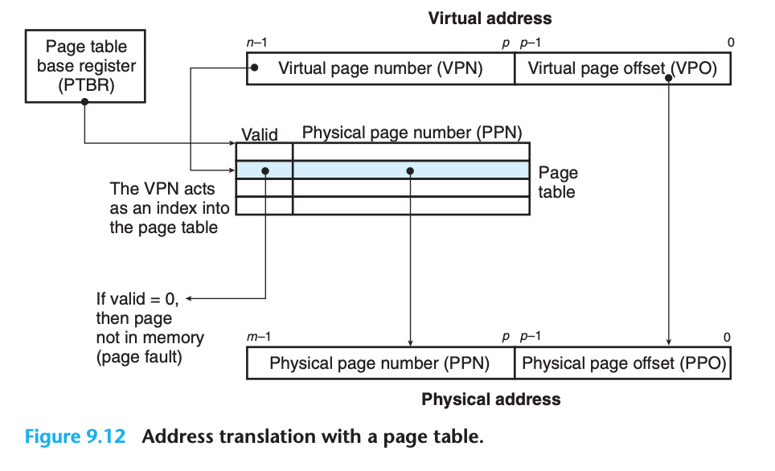
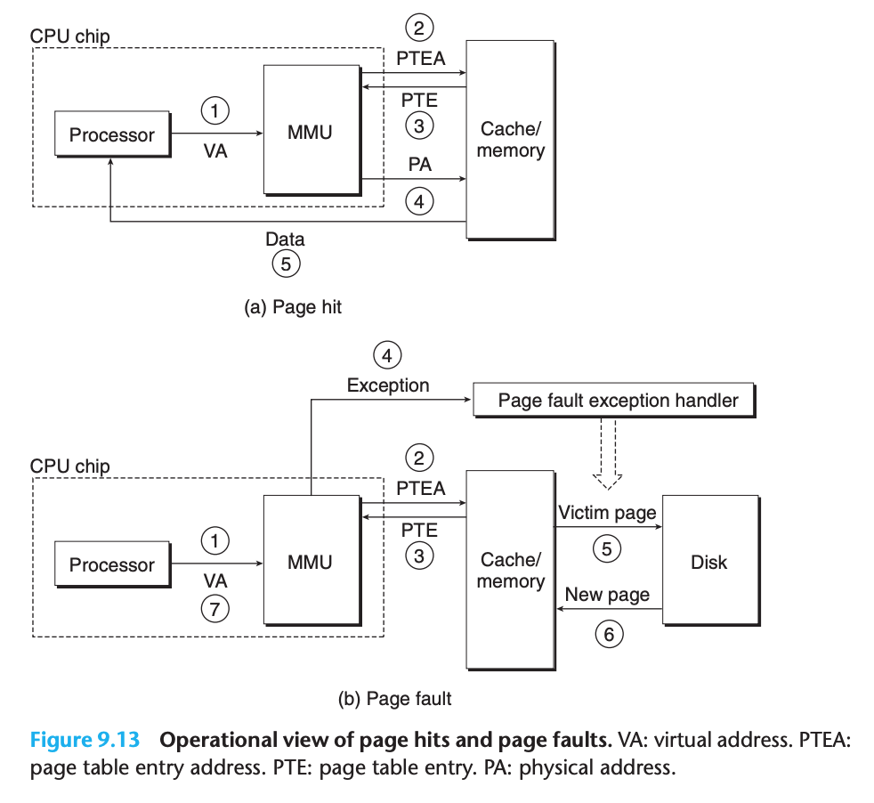

## Virtual Memory

### Physical and Virtual Addressing

- With virtual addressing, the CPU accesses main memory by generating a virtual address (VA), which is converted to the appropriate physical address before being sent to main memory

- **address translation**: converting a virtual address to a physical one

### VM as a Tool for Caching

- The contents of the array on disk are cached in main memory
- VM systems partitioning the virtual memory into fixed-size blocks called virtual pages (VPs). Each virtual page is $P = 2^{p}$ bytes in size. Similar as blocks in disk
- physical memory is partitioned into physical pages (PPs), also P bytes in size
- At any point in time, the set of virtual pages is partitioned into three disjoint subsets
  - **Unallocated**: Pages that have not yet been allocated (or created) by the VM system
  - **Cached**: Allocated pages that are currently cached in physical memory
  - **Uncached**: Allocated pages that are not cached in physical memory
- eg.

#### DRAM Cache Organization

- The position of the DRAM cache in the memory hierarchy has a big impact on the way that it is organized
  - A DRAM is at least 10 times slower than an SRAM and that disk is about 100,000 times slower than a DRAM
- Because of the large miss penalty and the expense of accessing the first byte, virtual pages tend to be large—typically 4 KB to 2 MB
- DRAM caches are fully associative; that is, any virtual page can be placed in any physical page
- DRAM caches always use write-back instead of write-through

#### Page Tables

- These capabilities are provided by a combination of **operating system software**, **address translation hardware in the MMU (memory management unit)**, and a data structure stored in physical memory known as a **page table** that maps virtual pages to physical pages

- A page table is an array of page table entries (PTEs)
- Each PTE consists of a valid bit and an n-bit address field
- The DRAM cache is fully associative, any physical page can contain any virtual page

- eg. page hit

- In virtual memory parlance, a DRAM cache miss is known as a **page fault**
- eg. page faults

- The activity of transferring a page between disk and memory is known as **swapping or paging**
  - Pages are swapped in (paged in) from disk to DRAM, and swapped out (paged out) from DRAM to disk
-  The strategy of waiting until the last moment to swap in a page, when a miss occurs, is known as **demand paging**

- eg. allocating pages

- allocating pages happen when operating system allocates a new page of virtual memory, eg. as a result of calling `malloc`

- In practice, virtual memory works well, mainly because of our old friend locality
- If the working set size exceeds the size of physical memory, then the program can produce an unfortunate situation known as **thrashing**, where pages are swapped in and out continuously

### VM as a Tool for Memory Management

- Multiple virtual pages can be mapped to the same shared physical page
- Advantage of VM:
  - **Simplifying linking**
  - **Simplifying loading**
  - **Simplifying sharing**
  - **Simplifying memory allocation**

### VM as a Tool for Memory Protection

- A user process should not be allowed to modify its read-only code section
  - Not allowed to read or modify any of the code and data structures in the kernel
  - Not allowed to read or write the private memory of other processes
  - Not allowed to modify any virtual pages that are shared with other processes

- eg. 

- In this example, we have added three permission bits to each PTE

### Address Translation

- Summary of address translation symbols:

|Symbol | Description|
|:------ | :---------|
|Basic parameters| |
|$N = 2^n$| Number of addresses in virtual address space|
|$M = 2^m$| Number of addresses in physical address space|
|$P = 2^p$| Page size (bytes)|
|Components of a virtual address (VA)| |
|VPO |Virtual page offset (bytes)|
|VPN |Virtual page number|
|TLBI| TLB index|
|TLBT| TLB tag|
|Components of a physical address (PA)||
|PPO| Physical page offset (bytes)|
|PPN| Physical page number|
|CO| Byte offset within cache block|
|CI| Cache index|
|CT| Cache tag|

- How the MMU uses the page table to perform mapping:

- A control register in the CPU, the **page table base register (PTBR)** points to the current page table
- The n-bit virtual address has two components: a p-bit virtual page offset (VPO) and an (n − p)bit virtual page number (VPN)
- The MMU uses the VPN to select the appropriate PTE

- Page hits and page faults:

