## Virtual Memory

### Physical and Virtual Addressing

- With virtual addressing, the CPU accesses main memory by generating a virtual address (VA), which is converted to the appropriate physical address before being sent to main memory

- **address translation**: converting a virtual address to a physical one

### VM as a Tool for Caching

- The contents of the array on disk are cached in main memory
- VM systems partitioning the virtual memory into fixed-size blocks called virtual pages (VPs). Each virtual page is $P = 2^{p}$ bytes in size. Similar as blocks in disk
- physical memory is partitioned into physical pages (PPs), also P bytes in size
- At any point in time, the set of virtual pages is partitioned into three disjoint subsets
  - **Unallocated**: Pages that have not yet been allocated (or created) by the VM system
  - **Cached**: Allocated pages that are currently cached in physical memory
  - **Uncached**: Allocated pages that are not cached in physical memory
- eg.

#### DRAM Cache Organization

- The position of the DRAM cache in the memory hierarchy has a big impact on the way that it is organized
  - A DRAM is at least 10 times slower than an SRAM and that disk is about 100,000 times slower than a DRAM
- Because of the large miss penalty and the expense of accessing the first byte, virtual pages tend to be large—typically 4 KB to 2 MB
- DRAM caches are fully associative; that is, any virtual page can be placed in any physical page
- DRAM caches always use write-back instead of write-through

#### Page Tables

- These capabilities are provided by a combination of **operating system software**, **address translation hardware in the MMU (memory management unit)**, and a data structure stored in physical memory known as a **page table** that maps virtual pages to physical pages

- A page table is an array of page table entries (PTEs)
- Each PTE consists of a valid bit and an n-bit address field
- The DRAM cache is fully associative, any physical page can contain any virtual page

- eg. page hit

- In virtual memory parlance, a DRAM cache miss is known as a **page fault**
- eg. page faults

- The activity of transferring a page between disk and memory is known as **swapping or paging**
  - Pages are swapped in (paged in) from disk to DRAM, and swapped out (paged out) from DRAM to disk
-  The strategy of waiting until the last moment to swap in a page, when a miss occurs, is known as **demand paging**

- eg. allocating pages

- allocating pages happen when operating system allocates a new page of virtual memory, eg. as a result of calling `malloc`

- In practice, virtual memory works well, mainly because of our old friend locality
- If the working set size exceeds the size of physical memory, then the program can produce an unfortunate situation known as **thrashing**, where pages are swapped in and out continuously

### VM as a Tool for Memory Management

- Multiple virtual pages can be mapped to the same shared physical page
- Advantage of VM:
  - **Simplifying linking**
  - **Simplifying loading**
  - **Simplifying sharing**
  - **Simplifying memory allocation**

### VM as a Tool for Memory Protection

- A user process should not be allowed to modify its read-only code section
  - Not allowed to read or modify any of the code and data structures in the kernel
  - Not allowed to read or write the private memory of other processes
  - Not allowed to modify any virtual pages that are shared with other processes

- eg. 

- In this example, we have added three permission bits to each PTE

### Address Translation

- Summary of address translation symbols:

|Symbol | Description|
|:------ | :---------|
|Basic parameters| |
|$N = 2^n$| Number of addresses in virtual address space|
|$M = 2^m$| Number of addresses in physical address space|
|$P = 2^p$| Page size (bytes)|
|Components of a virtual address (VA)| |
|VPO |Virtual page offset (bytes)|
|VPN |Virtual page number|
|TLBI| TLB index|
|TLBT| TLB tag|
|Components of a physical address (PA)||
|PPO| Physical page offset (bytes)|
|PPN| Physical page number|
|CO| Byte offset within cache block|
|CI| Cache index|
|CT| Cache tag|

- How the MMU uses the page table to perform mapping:

- A control register in the CPU, the **page table base register (PTBR)** points to the current page table
- The n-bit virtual address has two components: a p-bit virtual page offset (VPO) and an (n − p)bit virtual page number (VPN)
- The MMU uses the VPN to select the appropriate PTE

- Page hits and page faults:

#### Integrating Caches and VM

- In any system that uses both virtual memory and SRAM caches, SRAM can be put intermediate instead of separate:

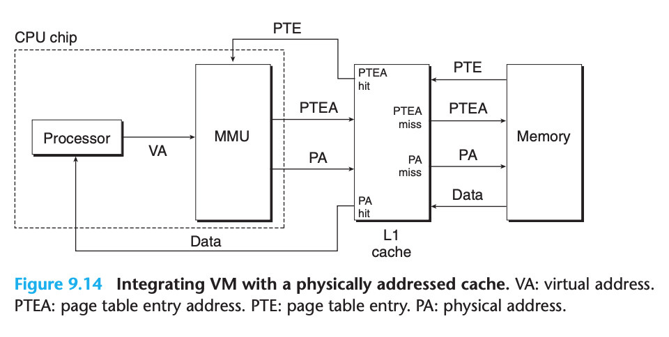

- The main idea is that the address translation occurs before the cache lookup
- Notice that page table entries can be cached, just like any other data words

#### Speeding Up Address Translation with a TLB

- Structure of TLB:

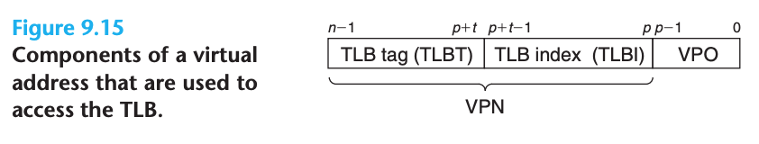

- The index and tag fields that are used for set selection and line matching are extracted from the virtual page number in the virtual address

- Position of TLB:

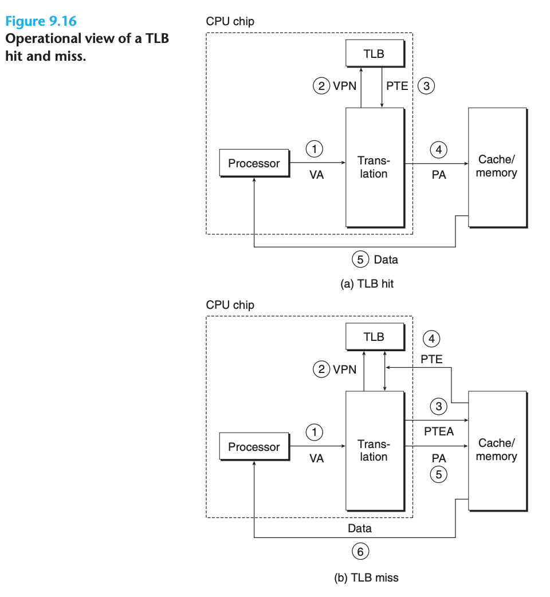

#### Multi-Level Page Tables

- The common approach for compacting the page table is to use a hierarchy of page tables instead

- eg. 

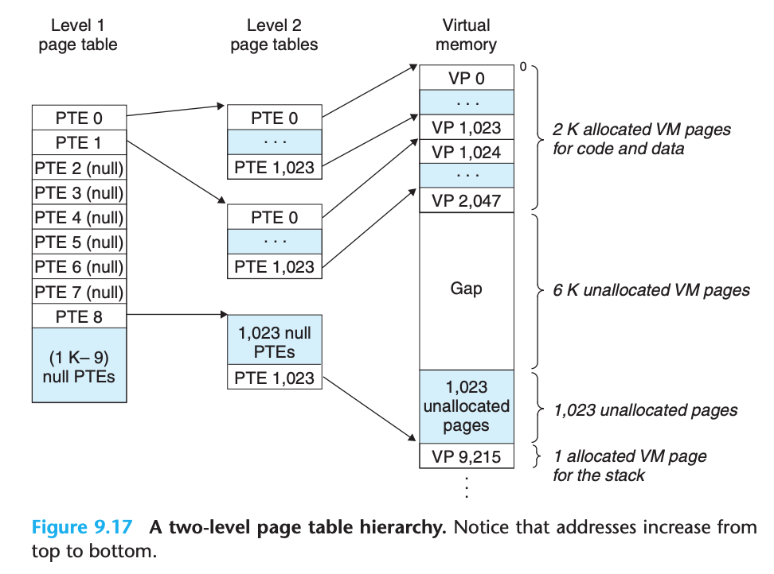

- If every page in chunk i is unallocated, then level 1 PTE i is null
- This scheme reduces memory requirements in two ways:
  1. If a PTE in the level 1 table is null, then the corresponding level 2 page table does not even have to exist
    - most of the 4 GB virtual address space for a typical program is unallocated
  2. Only the level 1 table needs to be in main memory at all times
    - The level 2 page tables can be created and paged in and out by the VM system as they are needed, which reduces pressure on main memory
    - Only the most heavily used level 2 page tables need to be cached in main memory

- eg. k-level page table:

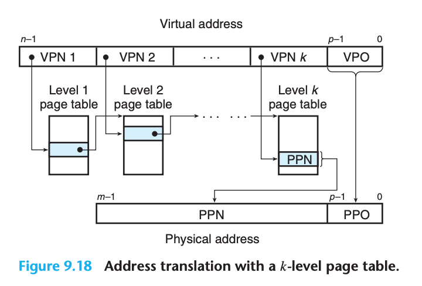

- Accessing k PTEs may seem expensive and impractical at first glance. However, the TLB comes to the rescue here by caching PTEs from the page tables at the different levels

#### Putting It Together: End-to-End Address Translation

- eg. assuming:
  - The memory is byte addressable
  - Memory accesses are to 1-byte words (not 4-byte words)
  - Virtual addresses are 14 bits wide (n = 14)
  - Physical addresses are 12 bits wide (m = 12)
  - The page size is 64 bytes (P = 64)
  - The TLB is 4-way set associative with 16 total entries
  - The L1 d-cache is physically addressed and direct mapped, with a 4-byte line size and 16 total sets
- Since each page is $2^6 = 64$ bytes, the low-order 6 bits of the virtual and physical addresses serve as the VPO and PPO, respectively:

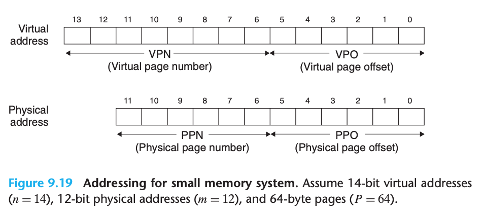

- Memory system:

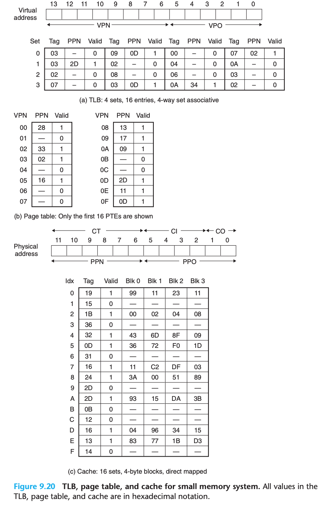

- **TLB**: The TLB is virtually addressed using the bits of the VPN
- **Page table**: The page table is a single-level design with a total of $2^8 = 256$ page table entries (PTEs). However, we are only interested in the first 16 of these
- **Cache**:
  - Since each block is 4 bytes, the low-order 2 bits of the physical address serve as the block offset (CO)
  - Since there are 16 sets, the next 4 bits serve as the set index (CI)
  - The remaining 6 bits serve as the tag (CT)

- When the CPU executes a load instruction that reads the byte at address `0x03d4`
  - MMU -> TLB
  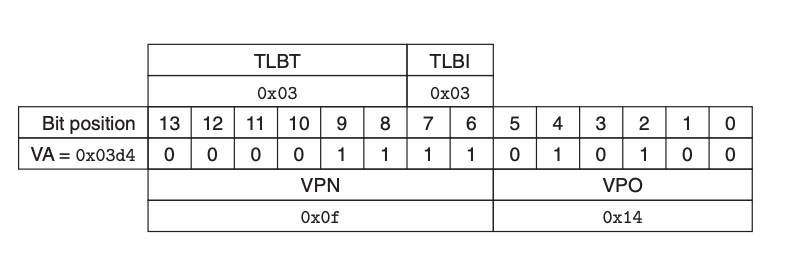
  - MMU concatenating the PPN(`0x0D`) from the PTE with VPO(`0x14`) -> physical address (`0x354`)
  - MMU sends the physical address to the cache
  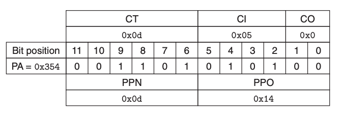
  - Cache detects a hit, reads out the data byte (`0x36`) at offset CO, and returns it to the MMU, which then passes it back to the CPU

### Case Study: The Intel Core i7/Linux Memory System

- An Intel Core i7 running Linux:

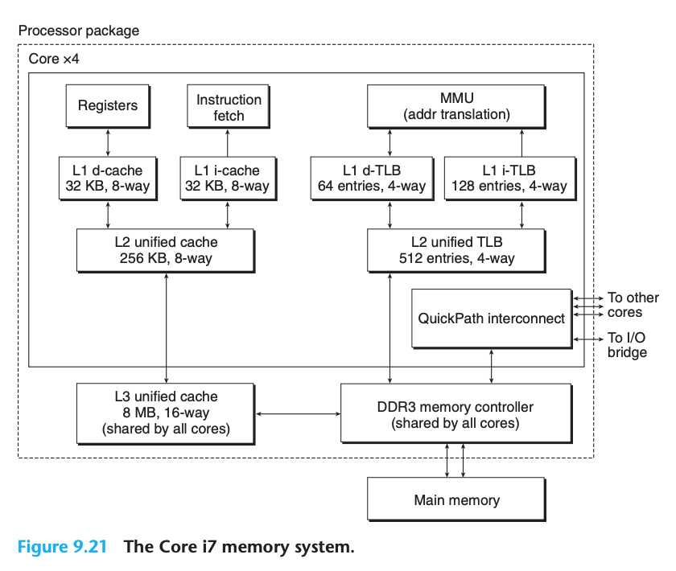

#### Core i7 Address Translation

- Core i7 Address Translation process:

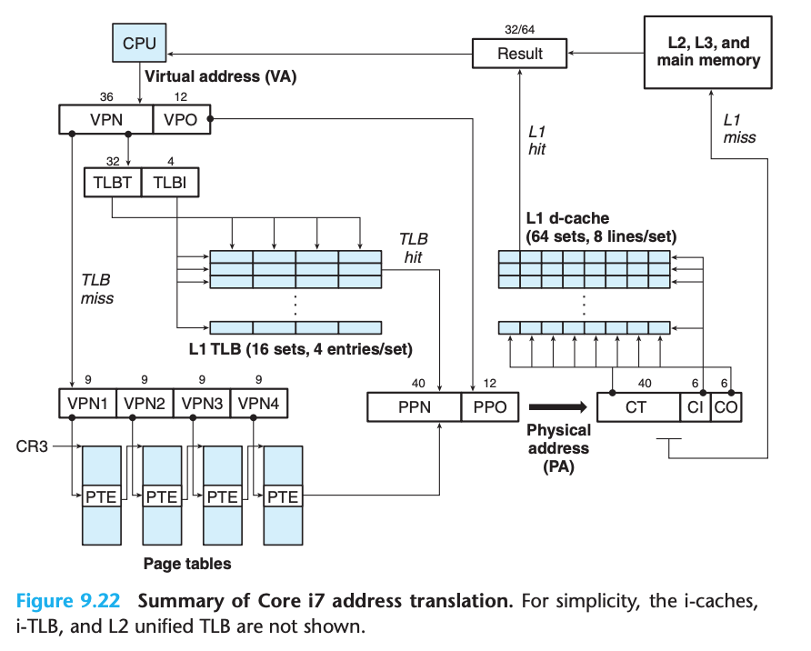

- The Core i7 uses a four-level page table hierarchy. Each process has its own private page table hierarchy
- When a Linux process is running, the page tables associated with allocated pages are all memory-resident, although the Core i7 architecture allows these page tables to be swapped in and out
- The value of CR3 is part of each process context, and is restored during each context switch
- format of an entry in a level 1, level 2, or level 3 page table:

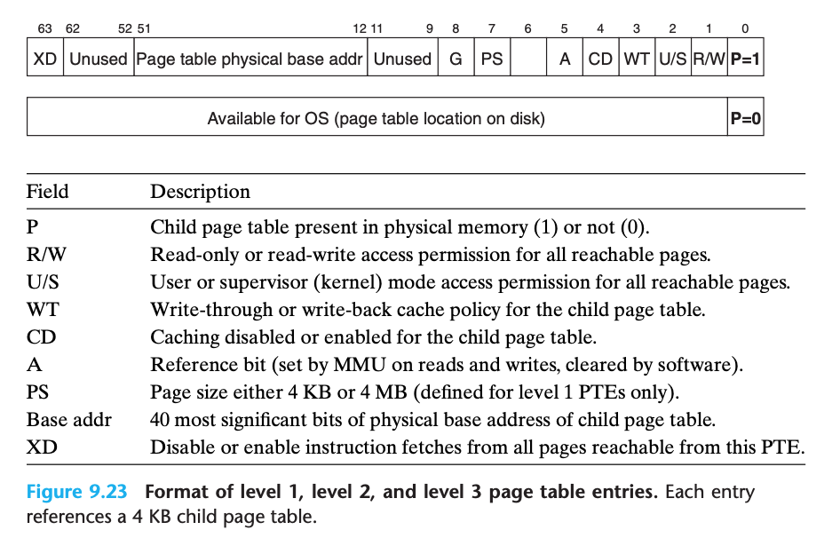

- format of an entry in a level 4 page table:

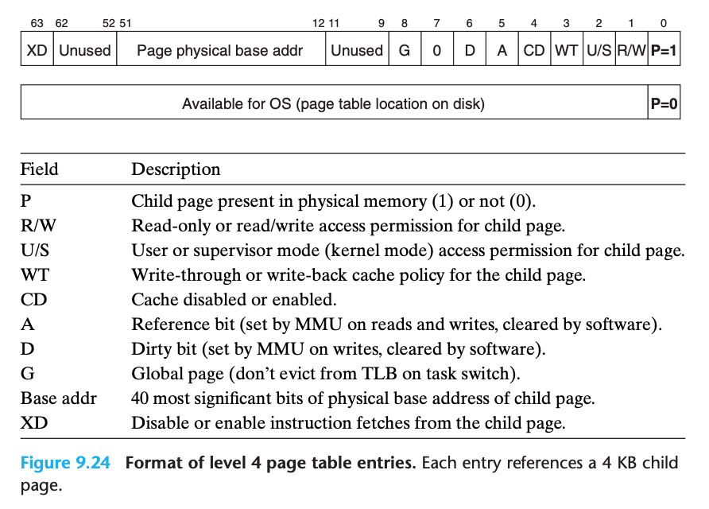

- How the Core i7 MMU uses the four levels of page tables to translate a virtual address to a physical address:

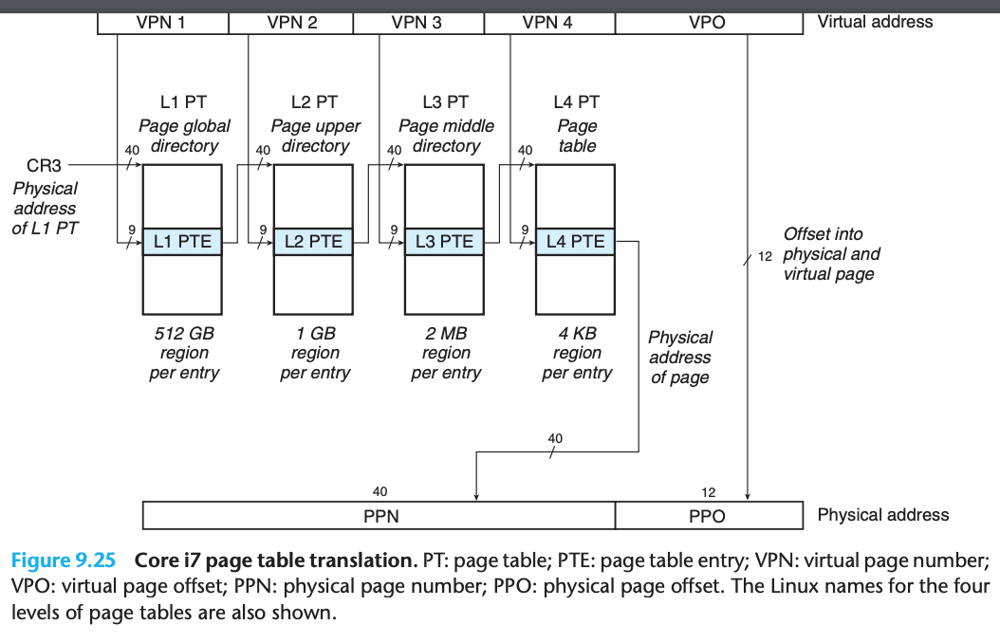

- The 36-bit VPN is partitioned into four 9-bit chunks, each of which is used as an offset into a page table
- The CR3 register contains the physical address of the L1 page table
- VPN 1 provides an offset to an L1 PTE, which contains the base address of the L2 page table
- VPN 2 provides an offset to an L2 PTE, and so on

- In our discussion of address translation, we have described a sequential two-step process where the
  1. Translates the virtual address to a physical address
  2. Passes the physical address to the L1 cache
- However, real hardware implementations use a neat trick that allows these steps to be partially overlapped, thus speeding up accesses to the L1 cache

#### Linux Virtual Memory System

- The virtual memory of a linux process (filled in some more details about the kernel virtual memory that lies above the user stack)

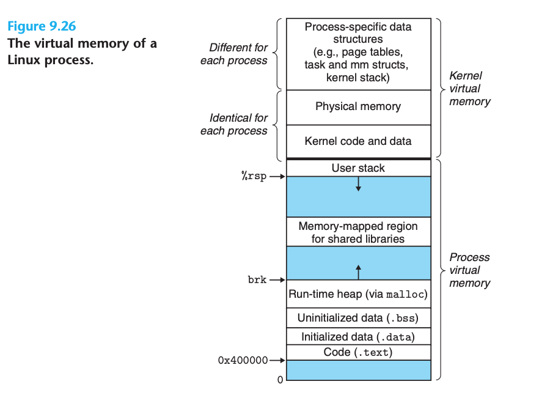

##### Linux Virtual Memory Areas

- Linux organizes the virtual memory as a collection of areas (also called segments). An area is a contiguous chunk of existing (allocated) virtual memory whose pages are related in some way
- The notion of an area is important because it allows the virtual address space to have gaps

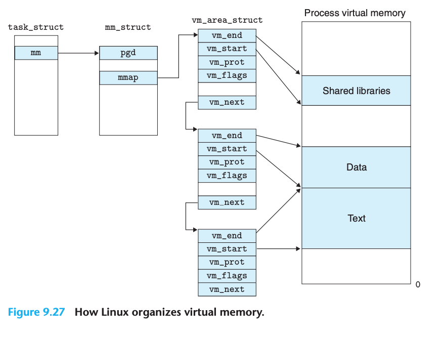

- The elements of the **task structure** either contain or point to all of the information that the kernel needs to run the process (e.g., the PID, pointer to the user stack, name of the executable object file, and program counter)

- `mm_struct` that characterizes the current state of the virtual memory
- `pgd` points to the base of the level 1 table (the page global directory)
- a list of `vm_area_structs` (area structs) each of which characterizes an area of the current virtual address space
- When the kernel runs this process, it stores pgd in the CR3 control register
- For our purposes, the area struct for a particular area contains the following fields:
  - **fvm_start**: Points to the beginning of the area
  - **vm_end**: Points to the end of the area
  - **vm_prot**: Describes the read/write permissions for all of the pages contained in the area
  - **vm_flags**: Describes (among other things) whether the pages in the area are shared with other processes or private to this process
  - **vm_next**: Points to the next area struct in the list

##### Linux Page Fault Exception Handling

- kernel’s page fault handler performs the following steps:
  1. Is virtual address A legal?
    - The fault handler searches the list of area structs, comparing A with the vm_start and vm_end in each area struct (in practice, search in a tree)
    - Not legal -> triggers a segmentation fault
  2. Is the attempted memory access legal?
    - does the process have permission to read, write, or execute the pages in this area?
    - Not legal -> triggers a protection exception
  3. The kernel knows that the page fault resulted from a legal operation on a legal virtual address

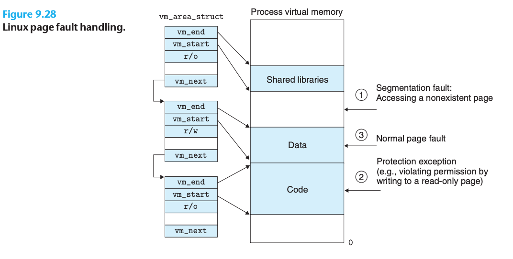

### Memory Mapping

- Linux initializes the contents of a virtual memory area by associating it with an object on disk, a process known as **memory mapping**
- Areas can be mapped to one of two types of objects:
  - **Regular file in the Linux file system**: An area can be mapped to a contiguous section of a regular disk file, such as an executable object file
  - **Anonymous file**: An area can also be mapped to an anonymous file, created by the kernel, that contains all binary zeros
- In either case, once a virtual page is initialized, it is swapped back and forth between a special **swap file** maintained by the kernel
- The swap file is also known as the swap space or the swap area
- An important point to realize is that at any point in time, **the swap space bounds the total amount of virtual pages that can be allocated by the currently running processes**

#### Shared Objects Revisited

- An object can be mapped into an area of virtual memory as either a shared object or a private object
- **shared object**
  - Any writes that the process makes to that area are visible to any other processes that have also mapped the shared object into their virtual memory
  - The changes are also reflected in the original object on disk

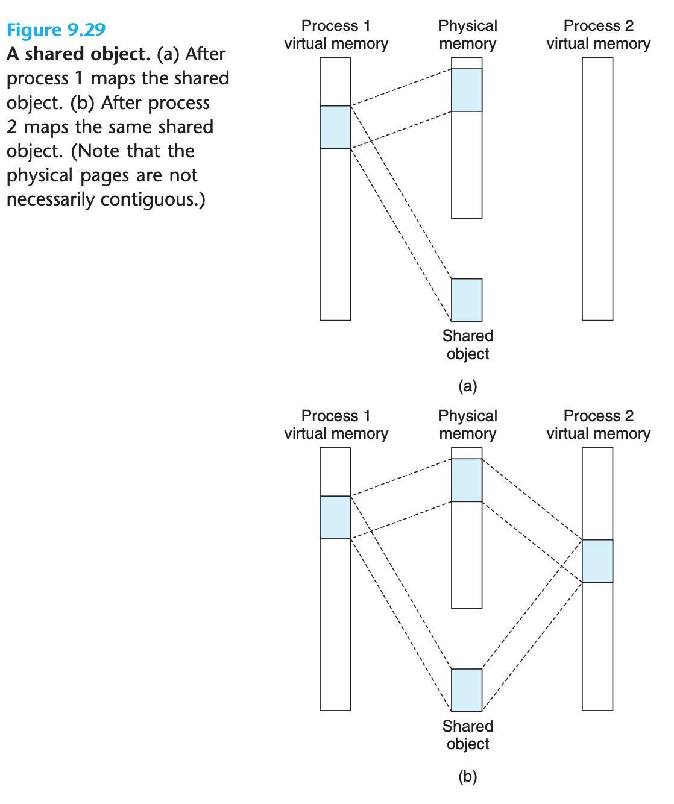

- The key point is that only a single copy of the shared object needs to be stored in physical memory

- **private object**
  - Not visible to other processes
  - Any writes that the process makes to the area are not reflected back to the object on disk

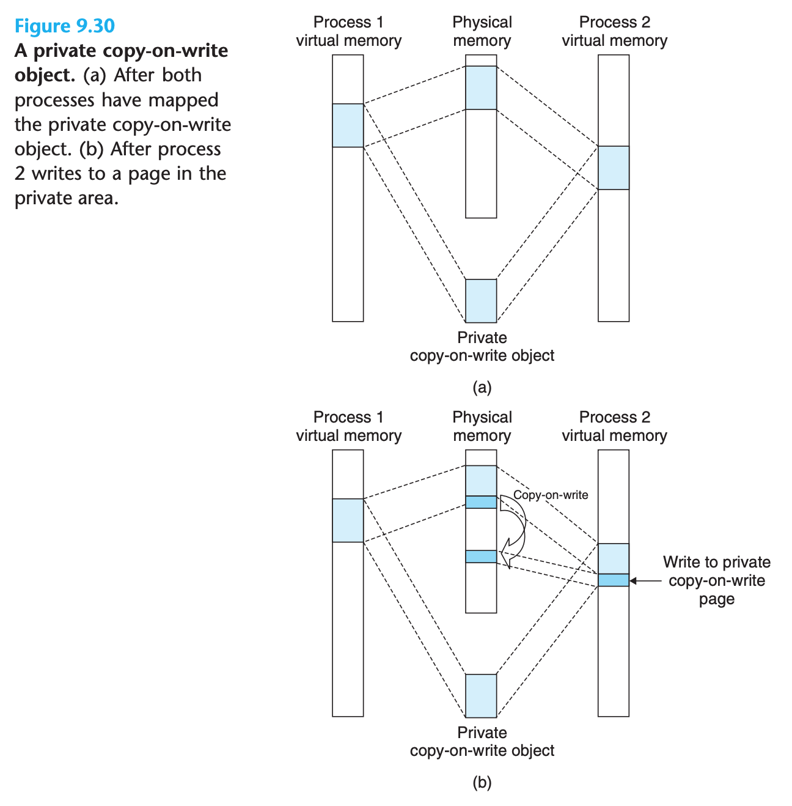

- A private object begins life in exactly the same way as a shared object, with only one copy of the private object stored in physical memory
- For each process that maps the private object, the page table entries for the corresponding private area are flagged as read-only, and the area struct is flagged as private copy-on-write
- As soon as a process attempts to write to some page in the private area, the write triggers a protection fault, and the handler make the copy
- Copy-on-write makes the most efficient use of scarce physical memory
